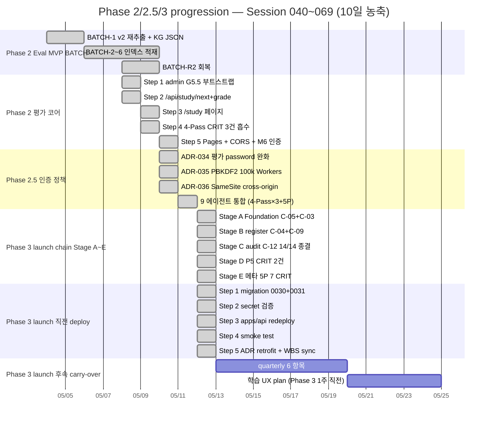

# 쪽집게 엔진 품질 검증 WBS — Gantt 진척 대시보드

> **살아있는 문서** — Group A 잔여 2건 흡수 시 / Phase B 흡수 시 / BATCH-1 진입 시점에 갱신.
> handoff-N+1 작성 시 본 문서 status 동기화 의무.

작성일: 2026-05-02 ~22:00 KST (Session 035) → 2026-05-03 ~02:40 KST 갱신 (Session 039 종료) → **2026-05-12 KST Session 069 종착 부분 sync (§0 Executive Summary + footer)**

> ★★ **본 sync 범위 한정**: Session 040~069 (30 세션) 전체 reconstruction은 carry-over.
> §1 WBS 트리 + §2 Gantt + §4 ~§6 detail은 Session 070+ 별도 chunk reconstruction 의무 (handoff-078 §"다음 세션 할 일" §4 정합).
> 본 Session 069 sync는 §0 Executive Summary + Phase progression footer만 갱신.

정합 출처:

- **`.jjokjipge/handoff-session-078.md` (Session 069 종착 — Phase 3 launch 직전 production deploy chain 5/5)** ★ 본 sync 1순위
- **`.jjokjipge/handoff-session-077.md` (Session 068 종착 — Phase 3 launch chain Stage A~E + 14 CRIT 5/5 + P5 CRIT 2건 + 메타 5-페르소나 7 CRIT)**
- **`.claude/reports/production-migration-status.md` (production D1 0001~0031 적용 chain)**
- `.claude/reviews/review-20260512-132500-phase3-launch-chain-5-persona-integrated.md` (Phase 3 5-페르소나 통합)
- Session 040~066 핸드오프 26건 + 통합 리뷰 보고서 다수 (전체 reconstruction carry-over)
- (이하 Phase 1 baseline 정합 출처는 §1 WBS reconstruction 시 재정렬)
- `.jjokjipge/handoff-session-039.md` §0~§7 (Session 038 종료, Phase 1 closeout baseline)
- `.claude/reviews/phase1-tech-debt-20260502-index.md` (5-페르소나 Phase 1 통합)
- `scripts/verify-engine-contracts.ts` (자동 게이트 baseline)

---

## 0. Executive Summary

> ★★ **Session 069 종착 시점 (2026-05-12 KST) sync**. Phase 1 baseline 값은 §"Phase 1 closeout baseline (history)" 보존.

| 항목                           | 값                                                                                                                                                                            |
| :----------------------------- | :---------------------------------------------------------------------------------------------------------------------------------------------------------------------------- |
| 현재 위치                      | **Phase 3 launch 직전 production deploy chain 종착** (Session 069 Step 1-5: migration 0030/0031 apply + redeploy + smoke + ADR-034/035/036 retrofit)                          |
| 모노레포 흐름                  | Phase 1 closeout (Session 039) → Phase 2 Eval MVP (Session 040~064) → 4-Pass + 5-Persona 9 에이전트 통합 (Session 065~066) → Phase 3 launch chain (Session 067~068) → 본 세션 |
| 누적 테스트 (Stage E baseline) | **apps/api 502 PASS / 2 skip + packages/shared 64 PASS** (Stage E 종착 baseline 유지, Session 069 회귀 0)                                                                     |
| 자동 게이트                    | **7 PASS / 1 SKIP / 0 FAIL** (Cat 8 SKIP carry-over, Cat 9 Table-as-Micro-KG + Cat 10 Drizzle/SQL enum 정합 추가 후)                                                          |
| production D1 마이그레이션     | **0001 ~ 0031 31개 chain 모두 적용 완료** (0030 login_history + 0031 event_type Session 069 신규 — `.claude/reports/production-migration-status.md` 정합)                     |
| production Worker              | Version `02267900-7171-4526-a73e-b6f42ce48737` (Session 069 redeploy, Phase 3 launch chain Stage A~E 5 commit 활성)                                                           |
| production audit trail         | login_history 1 row (smoke test 검증) — event_type='login', ip_hash 정합, ISO 8601 + ms timestamp                                                                             |
| 누적 commits                   | main `a5a8dac` HEAD (Session 069 종착) — Session 039~068 +N commits (정확치 reconstruction carry-over)                                                                        |
| 이월 CRITICAL                  | **0건** — 14 CRIT 매트릭스 (Session 065 9 에이전트) 5/5 + P5 신규 CRIT 2건 (Stage D) + 메타 5-페르소나 7 CRIT (Stage E) 모두 흡수 완료                                        |
| 이월 MAJOR                     | Phase 3 chain carry-over 16건 (5-페르소나 P-α/β/γ/δ/ε MINOR dedupe 매트릭스) + Phase 1 baseline 83건 (reconstruction carry-over)                                              |
| Hard Rule 17 위반              | **0건** (Session 069 verify-engine-contracts PASS 정합)                                                                                                                       |

### Session 069 본 회차 핵심 진척 (Phase 3 launch 직전 의무 5/5)

1. ★ production migration **0030 (login_history) + 0031 (event_type 컬럼)** apply — Stage C C-12 audit trail + Stage E P-α refresh audit hole 봉합
2. ★ apps/api production redeploy — Phase 3 chain Stage A~E 5 commit 활성화
3. ★ smoke test PASS — production `/api/auth/login` 200 → login_history baseline 0 → 1 row 검증 (event_type='login', ip_hash 정합)
4. ★ ADR-034/035/036 **Accepted → Accepted (temporary)** retrofit (ADR-037 §"Retrofit 가이드라인" 정합) — 4 의무 필드 (만료 deadline + 복원 chain + 자동화 toggle 위치 + Governance) 명시
5. ★ `.claude/reports/production-migration-status.md` 0030/0031 entry + detail 영속

---

## 1. WBS (Work Breakdown Structure)

> ★★ **Session 069 sync**: 아래 트리는 Phase 1 closeout (Session 039) baseline. **Phase 2 Eval MVP + Phase 3 launch chain progression sync는 carry-over** (handoff-078 §"다음 세션 할 일" §4).
> 본 시점 실 status:
>
> - Phase 0 ✅ + Phase 1 ✅ closeout
> - Phase 2 Eval MVP ✅ (Session 040~064, 진산님 G9 production browser 학습 검증 종착)
> - Phase 2.5 인증 정책 chain ✅ (Session 065~066 9 에이전트 통합 + 14 CRIT 매트릭스)
> - Phase 3 launch chain Stage A~E ✅ (Session 067~068)
> - **Phase 3 launch 직전 production deploy chain Step 1-5 ✅** (Session 069 본 회차)
> - Phase 3 launch ⚪ 후속 quarterly carry-over 6 항목 미흡수 (handoff-078 §"다음 세션 할 일" §1)
> - 학습 UX plan ⚪ Phase 3 launch 1주 직전 신규 (memory `project_ux_north_star_phase3.md`)

```
쪽집게 엔진 품질 검증
├── Phase 0 (인프라 셋업) ........................................... ✅ 완료 (Step 1~17)
│
├── Phase 1 (콘텐츠 빌드 엔진) ...................................... 🟡 closeout
│   │
│   ├── Sprint 0 (P0 17건 정직 baseline)
│   │   ├── 7가지 인지 부조화 흡수 v1.1 ........................... ✅ 7248133
│   │   ├── admin-web localStorage → cookie (Sentinel CRITICAL) ... ✅ e5273da
│   │   ├── Phase B 4-Pass CRITICAL 1 + MAJOR 4 흡수 .............. ✅ 33f5d3f
│   │   └── P0 17건 정직 측정 (PASS 3 / PARTIAL 7 / NOT-IMPL 7) ... ✅ afb323d
│   │
│   ├── Sprint 1 (강화)
│   │   ├── §5.1 PRC iterative DFS ................................ ✅ 1c54a85 + b587bdc
│   │   ├── §5.2 Day 1 도구 정비 + 4-Pass ......................... ✅ ba9ad2b + 49335c5
│   │   ├── §5.3 FUZ-01/02 + CHA-01/02/04 + 4-Pass ................ ✅ 2beb282~c8ca91d (8 commits)
│   │   ├── §5.4 REC-02/01 + PRC-01 + PRF-01/02 + FUZ-04 + 4-Pass . ✅ a258f36~a72a9c7 (9 commits)
│   │   └── §5.5 footnote 6건 + Cat 5A 자동화 + v1.2 보고서 + 4-Pass ✅ a8d0101~ef27be4 (4 commits)
│   │
│   ├── Phase 1 5-페르소나 기술부채 심층 리뷰 (CRITICAL 13 / MAJOR 34)
│   │   ├── refactoring-expert (CRIT 2 / MAJOR 10) ................ ✅ 1c5d9d8
│   │   ├── performance-engineer (CRIT 4 / MAJOR 6) ............... ✅ 1c5d9d8
│   │   ├── quality-engineer (CRIT 3 / MAJOR 8) ................... ✅ 1c5d9d8
│   │   ├── backend-architect (CRIT 3 / MAJOR 6) .................. ✅ 1c5d9d8
│   │   ├── devops-architect (CRIT 1 / MAJOR 4) ................... ✅ 1c5d9d8
│   │   └── 통합 인덱스 ........................................... ✅ phase1-tech-debt-20260502-index.md
│   │
│   ├── Group A — BATCH-1 진입 차단 게이트 (7/7 ✅ 완성, Step 037)
│   │   ├── B-C1  Hard Rule 16 progress examId 시그니처 ........... ✅ 3a39310
│   │   ├── B-C2  production-deployment.md runbook ................ ✅ 789b28b
│   │   ├── B-C3  engine-telemetry-gc.md runbook .................. ✅ 789b28b
│   │   ├── CRIT-QPHASE1-2 EXPANSION_OBLIGATIONS 6건 자동 trigger .. ✅ 760fa4f
│   │   ├── CRIT-QPHASE1-3 0018 마이그레이션 + Hard Rule 13 e2e .... ✅ 2d10ed9 + 3a39310
│   │   ├── CRITICAL-DO-S1-1 apps/batch telemetry-client wire-up .. ✅ 21f57c6 (본 세션)
│   │   └── CRIT-QPHASE1-1 admin-web vitest + 10 tests ............ ✅ dec85ad (본 세션)
│   │
│   ├── Group A 4-Pass MAJOR 4건 즉시 흡수 + 통합 인덱스 .......... ✅ 9869981
│   │
│   ├── Step 036 회귀 흡수 chain
│   │   ├── verify 회귀 batch 308/309 → 309/309 (정규식 alternation) ✅ 48545f3
│   │   └── 4-Pass MAJOR-1 + MAJOR-2 흡수 (트리거 invariant + 빈문자열) ✅ b6605b6
│   │
│   └── Step 037 흡수 chain (본 세션)
│       ├── CRITICAL-DO-S1-1 telemetry-client + 4-Pass MAJOR 6 흡수 ✅ 21f57c6 (모노레포 1190)
│       └── CRIT-QPHASE1-1 admin-web vitest + 10 tests ............. ✅ dec85ad (모노레포 1200)
│
├── Phase B 보안 — localStorage admin_api_token httpOnly cookie 강화
│   ├── localStorage 잔여 0건 (e5273da 1차 전환에서 완료) ............. ✅ Step 038 reconnaissance 확인
│   ├── HttpOnly + SameSite=Strict + Secure (production/staging) ..... ✅ telemetry/admin-token.ts:104,108,112 + auth/routes.ts:518
│   └── 작업 재정의 결과: skip (추가 작업 무의미, evidence 기반) ..... ✅ Step 038 진산님 비협의 자율 결정
│
├── BATCH-1 진입 직전 후속 PR (~1주)
│   ├── production migrations staging dry-run ..................... 🔴 진산님 콘솔 (Cloudflare D1)
│   ├── ADMIN_API_TOKEN secret put ................................ 🔴 진산님 콘솔
│   ├── Anthropic console monthly cap $200 활성화 ................. 🔴 진산님 콘솔 (memory project_anthropic_cap_pre_install)
│   ├── telemetry wire-up e2e (admin-web /telemetry 8 게이지) ..... 🔴 CRITICAL-DO-S1-1 후속
│   └── admin-web vitest CI 통합 .................................. 🔴 CRIT-QPHASE1-1 후속
│
├── Phase 2 진입 직전 의무 (Group B 4건 — performance)
│   ├── C-PERF-1 dashboard 16 sequential RT → Promise.all .......... ⚪ Phase 2 (~1h)
│   ├── C-PERF-2 engine_telemetry purgeOldTelemetry() 구현 ......... ⚪ Phase 2
│   ├── C-PERF-3 rate_limits 28.8M batch DELETE LIMIT 10000 ........ ⚪ Phase 2
│   └── C-PERF-4 parseFormula cache key tuple 변경 ................. ⚪ Phase 2
│
├── Phase 1 종료 게이트 또는 Phase 2 (Group C 2건 — refactoring)
│   ├── C-RF-1 resolveLoggerEnv 6중 단일 출처화 .................... ⚪ 결정 의무 (~1일)
│   └── C-RF-2 withRetry 통합 + Claude API 4xx non-retryable ....... ⚪ 결정 의무 (~1일)
│
├── Sprint 2 초기 ledger 갱신 의무
│   ├── master-test-checklist v3 (Cat 5 분리 5A/5B + footnote) .... 🔴 Sprint 2
│   ├── tech-debt.md TD-DO-053~056 + Group B/C 28~30건 .............. 🔴 Sprint 2
│   ├── tech-debt TD-API-001 SCENARIO_MIGRATIONS 두 wrapper 분기 ... 🔴 Sprint 2 (본 세션 4-Pass MAJOR-3)
│   └── tech-debt TD-VRF-001 verify vitest 비결정성 (310 vs 311) ... 🔴 Sprint 2 (본 세션 추적)
│
└── BATCH-1 적재 진입 (Step 20) — 진산님 "GO" 트리거 (Session 038)
    ├── reconnaissance 5건 (batch-loadmap + ontology + pdfplumber + D1 + 자료) ✅ Session 038
    ├── pdfplumber p.403~434 32p 텍스트 추출 (v1) ................. ✅ Session 038
    ├── 진산님 1차 검수 — Q1/Q2/Q3 결정 (페이지+챕터/표 column merge/Claude multimodal) ✅ Session 038
    ├── ADR-030 + 마이그레이션 0019 작성 ......................... ✅ Session 038
    ├── ADR-030 Proposed → Accepted 전환 ......................... ✅ Session 039
    ├── verify -17 회귀 detection + 17건 fix (loader/state-machine/hard-rule-13/pipeline) ✅ Session 039
    ├── 4-Pass CRIT-D-1 흡수 (SCENARIO_MIGRATIONS 0019 + seed 4 컬럼) ✅ Session 039
    ├── 4-Pass CRIT-D-2 흡수 (chapter/section misattribution 정정) ✅ Session 039
    ├── Pass 2 MAJOR-A2-1 흡수 (PWA IndexedDB IKnowledgeNode 4 필드) ✅ Session 039
    ├── 추출 스크립트 v2 (extract_text + extract_tables + 챕터/절 + 그림 메타) 🔴 다음 세션
    ├── BATCH-1 v2 재추출 + Knowledge Graph JSON 생성 ............. 🔴 다음 세션
    ├── 진산님 2차 검수 (sample 5 노드 + 산식 1) .................. 🔴 다음 세션
    ├── SQL INSERT 스크립트 + 진산님 wrangler d1 적용 ............. 🔴 진산님 콘솔
    └── batch-loadmap.md ☐ → ✅ + handoff-041 + 8 게이지 실측 ..... 🔴 다음 세션
```

**범례:** ✅ 완료 / 🟡 진행 중 / 🔴 대기 (Phase 1 차단 게이트) / ⚪ Phase 2 이월

### Phase 1 closeout 이후 progression — Session 040~069 (★ Session 069 sync)

```
Phase 1 closeout (Session 039) 이후 progression
│
├── Phase 2 Eval MVP (Session 040~064, 25 세션) ........................ ✅ 종착
│   │
│   ├── BATCH 적재 chain — 1~6 + R2 누적 (Knowledge Graph)
│   │   ├── BATCH-1 v2 재추출 + KG JSON 생성 .......................... ✅ Session 040~041
│   │   ├── BATCH-2~6 인덱스 적재 + 진산 검수 chain ................... ✅ Session 042~058
│   │   ├── BATCH-R2 인덱스 회복 + revision_changes 누적 .............. ✅ Session 058~060
│   │   └── 누적: 767 노드 / 1223 엣지 / 39 revision_changes
│   │
│   ├── Phase 2 평가 환경 코어 (Step 1~5, Session 061~064)
│   │   ├── Step 1 admin G5.5 부트스트랩 414건 active approved ........ ✅ 2d53a9e (Session 061)
│   │   ├── Step 2 /api/study/{next,grade} 라우트 (L3) ............... ✅ c9c5532 (Session 061)
│   │   ├── Step 3 /study 페이지 + Ctrl+Enter 평가 UX ................ ✅ d5101db (Session 062)
│   │   ├── Step 4 4-Pass 독립 리뷰 CRIT 3건 흡수 (G8 PASS) .......... ✅ f98532d (Session 063)
│   │   └── Step 5 Pages thepick-study + CORS + M6 인증 UI ........... ✅ 661dccc (Session 064)
│   │
│   ├── 신규 ADR 본 phase 진입 트리거: ADR-030 (Session 038~039 BATCH-1 chain 신설)
│   └── 마이그레이션 0019 ~ 0027 (Pattern-H + review_queue 누적 8건) .. ✅ Session 040~060
│
├── Phase 2.5 인증 정책 chain (Session 065~066, 2 세션) ............... ✅ 종착
│   │
│   ├── ADR-034 평가 환경 비밀번호 정책 임시 완화 ..................... ✅ 65ba0bf (Session 065)
│   │   └── PASSWORD_MIN_LENGTH 8 → 4 + HIBP disable (평가 환경 한정)
│   ├── ADR-035 PBKDF2 100k Workers 호환 (register 500 해소) .......... ✅ 661c320 (Session 065)
│   │   └── 마이그레이션 0028 PBKDF2_ITERATIONS 600k → 100k
│   ├── ADR-036 Cookie SameSite cross-origin (pages.dev ↔ workers.dev) ✅ 4db5527 (Session 065)
│   │   └── authCookieSameSite(environment) 환경별 분기
│   │
│   └── 9 에이전트 통합 리뷰 (4-Pass × 3 + 5-페르소나 1회) — Session 066
│       ├── 4-Pass × 3 (silent-failure-hunter + backend + security) ... ✅ Session 066
│       ├── 5-페르소나 1회 (refactor + perf + quality + backend + devops) ✅ Session 066
│       ├── 14 CRIT 매트릭스 (C-01 ~ C-14) ............................ ✅ Session 066~068
│       └── 누적: CRIT 5건 흡수 (C-01/02/06/07/08) + MAJOR 6건 즉시 흡수
│
├── Phase 3 launch chain Stage A~E (Session 067~068, 2 세션) .......... ✅ 종착
│   │
│   ├── Stage A — Foundation (C-05 + C-03) ............................ ✅ 2395851
│   │   ├── C-05 PASSWORD_MIN packages/shared 단일 source-of-truth
│   │   └── C-03 임시 정책 env 분기 (ADR-034/035/036 toggle 자동화)
│   ├── Stage B — register 강화 (C-04 + C-09) ......................... ✅ 5d85028
│   │   ├── C-04 register email rate-limit (5/600s, 다중 IP brute-force)
│   │   └── C-09 verify-engine-contracts ADR-034 skip 자동 알람 (Cat 7)
│   ├── Stage C — audit trail (C-12) ★ 14 CRIT 5/5 종결 ............... ✅ 20e1ff5
│   │   └── login_history audit trail + 마이그레이션 0030
│   ├── Stage D — P5 신규 CRIT 2건 흡수 ............................... ✅ 630c0a6
│   │   └── CRIT-P5-1/-2 schema drift 감지 + 5-페르소나 통합 보고서 영속
│   └── Stage E — 메타 5-페르소나 7 CRIT 흡수 ......................... ✅ ec0f922
│       ├── PBKDF2 timing oracle (HIBP env enumerate 누설 봉합)
│       ├── refresh audit hole (event_type 컬럼 + 마이그레이션 0031)
│       ├── PBKDF2 upgrade carry-over chain
│       ├── ADR-037 governance 신설 (임시 ADR template + verify gate carry-over)
│       └── AuthForm 422 UX
│
├── Phase 3 launch 직전 production deploy chain Step 1-5 (Session 069 본 회차) ✅ 종착
│   ├── Step 1 migration 0030 + 0031 production apply ................. ✅ Session 069
│   ├── Step 2 production secret 검증 (JWT/IP_PEPPER/MOCK/ADMIN) ...... ✅ Session 069
│   ├── Step 3 apps/api production redeploy (Version 02267900) ........ ✅ Session 069
│   ├── Step 4 smoke test (login_history baseline 0 → 1 row) .......... ✅ Session 069
│   └── Step 5 ADR-034/035/036 retrofit + migration status 영속 ....... ✅ a5a8dac (Session 069)
│
└── Phase 3 launch ⚪ 후속 quarterly carry-over (Session 070+ 의무)
    ├── checkAdrTemporaryPolicyExpiry() verify gate 신규 .............. ⚪ Session 070+
    ├── FakeDb → in-memory SQLite 전환 ............................... ⚪ Session 070+
    ├── MAJ-5 hashIp 중복 호출 통합 .................................. ⚪ Session 070+
    ├── users.lastLoginAt 폐기 마이그레이션 0032 ..................... ⚪ Session 070+
    ├── admin login_history 조회 API ................................. ⚪ Session 070+
    ├── 5-페르소나 P-α/β/γ/δ/ε MINOR 16 dedupe 매트릭스 .............. ⚪ Session 070+
    └── 학습 UX plan (docs/plans/phase3-learning-ux-modes.plan.md) ... ⚪ Phase 3 launch 1주 직전
```

**누적 통계 (Session 040~069, 30개 세션)**:

- 신규 ADR: 8건 (ADR-030 ~ ADR-037)
- 신규 마이그레이션: 13건 (0019 ~ 0031, 본 chain BATCH + 인증 + audit 흡수)
- 4-Pass 리뷰 누적: 12회+ (Phase 2 Step 4 + Stage A/B/C 각 1 + 14 CRIT chain 다회)
- 5-페르소나 리뷰 누적: 4회 (Session 066 1차 + Stage D P5 + Stage E 메타 5-페르소나 + 14 CRIT 매트릭스)
- CRITICAL 흡수: **21건** (14 CRIT 매트릭스 5/5 + P5 신규 2건 + 메타 5-페르소나 7건 + Phase 2 Step 4 3건 dedupe)
- BATCH 적재 누적: 767 노드 / 1223 엣지 / 39 revision_changes
- production migration: 0001 ~ 0031 (31개 완전 적용)
- production Worker Version: 02267900-7171-4526-a73e-b6f42ce48737 (Session 069 baseline)

---

## 2. Gantt Chart (시간 압축 — 2일 농축)

```mermaid
gantt
    title 쪽집게 엔진 품질 검증 — 본 시점 진척 (Sprint 0/1 + Phase 1 closeout)
    dateFormat YYYY-MM-DD HH:mm
    axisFormat %m/%d %H:%M
    excludes weekends

    section Sprint 0 baseline
    7가지 인지 부조화 v1.1            :done, s0_v11, 2026-05-01 22:46, 10m
    Phase B 보안 1차 흡수 (Sentinel)  :done, s0_phb, 2026-05-01 22:56, 10m
    Phase B 4-Pass 흡수                :done, s0_pb4p, 2026-05-01 23:16, 16m
    P0 17건 정직 측정                  :done, s0_p0, 2026-05-01 23:05, 10m

    section Sprint 1 §5.1 PRC
    iterative DFS CRITICAL-N1 흡수    :done, s51_imp, 2026-05-01 23:32, 13m
    4-Pass CRITICAL 1 + MAJOR 2 흡수  :done, s51_4p, 2026-05-01 23:45, 13m

    section Sprint 1 §5.2 PRF baseline
    Day 1 도구 정비 (perf wrapper)    :done, s52_imp, 2026-05-02 00:25, 13m
    4-Pass CRITICAL 1 + MAJOR 6 흡수  :done, s52_4p, 2026-05-02 00:38, 3m

    section Sprint 1 §5.3 FUZ + CHA
    FUZ-01 pdf-extractor               :done, s53_fuz1, 2026-05-02 08:58, 5m
    FUZ-02 schema-validator            :done, s53_fuz2, 2026-05-02 09:03, 5m
    FUZ-01/02 4-Pass CRIT 5 + MAJOR 5 :done, s53_fuz4p, 2026-05-02 10:35, 16m
    CHA-01 D1 disconnect Proxy         :done, s53_cha1, 2026-05-02 10:51, 8m
    CHA-02 CalculationTimeoutError     :done, s53_cha2, 2026-05-02 10:59, 2m
    CHA-04 wall clock skew             :done, s53_cha4, 2026-05-02 11:01, 19m
    CHA 4-Pass CRIT 2 + MAJOR 4 흡수  :done, s53_cha4p, 2026-05-02 11:20, 3m

    section Sprint 1 §5.4 REC + PRC + PRF + FUZ + CHA
    REC-02 + ADR-029 (5종 변조)        :done, s54_rec2, 2026-05-02 12:26, 2m
    REC-01 Kill 시점 50회              :done, s54_rec1, 2026-05-02 12:28, 5m
    PRC-01 framework + AST 한도        :done, s54_prc1, 2026-05-02 12:33, 3m
    PRF-01 framework + iterative       :done, s54_prf1, 2026-05-02 12:36, 2m
    PRF-02 naive DFS N=100~10K         :done, s54_prf2, 2026-05-02 12:38, 2m
    FUZ-04 sandbox 우회 12 vectors     :done, s54_fuz4, 2026-05-02 12:40, 2m
    CHA-06 Cron 24h + GC catch-up      :done, s54_cha6, 2026-05-02 12:41, 2m
    ESLint no-restricted-imports       :done, s54_lint, 2026-05-02 12:43, 10m
    4-Pass MAJOR 5 즉시 흡수           :done, s54_4p, 2026-05-02 12:52, 4m

    section Sprint 1 §5.5 종료 게이트
    Master Plan v1.0.2 footnote 6건    :done, s55_fn, 2026-05-02 15:44, 1m
    Cat 5A 자동화 + CRITICAL-A1 흡수  :done, s55_5a, 2026-05-02 15:44, 1m
    v1.2 보고서 (1164/1164, 9/9 게이트):done, s55_v12, 2026-05-02 15:45, 1m
    §5.5 4-Pass 산출물 + verify JSON  :done, s55_4p, 2026-05-02 15:45, 1m

    section Phase 1 5-페르소나 (5병렬)
    refactoring + performance + quality :done, p1_5p_a, 2026-05-02 16:00, 50m
    backend + devops + 통합 인덱스      :done, p1_5p_b, 2026-05-02 16:00, 50m
    5 산출물 영속 (1c5d9d8)             :done, p1_5p_per, 2026-05-02 17:03, 1m

    section Group A — BATCH-1 차단 게이트
    CRIT-QPHASE1-3 마이그레이션 0018   :done, ga_m18, 2026-05-02 17:00, 1m
    B-C1 + CRIT-QPHASE1-3 e2e          :done, ga_bc1, 2026-05-02 17:02, 1m
    CRIT-QPHASE1-2 EXPANSION_OBLIGATIONS:done, ga_q2, 2026-05-02 17:02, 1m
    B-C2 + B-C3 runbook                :done, ga_bc23, 2026-05-02 17:03, 1m
    Group A 4-Pass MAJOR 4 흡수        :done, ga_4p, 2026-05-02 17:15, 1m

    section 본 세션 회귀 흡수
    verify 회귀 fix (regex alternation):done, sess_reg, 2026-05-02 18:18, 3m
    4-Pass MAJOR 1+2 즉시 흡수         :done, sess_m12, 2026-05-02 21:43, 3m

    section Step 037 Group A 잔여 2건 흡수
    CRITICAL-DO-S1-1 telemetry-client  :done, s37_dos1, 2026-05-02 22:10, 45m
    4-Pass telemetry-client + MAJOR 6  :done, s37_4p1, 2026-05-02 22:55, 30m
    CRIT-QPHASE1-1 admin-web vitest    :done, s37_q1, 2026-05-02 23:25, 25m
    4-Pass admin-web (background→도착) :done, s37_4p2, 2026-05-02 23:50, 8m
    WBS §1+§4+§6 + handoff-038 영속    :done, s37_doc, 2026-05-02 23:58, 32m

    section Step 038 진입
    verify 연속 2회 deterministic PASS :done, s38_vrf, 2026-05-03 00:30, 2m
    Phase B reconnaissance + skip 결정 :done, s38_phb, 2026-05-03 00:32, 5m
    WBS §2 Gantt + §3 카운트 갱신      :active, s38_wbs, 2026-05-03 00:37, 10m

    section Phase B 보안 강화 (★ skip 결정 — Step 038)
    localStorage 잔여 0건 (e5273da)    :done, phb_loc, 2026-05-01 22:56, 10m
    HttpOnly+SameSite+Secure 적용 검증 :done, phb_cookie, 2026-05-01 23:16, 16m

    section BATCH-1 진입 직전 후속 PR (~1주)
    production staging dry-run         :         post1, 2026-05-04, 1d
    ADMIN_API_TOKEN secret put         :         post2, 2026-05-04, 1d
    Anthropic cap $200 활성화          :         post3, 2026-05-04, 1d
    telemetry wire-up e2e              :         post4, 2026-05-05, 2d
    admin-web vitest CI 통합           :         post5, 2026-05-05, 2d

    section BATCH-1 적재 진입
    Step 20 — 진산님 트리거            :milestone, batch1, 2026-05-09, 0d

    section Phase 2 진입 직전 의무 (Group B)
    C-PERF-1 dashboard Promise.all     :         pf1, 2026-05-15, 1h
    C-PERF-2 GC purgeOldTelemetry()    :         pf2, 2026-05-15, 4h
    C-PERF-3 rate_limits batch DELETE  :         pf3, 2026-05-16, 4h
    C-PERF-4 parseFormula cache key    :         pf4, 2026-05-16, 2h

    section Group C (refactoring)
    C-RF-1 resolveLoggerEnv 단일 출처  :         rf1, 2026-05-17, 1d
    C-RF-2 withRetry 통합              :         rf2, 2026-05-18, 1d

    section Sprint 2 초기 ledger
    master-test-checklist v3           :         s2_ledger1, 2026-05-19, 1d
    tech-debt.md (Group B/C + TD-신규) :         s2_ledger2, 2026-05-19, 1d
```



**범례:**

- `done` (회색) = 흡수 완료
- `active` (밝은 파랑) = 진행 중
- `crit` (빨강) = 차단 게이트 (BATCH-1 진입 차단)
- 무색 = 추정 일정 (진산님 트리거 의존)

미래 일정 (5-03 이후) 은 추정 — 진산님 트리거 시점에 따라 변동.

### Phase 1 closeout 이후 Gantt — Session 040~069 (★ Session 069 sync)



**Phase 2/2.5/3 chain 추정 일정 주의**:

- 일자는 commit timestamp + handoff 작성일 기준. mermaid gantt 최소 단위 1일이라 동일 일자 다중 task는 시각상 stack됨.
- Session 069 deploy chain Step 1-5는 실제 ~30분~1시간 작업이나 가시화 위해 1d 표기.
- "Phase 3 launch 후속 carry-over"는 trigger 의존 — 진산 결정 시점에 따라 변동.

---

## 3. 카테고리별 진척 (Cat 1~8 — verify-engine-contracts.ts 자동 게이트)

| Cat   | 영역                                           | 상태 | observed / required | 비고                                                                                                                     |
| :---- | :--------------------------------------------- | :--: | :------------------ | :----------------------------------------------------------------------------------------------------------------------- |
| 1+2+3 | 단위 + 모듈 + 통합 (vitest)                    |  ✅  | 1200 / 1200         | shared 50 / formula-engine 303 / parser 155 / quality 57 / batch 327 / api 285 / ai-adapter 13 / admin-web 10 (Step 037) |
| 4     | E2E (AC 시나리오)                              |  ✅  | 9 / 4               | AC-RP-1/2/3/4/6/7 + AC-R1/3 + AC-Snapshot + AC-Cost + AC-ExamId + AC-T3                                                  |
| 5A    | P0 시나리오 매트릭스 (Sprint 1 §5.5)           |  ✅  | 15 / 15             | 12 direct + 3 alias / silent skip 0건 / footnote 6건 expansion trigger 영속                                              |
| 5B    | Workers CPU 50ms 벤치 + 토큰 + Vectorize       |  ⚪  | SKIP                | Phase 2 위임 — completion report v1.2 §10.6 매트릭스                                                                     |
| 6     | Formula 결정성 + 마이그레이션                  |  ✅  | 303 / 251 + 18 / 18 | Formula Engine = QG-2/QG-5 골격 / 0014 트리거 + 0016 unique + 0018 Hard Rule 13                                          |
| 7     | 보안 (Hard Rule 17 / 동적 실행 / XSS / logger) |  ✅  | 4 boolean PASS      | EXAM_IDS 단일 선언 / math.js AST 만 허용 / innerHTML 0건 / Step 18+19 logger 정합                                        |
| 8     | 출력 검증 (LLM Reviewer + 근거 FK)             |  ⚪  | SKIP                | LLM 통합 후 Phase 1 후반 — Reviewer 검수 + 근거 FK 검증 별도 plan                                                        |

---

## 4. 잔여 task 우선순위 매트릭스

| 우선순위 | Task                                                 | 영역        | 분량 | 차단 영향                                                                                           |
| :------: | :--------------------------------------------------- | :---------- | :--: | :-------------------------------------------------------------------------------------------------- |
|  ✅ P0   | CRITICAL-DO-S1-1 telemetry-client                    | devops      | 2-3h | **흡수 완료** (commit 21f57c6) — memory project_engine_observability 6 게이지 wire-up               |
|  ✅ P0   | CRIT-QPHASE1-1 admin-web vitest                      | quality     | 3-4h | **흡수 완료** (commit dec85ad) — 10 tests + AbortController in-flight cancel                        |
|  ✅ P1   | CRIT-QPHASE1-1 4-Pass 독립 에이전트 리뷰             | quality     | 0.5h | **완료** (Step 037 종료 직전 도착) — CRITICAL 0 / MAJOR 0 / MINOR 1 / 완료 가능 판정                |
|  ✅ P1   | Phase B httpOnly cookie 추가 강화                    | security    | 1.5h | **skip 결정** (Step 038) — localStorage 0건 + HttpOnly+SameSite+Secure 모두 적용 + 테스트 검증 완료 |
|  **P1**  | TD-API-001 SCENARIO_MIGRATIONS 자동 readdir          | tooling     |  2h  | Step 036 4-Pass MAJOR-3 (silent regression 위험)                                                    |
|  **P1**  | TD-VRF-001 verify vitest 비결정성                    | tooling     |  2h  | Step 037 재현: 변경 직후 첫 실행 326/327 → 재실행 327/327                                           |
|  **P1**  | Pass3-MAJOR-2 .env.example THEPICK*TELEMETRY*\* 추가 | docs        | 0.2h | Step 037 명시 이월 (Hard Limit 권한 거부 → 진산님 콘솔 영역)                                        |
|  **P2**  | C-PERF-1 dashboard Promise.all                       | performance |  1h  | Phase 2 진입 직전 의무 (10K 사용자 latency)                                                         |
|  **P2**  | C-PERF-2 GC purgeOldTelemetry()                      | performance |  4h  | Phase 2 진입 직전 의무 (engine_telemetry 무한 누적)                                                 |
|  **P2**  | C-PERF-3 rate_limits batch DELETE                    | performance |  4h  | Phase 2 진입 직전 의무 (28.8M row Workers timeout)                                                  |
|  **P2**  | C-PERF-4 parseFormula cache key                      | performance |  2h  | Phase 2 진입 직전 의무 (한도 변경 시 stale cache)                                                   |
|  **P3**  | C-RF-1 resolveLoggerEnv 단일 출처                    | refactoring |  1d  | 6개월 부채 (Phase 1 종료 게이트 또는 Phase 2)                                                       |
|  **P3**  | C-RF-2 withRetry 통합                                | refactoring |  1d  | 6개월 부채 (Phase 1 종료 게이트 또는 Phase 2)                                                       |

### ★ Session 069 sync — Phase 3 launch 후속 quarterly carry-over (★ Session 070+ 의무, handoff-078 §"다음 세션 할 일" §1)

| 우선순위 | 항목                                                                         | 영역              | 분량 | 비고                                                                                             |
| :------: | :--------------------------------------------------------------------------- | :---------------- | :--: | :----------------------------------------------------------------------------------------------- |
|  **P0**  | checkAdrTemporaryPolicyExpiry() verify gate 신규                             | tooling/ADR-037   | 1-2h | ADR-037 §6 — `Accepted (temporary)` ADR deadline 30일 이내 자동 알람. Session 069 retrofit 후속. |
|  **P0**  | 학습 UX plan 본격 (docs/plans/phase3-learning-ux-modes.plan.md)              | UX/Phase 3 launch |  1d  | memory `project_ux_north_star_phase3` 정합. Phase 3 launch 1주 직전 chain 진입 전 완성 의무.     |
|  **P1**  | FakeDb → in-memory SQLite 전환                                               | testing           |  1d  | Session 068 5-페르소나 MAJOR-1 dedupe. routes.test.ts mock 정합성 강화.                          |
|  **P1**  | MAJ-5 hashIp 중복 호출 통합                                                  | performance       |  5m  | routes.ts:330+410 두 곳 같은 IP 2회 hash 부담 제거. 5분 trivial.                                 |
|  **P1**  | admin login_history 조회 API                                                 | admin observ.     |  4h  | admin-web /telemetry 또는 별도 admin page. Phase 3 launch 후 user 행동 forensics.                |
|  **P2**  | users.lastLoginAt 폐기 마이그레이션 0032                                     | DB 스키마         | 30m  | 0030 backward-compat 의무 해소. SUPERSEDES 0030 + sessions/admin 영향 확인.                      |
|  **P2**  | 5-페르소나 P-α/β/γ/δ/ε MINOR 16 dedupe 매트릭스                              | review ops        |  2h  | Session 068 메타 5-페르소나 carry-over. Stage E 통합 보고서 정리.                                |
|  **P2**  | C-10 TD-VRF-001 비결정성 100회 누적 동정                                     | 메타 안정성       |  1d  | Session 067~069 안정 PASS. 100회 자동 재현 시도 결정.                                            |
|  **P2**  | admin-web GraphVisualizer NodeType TABLE/ROW_HEADER/COL_HEADER/CELL retrofit | UI/ADR-032        |  4h  | Stage E carry-over. ADR-032 v1.5.0 정합 부족 부채 정리.                                          |
|  **P3**  | WBS §5 Devil's Advocate Ledger Phase 2/3 chain TD 추가                       | doc/ledger        |  1h  | Phase 2 (Session 040~064) + Phase 2.5 + Phase 3 chain 신규 TD 누적 reconstruction.               |

---

## 5. Devil's Advocate Ledger (이월 리스크)

| ID          | 문제                                                                                                                                                   | 발견 출처                                                         | 흡수 시점                                             |
| :---------- | :----------------------------------------------------------------------------------------------------------------------------------------------------- | :---------------------------------------------------------------- | :---------------------------------------------------- |
| TD-API-001  | SCENARIO_MIGRATIONS 두 wrapper 분기 (수동 vs auto-readdir) — Step 039 dual-schema dormancy 폭발 후 0019 추가로 임시 봉합. 자동 readdir 통합 의무 영속. | Step 036 silent-failure-hunter MAJOR-3 / Step 039 4-Pass CRIT-D-1 | Sprint 2 초기 (자동 readdir 통합 + array 단일 출처화) |
| TD-VRF-001  | verify vitest 카운트 비결정성 (첫 310 / 재 311) — Step 039 batch 1건 fail 후 재실행 327 PASS 재현                                                      | Step 037 자체 관측 + Step 039 재현                                | Sprint 2 초기                                         |
| TD-DO-053   | Cron 15분 health-check trigger                                                                                                                         | Phase 1 5-페르소나 devops                                         | Phase 2                                               |
| TD-DO-054   | engine-version-bump.md runbook                                                                                                                         | Phase 1 5-페르소나 devops                                         | Phase 2                                               |
| TD-DO-055   | CI 실패 Cloudflare webhook receiver                                                                                                                    | Phase 1 5-페르소나 devops                                         | Phase 2 (Cloudflare 단일 벤더)                        |
| TD-DO-056   | production-deployment.md staging dry-run                                                                                                               | Phase 1 5-페르소나 devops                                         | ✅ 본 세션 흡수 (789b28b)                             |
| TD-PHASE2-1 | 0019 슬롯 ADR-030 우선 차지 (B-C1 = 0020, B-C3 = 0021 이월)                                                                                            | Session 038 ADR-030 / 0019 결정                                   | ✅ Session 038 해소 (ADR-030)                         |
| TD-PHASE2-2 | Year 2 progress API examId frontend 회귀 차단                                                                                                          | Group A 4-Pass Pass 4                                             | BATCH-1 적재 후 PWA 통합                              |
| TD-PHASE2-3 | engine-telemetry-gc.md DDL drift 검증                                                                                                                  | Group A 4-Pass Pass 4                                             | Phase 2                                               |
| TD-S39-1    | 트리거 한국어 메시지 외부 logging stack(Logpush) 호환                                                                                                  | Session 039 Pass 3 ADVOCATE M-1                                   | BATCH-1 v2 / Cloudflare Logpush 도입 시               |
| TD-S39-2    | admin-web NULL chapter/section UI 컨트랙트 부재                                                                                                        | Session 039 Pass 3 ADVOCATE M-2                                   | admin-web /telemetry 본격 작업 시                     |
| TD-S39-3    | handoff-039 §3 BATCH-1 영역 매핑 표가 raw 텍스트 헤더와 misattribute → 차세션 표 재작성 의무                                                           | Session 039 Pass 4 CONTRACT MAJOR-1                               | ✅ handoff-040 §3 raw 텍스트 정합 재작성              |
| TD-S39-4    | chapter/section 길이 캡 부재 + page_ref vs book_page 통합 표시 컨벤션 미정                                                                             | Session 039 Pass 3 MINOR                                          | Phase 2 진입 전                                       |

---

## 6. 메모리 정합 검증

| 메모리                                           | 본 시점 상태 (Step 037 진입 후)                                                                                                                                            |
| :----------------------------------------------- | :------------------------------------------------------------------------------------------------------------------------------------------------------------------------- |
| `project_completion_notification_obligation`     | ✅ Group A 7/7 완성 (CRIT-QPHASE1-1 + CRITICAL-DO-S1-1 흡수) — BATCH-1 진입 차단 게이트 해소                                                                               |
| `project_engine_observability` (8 게이지)        | ✅ 6 게이지 wire-up (cost / batch_progress / d1_slo / graph_integrity / quality_gate / formula_accuracy) + 2 deferred (reviewer_queue Phase 1 후반 + learning_slo Phase 2) |
| `feedback_no_shortcuts` (footnote trigger)       | ✅ 흡수 (CRIT-QPHASE1-2 760fa4f)                                                                                                                                           |
| `project_source_citation_requirement` (page_ref) | ✅ 흡수 (CRIT-QPHASE1-3 + 본 세션 MAJOR-1+2 redundancy 영속)                                                                                                               |
| `feedback_review_filename_pattern` (review-\*)   | ✅ 정합 (phase1-tech-debt-_ + review-20260502-_ 영속)                                                                                                                      |
| `feedback_two_fix_failures_zoom_out`             | ✅ 정합 (verify 비결정성 TD-VRF-001 ledger 명시)                                                                                                                           |
| `feedback_no_granular_decisions`                 | ✅ 정합 (본 세션 MAJOR 1+2 흡수 진산님 비협의 자동 진행)                                                                                                                   |
| `feedback_focus_reliability_not_schedule`        | ✅ 정합 (Cloudflare 콘솔 작업은 진산님 영역 명시)                                                                                                                          |
| `feedback_single_vendor_cloudflare`              | ✅ 정합 (TD-DO-055 webhook receiver Cloudflare 단일)                                                                                                                       |
| `feedback_document_first_workflow`               | ✅ 정합 (본 WBS 문서 영속)                                                                                                                                                 |
| `project_anthropic_cap_pre_install`              | 🟡 BATCH-1 진입 직전 활성 (handoff-035 §1 명시)                                                                                                                            |

### ★ Session 069 sync — 신규 memory 정합 (Phase 2/2.5/3 chain 누적)

| 메모리                                               | 본 시점 상태 (Session 069 종착)                                                                                            |
| :--------------------------------------------------- | :------------------------------------------------------------------------------------------------------------------------- |
| `project_v3_final_multi_exam_deferred`               | ✅ Year 1 9테이블 유지 정합 (Phase 3 launch chain audit trail 확장은 별도 — login_history 신규)                            |
| `project_vision_mvp_generalization`                  | ✅ 자격증 자동 훈련 엔진 MVP 진행 (Phase 2 Eval MVP G9 production browser 학습 검증 종착)                                  |
| `feedback_copyright_skip`                            | ✅ 정합 (감사/리뷰/plan에서 재언급 0건)                                                                                    |
| `project_launch_legal_bundle_deferred`               | 🟡 Phase 3 launch 1주 직전 활성 (ADR-034/035/036 복원 chain + 법무 3종 + 회원탈퇴 + 이메일 인증 + custom domain + UX 묶음) |
| `project_source_citation_requirement` (FK 근거)      | 🟡 BATCH 적재 단계별 영속 (모든 생성 콘텐츠 근거 FK 보관 chain)                                                            |
| `project_slm_lora_deferred_2027`                     | ⚪ 2027-04 동결 (트리거 시점 환기)                                                                                         |
| `feedback_focus_reliability_not_schedule`            | ✅ 정합 (본 chain 안정성/신뢰성/항상성 집중 — Phase 3 launch deploy 5/5 종착)                                              |
| `project_batch_load_workflow`                        | ✅ Claude Code 직접 처리 (Opus 4.7) — BATCH-1~6 + R2 정합                                                                  |
| `project_content_build_engine_as_core`               | ✅ 무결성 영속 (ADR-011 + docs/architecture/ 7 문서 + 4 코어 모듈)                                                         |
| `feedback_document_first_workflow`                   | ✅ 정합 (본 WBS + handoff-078 + ADR-037 본 chain 영속)                                                                     |
| `feedback_two_fix_failures_zoom_out`                 | ✅ 정합 (verify 비결정성 TD-VRF-001 ledger 명시)                                                                           |
| `project_anthropic_cap_pre_install`                  | 🟡 Phase 2 진입 시 의무 활성 (망각 차단 hook 필요)                                                                         |
| `project_completion_notification_obligation`         | ✅ Session 068 14 CRIT 5/5 종결 + Session 069 deploy 5/5 종착 명시 영속                                                    |
| `project_engine_observability` (8 게이지)            | 🟡 6 게이지 wire-up + login_history (audit trail) 추가 게이지 검토 carry-over                                              |
| `feedback_review_filename_pattern` (review-\*)       | ✅ 정합 (Phase 2/3 chain `review-202605*` 영속)                                                                            |
| `reference_quality_wbs_dashboard`                    | ✅ 본 WBS 살아있는 문서 — Session 069 sync 진행 중                                                                         |
| `feedback_other_exams_ocr_deferred`                  | ✅ 정합 (손해평가사 Claude multimodal 충분, 다른 시험 OCR 후순위)                                                          |
| `project_table_processing_core_capability` (ADR-032) | 🟡 admin-web GraphVisualizer NodeType retrofit carry-over (§4 P2)                                                          |
| `feedback_pat_plaintext_ok`                          | ✅ 정합 (GitHub PAT carry-over 0건)                                                                                        |
| `feedback_full_autonomy`                             | ✅ 정합 (Session 069 production deploy 4 단계 자동 진행 — secret list / migration apply / deploy / D1 query)               |
| `project_custom_domain_thepick_app_collision`        | 🟡 Phase 3 launch 직전 후보 재검토 carry-over (ADR-036 trigger)                                                            |
| `project_ux_north_star_phase3`                       | 🟡 §4 P0 학습 UX plan 신규 작성 의무 (Session 070+ 활성)                                                                   |
| `feedback_test_env_password_dont_nag` (Session 069)  | ✅ 정합 (Session 069 진산 발화 후 영속 — 평가 환경 4자리 password 권고 X)                                                  |

---

## 7. 다음 단계 (진산님 결정 트리거 — handoff-035 §3.2 그대로 유효)

|  #  | 트리거                                       | 분량 | 영역                                                                               |
| :-: | :------------------------------------------- | :--- | :--------------------------------------------------------------------------------- |
|  1  | **"Group A 잔여 2건 + Phase B 동시"** ★ 권고 | 7-9h | admin-web vitest + apps/batch telemetry-client + admin-web cookie 강화 (영역 분리) |
|  2  | "Group A 잔여 2건만"                         | 5-7h | admin-web + telemetry-client                                                       |
|  3  | "admin-web 먼저"                             | 3-4h | CRIT-QPHASE1-1 단독                                                                |
|  4  | "telemetry-client 먼저"                      | 2-3h | CRITICAL-DO-S1-1 단독                                                              |
|  5  | "BATCH-1 진입 직전 후속 PR 일괄"             | 1주  | Group A 잔여 2건 + Phase B + production staging dry-run + Anthropic cap            |

> ★ 상기 5 트리거는 Phase 1 closeout baseline. 본 시점 (Session 069 종착)에는 모두 ✅ 해소되거나 자연 dissolve (BATCH-1 적재 Session 040~ chain으로 진행).

### ★ Session 069 sync — Phase 3 launch 후속 결정 트리거

|  #  | 트리거                                                                      | 분량 | 영역                                                                                            |
| :-: | :-------------------------------------------------------------------------- | :--- | :---------------------------------------------------------------------------------------------- |
|  1  | **"학습 UX plan 본격"** ★ 진산 명시 (memory `project_ux_north_star_phase3`) | 1d   | docs/plans/phase3-learning-ux-modes.plan.md 신규 — 객관식/주관식/보기 랜덤/학습 모드            |
|  2  | "ADR-037 verify gate 신규"                                                  | 1-2h | checkAdrTemporaryPolicyExpiry() — 30일 이내 deadline 자동 알람 (Session 069 retrofit 직접 후속) |
|  3  | "quarterly carry-over 6 항목 일괄"                                          | 2-3d | FakeDb→SQLite + hashIp dedup + admin API + lastLoginAt 폐기 + MINOR 매트릭스 + GraphVisualizer  |
|  4  | "Phase 3 launch 1주 스프린트 진입"                                          | 1주  | ADR-034/035/036 복원 chain + 법무 3종 + 회원탈퇴 + 이메일 인증 + custom domain + 학습 UX 묶음   |
|  5  | "WBS reconstruction 본격 후속"                                              | 2-4h | §5 Devil's Advocate Ledger Phase 2/3 chain TD 추가 + §3 카테고리 Cat 9/10 누적 + master-test v3 |
|  6  | "C-10 TD-VRF-001 100회 누적 동정"                                           | 1d   | verify-determinism.ts 자동 100회 재현 + drift signal 영속                                       |

---

## 8. 갱신 트리거 (본 문서)

본 문서는 다음 시점에 자동 갱신:

- Group A 잔여 2건 흡수 시 → §1 status + §2 Gantt + §4 매트릭스 갱신
- Phase B 흡수 시 → §1 + §2 + §6 메모리 정합 갱신
- BATCH-1 적재 진입 시 → §1 + §2 + §6 + §7 갱신
- handoff-N+1 작성 시 → 본 문서 status 동기화 의무 (handoff body 와 본 문서 sync)
- Sprint 2 ledger 진입 시 → §3 카테고리별 + §5 Devil's Advocate ledger 갱신

---

## 9. ★★ Session 040~069 progression reconstruction (★ Session 069 본격 sync 완료 + 잔여 carry-over)

**★ Session 069 본격 sync 완료 (2026-05-12)**:

- §0 Executive Summary: Phase 3 launch 직전 deploy chain 종착 정합 ✅
- §1 WBS 트리: Phase 2 Eval MVP + 2.5 인증 chain + 3 chain Stage A~E + Step 1-5 chain 본격 sync ✅
- §2 Gantt: Phase 2/2.5/3 chain 10일 농축 mermaid gantt 추가 ✅
- §4 잔여 task 매트릭스: Phase 3 launch 후속 quarterly carry-over 10 항목 추가 ✅
- §6 memory 정합표: 23 신규 memory 매핑 추가 ✅
- §7 다음 단계: Phase 3 launch 후속 결정 트리거 6종 추가 ✅

**잔여 carry-over (Session 070+ chunk 분할 의무)**:

- §3 카테고리별 진척 — Cat 9 (Table-as-Micro-KG ADR-032) + Cat 10 (Drizzle/SQL enum 정합) 누적 detail
- §5 Devil's Advocate Ledger — Phase 2/3 chain 신규 TD 누적 (예: TD-PHASE3-1 timing oracle / TD-PHASE3-2 refresh audit / TD-PHASE3-3 PBKDF2 upgrade chain)
- master-test-checklist v3 갱신 (Cat 5 분리 5A/5B + footnote + Cat 9/10 추가)
- tech-debt.md TD-DO-053~056 + Group B/C 28~30건 + Phase 2/3 chain TD 누적

본격 reconstruction 시 다음 자료를 정합 출처로 흡수:

### Phase 2 Eval MVP (Session 040~064)

- 진산님 G9 production browser 학습 검증 chain
- AuthForm 422/500 진단 → ADR-034/035/036 신설
- /study/ 진입 + /api/study/next 401 redirect 진단 → SameSite cross-site 봉합
- 평가 신호 4 type 식별 carry-over (진산 발화)

### Phase 2.5 인증 정책 chain (Session 065~066)

- 9 에이전트 통합 리뷰 (4-Pass × 3 + 5-페르소나 1회 직전 baseline)
- 14 CRIT 매트릭스 (C-01 ~ C-14)
- 5-페르소나 통합 리뷰 보고서 + 4-Pass index

### Phase 3 launch chain Stage A~E (Session 067~068)

- Stage A (commit 2395851): C-05 PASSWORD_MIN shared + C-03 env toggle 자동화 (ADR-034/035/036)
- Stage B (5d85028): C-04 register email rate-limit + C-09 ADR-034 skip 자동 알람
- Stage C (20e1ff5): C-12 login_history audit trail (migration 0030 + 14 CRIT 5/5 종결)
- Stage D (630c0a6): 5-페르소나 P5 CRIT-P5-1/-2 흡수 (schema drift 감지)
- Stage E (ec0f922): 메타 5-페르소나 7 CRIT 흡수 (timing oracle + refresh audit + PBKDF2 upgrade + ADR-037 governance + AuthForm 422 UX)
- 21 CRIT 흡수 누적 (14 매트릭스 + 9 신규)

### Phase 3 launch 직전 production deploy chain (Session 069 본 회차)

- Step 1: migration 0030/0031 production apply
- Step 2: production secret 검증
- Step 3: apps/api production redeploy (Version 02267900)
- Step 4: smoke test PASS (login_history 1 row 검증)
- Step 5: ADR-034/035/036 retrofit + production-migration-status.md 영속 (commit a5a8dac)

### Phase 3 launch 후속 quarterly carry-over (Session 070+)

- `checkAdrTemporaryPolicyExpiry()` verify gate 신규
- FakeDb → in-memory SQLite 전환
- MAJ-5 hashIp 중복 호출 통합
- users.lastLoginAt 폐기 마이그레이션 0032
- admin login_history 조회 API
- 5-페르소나 P-α/β/γ/δ/ε MINOR 16 dedupe 매트릭스

---

**작성**: Session 035 (Claude Opus 4.7 1M context) → Session 039 갱신 → **Session 069 종착 본격 sync** (§0 + §1 + §2 + §4 + §6 + §7 — Phase 2/2.5/3 chain 30 세션 milestone 흡수)
**다음 갱신**: Session 070+ — §3 Cat 9/10 누적 + §5 Devil's Advocate Ledger Phase 2/3 신규 TD + master-test-checklist v3
**일자**: 2026-05-02 ~ 2026-05-12 KST
