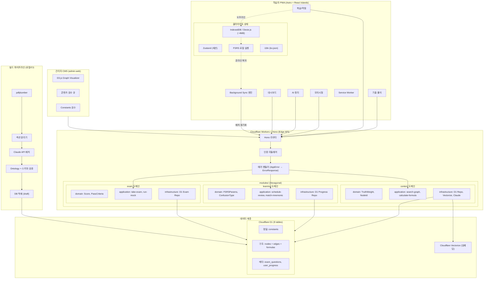
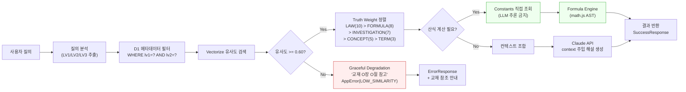
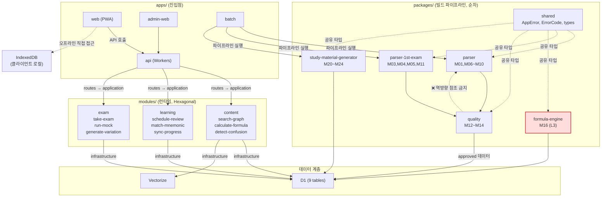
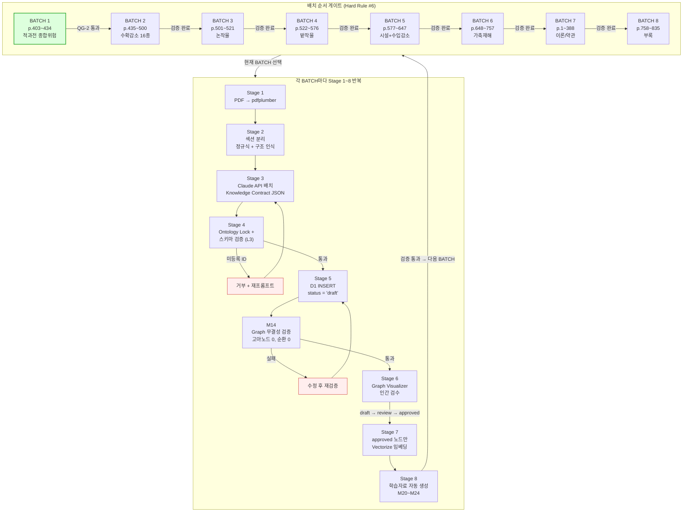
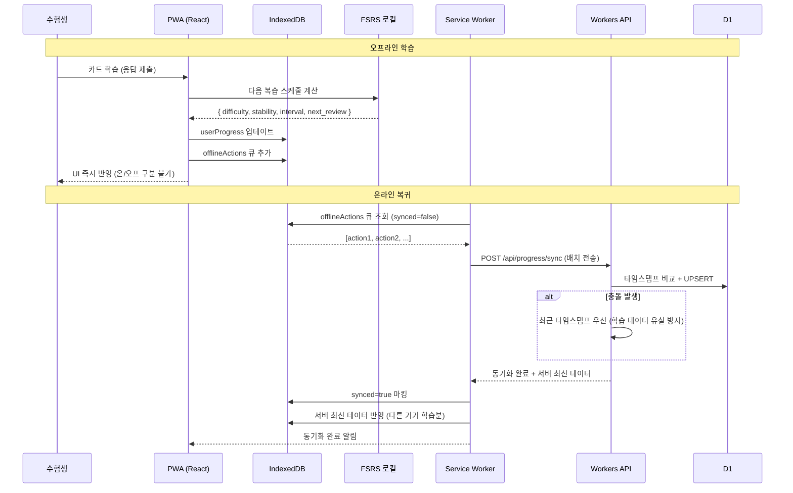
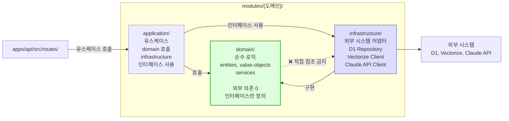
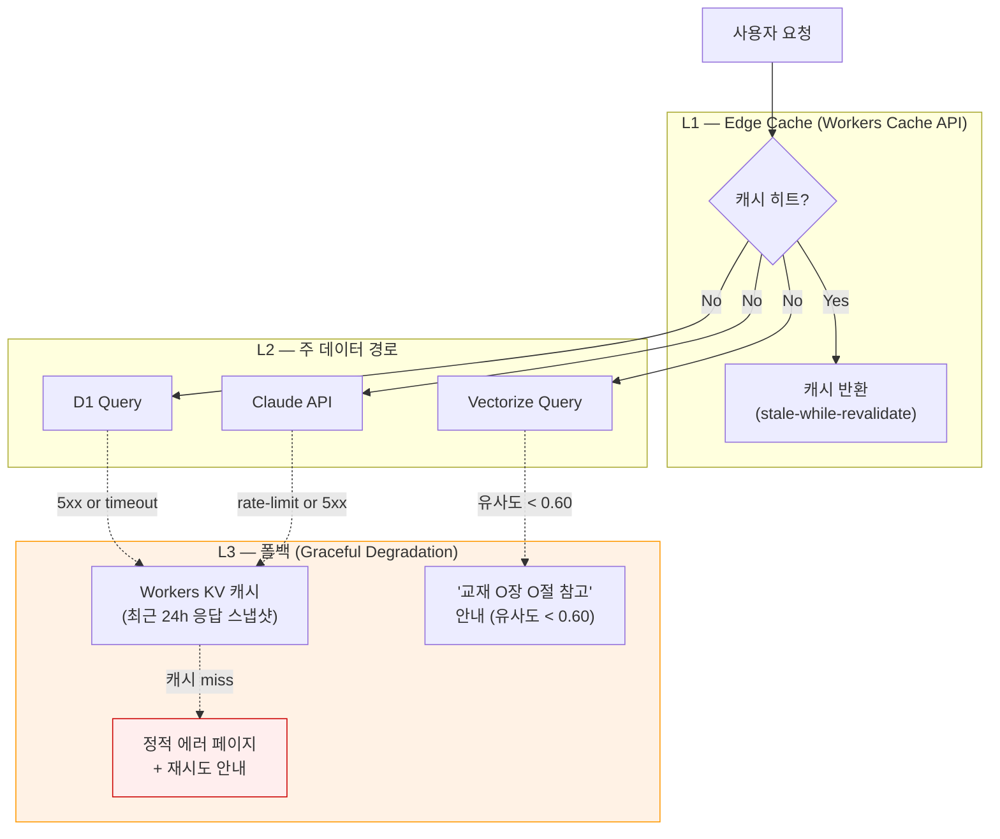

# 쪽집게(ThePick) — 아키텍처 다이어그램 (Mermaid DaC)

> **Diagram as Code** — 구현이 변경되면 다이어그램도 함께 수정한다.
>
> 이 파일은 6종의 아키텍처 다이어그램을 Mermaid.js로 관리한다.
>
> 최종 수정: 2026-04-12

---

## 1. 시스템 조감도

사용자(PWA) → Edge API(Workers) → 데이터 계층(D1/Vectorize)의 전체 흐름.
PWA는 오프라인 시 IndexedDB에서 직접 FSRS를 실행하므로 Workers를 거치지 않는 경로가 존재한다.

---

## 2. 3계층 데이터 흐름

질의가 들어왔을 때 3계층(정밀→구조→맥락)을 어떤 순서로 검색하고, 방어 장치가 어디서 개입하는지.

---

## 3. 모듈 의존관계 그래프

packages/(빌드 파이프라인)와 modules/(런타임 도메인)의 의존 방향.
packages/는 순차 파이프라인, modules/는 Hexagonal 규칙(domain ← application → infrastructure).

---

## 4. 배치 파이프라인 흐름

교재 PDF → 구조화 데이터 → 품질 검증 → 인간 검수 → 학습자료 생성의 8단계.
BATCH N 검증 없이 BATCH N+1 진행 금지 (Hard Rule #6).

---

## 5. PWA 오프라인 동기화 흐름

오프라인 학습 → offlineActions 큐 → 온라인 복귀 시 배치 동기화.
학습 데이터는 유실 방지를 위해 최근 타임스탬프 우선.

---

## 6. Hexagonal Architecture 의존 규칙

modules/ 내부의 3계층 의존 방향. domain은 외부 의존 0.

---

## 7. Graceful Degradation 정책 (계층별)

외부 의존성 장애 시 사용자 경험을 보존하는 계층별 폴백 전략.
Phase 1 Step 1-1 본격 구현 전 ADR-008에서 정량 기준 확정 예정.

**원칙:**

1. **L1 Edge Cache 먼저** — stale-while-revalidate로 지연 최소화
2. **L2 실패 시 L3로 단계적 저하** — 정적 5xx 페이지는 최후 수단
3. **조용한 실패 금지** — 모든 폴백 경로에 `logger.warn(DEGRADED_RESPONSE, { reason })` 기록
4. **사용자 안내 표준화** — 에러가 아닌 "교재 O장 O절 참고" 형태 (재정립서 Graceful Degradation 원칙)
5. **정량 기준은 ADR-008** — 재시도 횟수, 캐시 TTL, 폴백 판단 기준 등

> ### ⚠️ KV 폴백 적용 범위 (Hard Limit)
>
> L3 Workers KV 캐시 폴백은 **read-only 공용 데이터만** 대상으로 한다.
> 사용자별 데이터 및 Write-path는 KV 폴백을 엄격히 금지.
>
> **KV 폴백 허용 (read-only 공용):**
>
> - `knowledge_nodes`, `knowledge_edges`
> - `formulas`, `constants`
> - `exam_questions`, `mnemonic_cards`
> - `topic_clusters`
>
> **KV 폴백 금지 (사용자별 / Write-path):**
>
> - `users`, `user_progress` — 사용자별 PII. stale 캐시가 로그아웃 후
>   Bob 로그인 시 Alice 응답 반환 위험 (Broken Access Control, OWASP A01)
> - `payment_events` / 구독 상태 — stale "구독 활성" 캐시 반환 시 결제 우회 경로
> - Webhook 수신 (`/webhooks/payment` 등) — write-path. D1 5xx 시
>   **503 Service Unavailable + Retry-After 헤더**로 PG 측 재시도 위임.
>   Idempotency 키는 D1 단일 소스에만 보관 (KV 병행 저장 금지)
> - 결제/진도 쓰기 요청 — 동일 원칙 (503 + Retry-After)
>
> **이유:** 사용자별 데이터의 stale 캐시 반환은 인증/결제 경계 침범.
> CLAUDE.md CRITICAL RULE #3 ("try-catch에서 데이터 조용히 삭제 금지")과
> 정답 안전 Hard Stop 원칙의 연장.

**현재 구현 범위 (Year 1):**

- ✅ Vectorize 유사도 < 0.60 거부 → "교재 O장 O절 참고" (ADR-004)
- ⏳ D1 5xx 폴백 (ADR-008 수립 후 Phase 1 Step 1-1 이후) — **read-only 공용 데이터 한정**
- ⏳ Write-path 503 + Retry-After 정책 (Phase 1 Step 1-2 webhook 구현 시)
- ⏳ Claude API rate-limit 폴백 (Phase 2 batch 파이프라인 강화 시)

---

## 다이어그램 관리 규칙

1. **구현 변경 시 다이어그램도 함께 수정** — 코드 PR에 다이어그램 변경이 포함되어야 함
2. **네이밍 일치** — 다이어그램의 모듈명/파일명은 실제 코드와 100% 일치
3. **4-Pass 리뷰 Pass 2(Architect)에서 다이어그램 정합성 확인**
4. **새 다이어그램 추가 시** 이 파일에 섹션 추가 (별도 파일 생성 금지)
