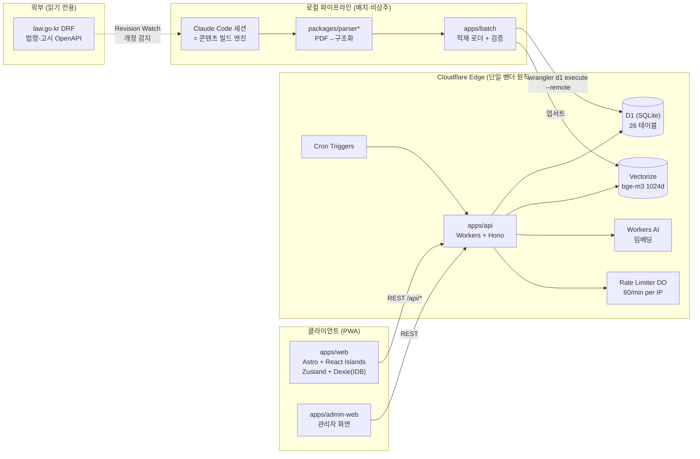
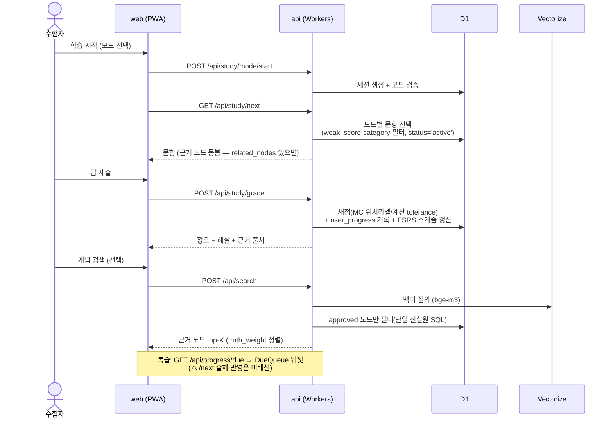
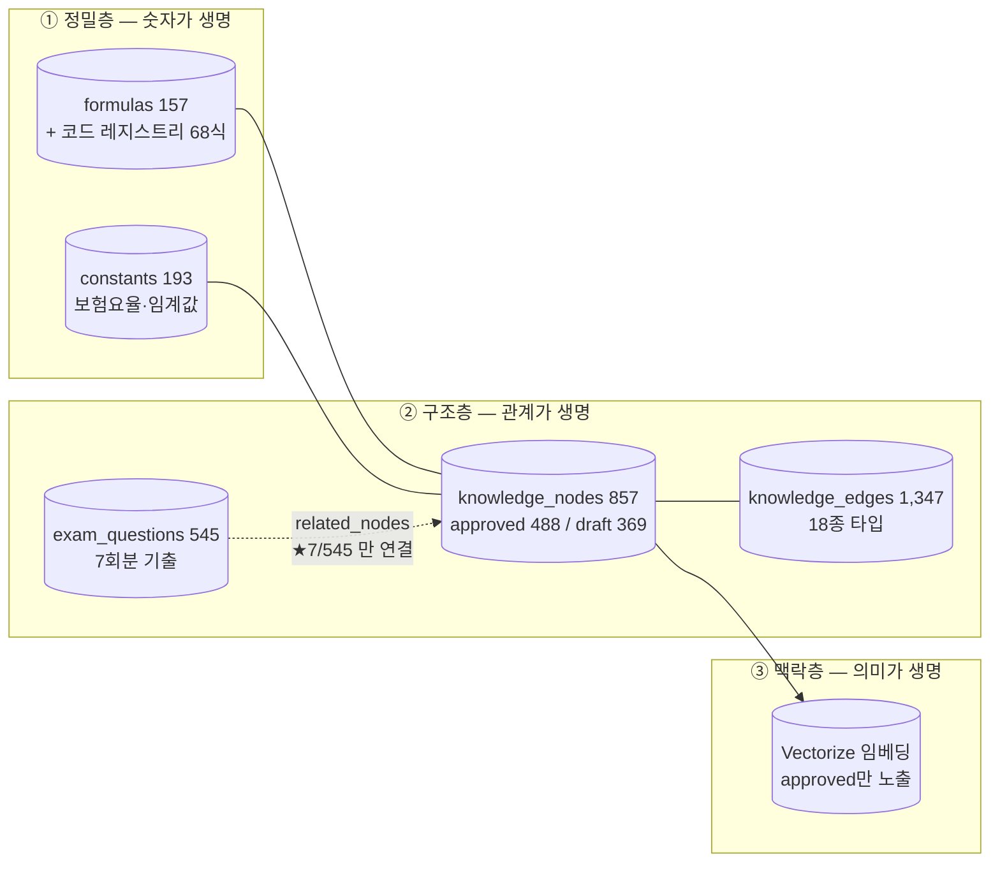
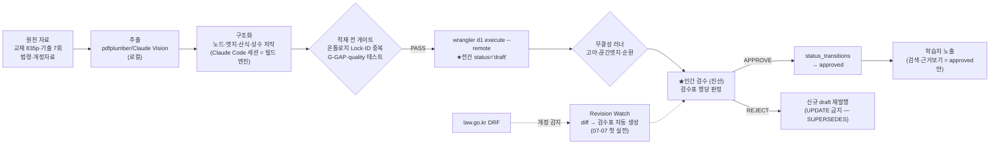
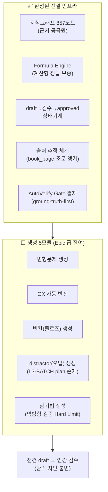

# 쪽집게(ThePick) 백엔드 인프라 중간점검 정본 — 2026-07-07

> **목적**: "무한히 반복되는 백엔드 개발이 얼마나 됐고 언제까지 해야 하나"에 대한 한 장의 답.
> 전 수치 = 실코드·실데이터 실측(3축 병렬 실사 + 07-07 백엔드 감사 + E0-8 역감사 승계). 과대평가 금지 원칙.
> 자매 문서: `docs/architecture/ARCHITECTURE.md`(상세 다이어그램) · `docs/plans/ROADMAP_TO_SERVICE_20260702.md`(시퀀스).
> ⚠️ 07-07 백엔드 감사 원 산출물은 세션 사고로 raw 트랜스크립트만 남음(`docs/audit/backend-infra-audit-20260707.transcript.jsonl` 보존) — **감사 결론의 digest 정본 = 본 문서 §5·§8**.

## 0. 한 장 요약 (TL;DR)

| 질문               | 답                                                                                                                                                                                                                                                 |
| :----------------- | :------------------------------------------------------------------------------------------------------------------------------------------------------------------------------------------------------------------------------------------------- |
| 전체 어디까지 왔나 | **서비스 최소선(가입→풀이→채점→근거보기→복습) 기준 ≈ 65%** — 엔진·파이프라인·품질체계는 상위권, **콘텐츠 연결 데이터**(문항↔근거 링크)와 **검수 적체**가 병목                                                                                      |
| 무엇이 끝났나      | 인증(90) · 문제서빙(85) · 채점(85) · 벡터 검색(70 — 코어 완성·프런트 노출 잔여) · 산식 엔진(95+, 확장 완료) · 적재 파이프라인(85) · 품질 게이트 체계(90)                                                                                           |
| 무엇이 남았나      | **근거보기 데이터(1.3%)** · 복습→출제 루프 배선 · 콘텐츠 자동 생성 5모듈(대부분 0%) · 과금(0%) · 관리자 사용자 CRUD(0%) · 알람 채널(0)                                                                                                             |
| 1차 단독 서비스    | **플랫폼은 준비됨·콘텐츠 데이터 3갭이 관건** — 1차 525문항·정답 100%·MC 채점 완결이나, ①4지선다 보기 데이터 미공급(현재 빈칸식 서빙 — 추출 BATCH=Claude) ②해설 0/525(해설집 자료 조달=진산) ③1차 근거 코퍼스 draft 상태(검수 승급=진산) (상세 §10) |
| 언제까지           | "코어 백엔드"는 사실상 종반전. 남은 것은 ①데이터 작업(백필·검수 — 개발이 아니라 콘텐츠 운영) ②사업 계층(과금·관리자 — 유료화 직전 스프린트) ③생성 자동화(차기 Epic) 의 3덩어리로 성격이 다름 — §11 로드맵                                          |

> **완성도 % 잣대 주의 (이중 수치 해명)**: 위 표의 %(인증 90·산식 95+ 등)는 **엔진 본체 완성도**, §5-B 모듈 %는 **학습자 소비 배선까지 포함한 모듈 완성도**다. 같은 대상이 두 숫자를 가질 수 있다 — 예: 산식 엔진 95+ ↔ M16 75(엔진은 완성이나 학습자 런타임 소비 0 차감), 문제서빙 85 ↔ M25 70, 벡터 검색 70 ↔ M15 60. 세 가지 총계 잣대(65/37/64)는 §5-A 참조.

---

## 1. 백엔드 전체 구조

### 1-A. 기술 아키텍처 (물리 계층)

### 1-B. 기능 구조 (논리 계층 — 7 Layer)

```mermaid
flowchart TB
    L1["L1 수집 (5모듈)<br/>PDF 추출·법령·기출 파서·OCR·웹보강"] --> L2["L2 구조화 (6모듈)<br/>섹션분리·배치·온톨로지·상수·<br/>Revision 감지·토픽 클러스터"]
    L2 --> L3["L3 품질검증 (3모듈)<br/>삼각 교차검증·정답 대조·무결성"]
    L3 --> L4["L4 Core 엔진 (5모듈)<br/>Graph RAG 검색·Formula Engine·<br/>FSRS·혼동 감지·암기법 매칭"]
    L4 --> L5["L5 생성 (5모듈)<br/>변형문제·OX·빈칸·distractor·암기법<br/>⚠️ 대부분 미착수"]
    L4 --> L6["L6 학습서비스 (3모듈)<br/>학습모드·채점·진도"]
    L5 -.-> L6
    L6 --> L7["L7 관리자 (1모듈)<br/>검수·모니터링"]

    style L5 fill:#4a2020,stroke:#a55
    style L1 fill:#1e3a2a,stroke:#5a5
    style L2 fill:#1e3a2a,stroke:#5a5
    style L3 fill:#1e3a2a,stroke:#5a5
    style L4 fill:#1e3a2a,stroke:#5a5
    style L6 fill:#2a3a1e,stroke:#8a5
```

> 다이어그램 모듈 구성 = §5-B 매트릭스(M01~M28)와 동일 정렬. draft→approved **상태기계**와 **Revision Watch**는 28모듈 설계 지도 밖의 신규 축(§5-C·M10)이라 별도 — 이중 선언 드리프트 방지를 위해 매트릭스를 정본으로 한다.

### 1-C. 데이터 흐름 (학습자 1회 학습 사이클)

### 1-D. 3계층 데이터 모델

---

## 2. 기술 스택 (실사용 확정본)

| 계층          | 기술                                                                                       | 상태 비고                                                  |
| :------------ | :----------------------------------------------------------------------------------------- | :--------------------------------------------------------- |
| Frontend      | Astro + React Islands + Tailwind                                                           | shadcn/ui 는 선언만·미도입(실측) — 프론트 본격화 시 결정   |
| 상태/오프라인 | Zustand + Dexie(IndexedDB) + PWA SW                                                        | 캐싱·로컬 영속 실재 / **IDB↔D1 동기화만 stub**(정직 표기)  |
| Backend       | Cloudflare Workers + Hono                                                                  | production 배포 완료                                       |
| DB            | D1 (26 테이블) + Vectorize                                                                 | Drizzle = 타입 전용, 런타임은 raw prepared statement       |
| AI            | Workers AI(bge-m3 임베딩) / Claude(콘텐츠 빌드 — 세션 직접, API 상주 호출 없음)            | 서비스 런타임에 LLM 추론 없음 = 원가·환각 리스크 최소 구조 |
| 산식          | math.js AST 파서 (동적실행 봉쇄 10중 stub)                                                 | 24함수+π·e — 07-07 확장 완료(삼각·exp·deg2rad·각도 lint)   |
| 복습          | ts-fsrs (packages/srs)                                                                     | 엔진+API 배선 완비                                         |
| 품질          | Vitest(전 워크스페이스 ~1,500+ 테스트) + Playwright E2E 20 + husky/lint-staged + g1 게이트 | 리뷰 프로토콜(4-Pass·5-페르소나) 포함                      |
| 외부          | law.go.kr DRF (Revision Watch)                                                             | OC 키 발급·IP 등록 완료, 첫 실감지 실적                    |

---

## 3. 데이터 처리 파이프라인 (원문 → 서비스)

핵심 성질 3가지:

1. **AI 는 draft 까지만** — 학습자에게 닿는 모든 지식은 인간 검수를 거친 approved 만 (Hard Limit).
2. **UPDATE 금지 (Temporal Graph)** — 개정은 신규 노드 + SUPERSEDES 엣지 → 개정 이력이 그래프에 남음 = 매년 개정 대응의 구조적 토대.
3. **무음 실패 0 설계** — 적재 카운트 검산·무결성 러너·fail-loud 관례 (E0-8 역감사에서 "무음 skip 0" 실증).

## 4. 콘텐츠 생성 파이프라인 (현재 = 반자동, 목표 = 자동생성관리)

**현재 실태 (정직)**: "생성"은 아직 **사람(진산)+Claude Code 세션의 반자동 저작**이다. 설계상의 자동 생성 5모듈(변형문제·OX·빈칸·distractor·암기법)은 §5 매트릭스 기준 대부분 0% — 이것이 백엔드 잔여 중 가장 큰 "신규 개발" 덩어리다. 단, 자동 생성의 **선결 인프라는 대부분 완성**되어 있다:

**2차 실기 문제 패턴 자산**: topic_clusters 50행(2차 2과목 기출 역공학 — 주제×배점 매핑)이 "패턴 파악"의 시드. 자동 생성까지의 사슬 = §5-B 참조.

---

## 5. 전체 모듈 완성도 매트릭스 (설계 지도 28모듈 전수 실측)

> 실사 방법: 4개 독립 read-only 서베이(api/packages/batch·migrations/web 소비) + 교차 검증. 완성도% = 실코드·실데이터 근거만.
> 분모 표기 규약: **545** = 기출 전수 / **534** = active(서빙 대상 = 545 − flagged 11) / **525** = 1차만.

### 5-A. Layer 별 요약

| Layer                | 모듈 수 |   평균   | 한 줄 판정                                                                                                      |
| :------------------- | :-----: | :------: | :-------------------------------------------------------------------------------------------------------------- |
| L1 수집              |    5    |   36%    | PDF 추출(90)이 홀로 견인 — 법령 자동수집·웹보강 0(수작업 대체 중), 기출 파서는 코드만(orphan)                   |
| L2 구조화            |    6    |   62%    | 섹션분리·검증기·상수추출 견고(85~95) — Revision 감지(10)·토픽 클러스터러(10)가 구멍                             |
| L3 품질검증          |    3    |   32%    | 무결성 검증기(95) 단독 우수 — 삼각교차·정답대조기는 코드 0(에이전트 프로세스로 대체 중)                         |
| L4 Core 엔진         |    5    |   47%    | **엔진 품질은 높으나 "소비자 단절"이 공통 병목** — 검색 프런트 소비 0·산식 런타임 소비 0·혼동감지 15·암기매칭 0 |
| **L5 생성**          |    5    |  **0%**  | **전면 공백** — study-material-generator = `export {};` 1줄. 최대 잔여 덩어리                                   |
| L6 학습서비스        |    3    |   43%    | 기출 풀이 사이클(70) 실가동 — 복습 부분(45)·모의시험(15) 미완                                                   |
| L7 관리자            |    1    |   35%    | 컴포넌트는 있는데 배선이 없다(telemetry 만 live — 검수큐·Visualizer 미마운트)                                   |
| **28모듈 단순 평균** |         | **≈37%** | (1,045/28 = 37.3 — 검증 재계산 07-08)                                                                           |

**★잣대 주의 — 37% vs 65% vs 64% 가 다 다른 이유**: ①37% = 설계 지도 28모듈 단순 평균(생성층 통째 0 이 평균을 끌어내림) ②65% = 서비스 최소선(풀이 사이클) 가중 — 산술이 아닌 가중 판단치 ③64% = 로드맵 마일스톤. **인프라·측정·품질 하네스(인증 강화 3,929줄·eval 하네스·telemetry·batch 운영·게이트 스크립트 = "지도 외 신규" 13종)는 28모듈 분모에 없다** — 즉 37%는 최저 잣대이며, "무한 반복" 체감의 정체는 지도에 없던 견고화 작업이 컸기 때문(아래 §5-C).

### 5-B. 모듈별 상세 (Layer 순)

| #      | 모듈              |   %   | 상태 · 잔여                                                                                                              |
| :----- | :---------------- | :---: | :----------------------------------------------------------------------------------------------------------------------- |
| M01    | PDF 추출          |  90   | 교재 835p·기출·법령 21종 추출 실적. 유지보수만                                                                           |
| M02    | 법령 수집기       |   0   | 수작업 대체 완료(법령 노드 적재됨) — **Revision Watch 가 실질 후계**(plan 기결·코드 0)                                   |
| M03    | 기출 파서         |  50   | 코드 338줄(barrel 제외 335) 실재하나 소비자·테스트 0(orphan) — 기출 545는 별도 SQL 경로로 적재 완료. 처분 = M1 Q5        |
| M04    | Vision OCR        |  40   | 파이프라인 편입·기본 off. 1호는 불요(멀티모달 충분 기결) — 2호용                                                         |
| M05    | 웹 보강           |   0   | 필요성 재평가 대상                                                                                                       |
| M06    | 섹션 분리         |  85   | 완료                                                                                                                     |
| M07    | Claude 배치       |  80   | TS 하네스 완성 — 실적재는 Path A(Claude Code 직접) 로 수행 중(API 하네스는 예비)                                         |
| M08    | 온톨로지 검증     |  95   | 레포 최대 검증기(1,572줄)                                                                                                |
| M09    | 상수 추출         |  90   | constants 193 적재 실적                                                                                                  |
| M10    | Revision 감지     |  10   | ★스키마 선작성(0041/0042)+plan 결재 완료+OC 라이브 첫 실감지 실적 — 상주 코드 0                                          |
| M11    | 토픽 클러스터러   |  10   | 소비 라우터는 있는데 **생산자 0** (topic_cluster 0/534)                                                                  |
| M12    | 삼각 교차검증     |   0   | 코드 0 — 독립 에이전트 적대검증 **프로세스**로 대체 중(명문화 필요)                                                      |
| M13    | 기출 정답 대조기  |   0   | QG-3 미기계화 — **생성층(L5) 진입 전 선결 후보**                                                                         |
| M14    | Graph 무결성      |  95   | production 정기 실행 실적(고아 24 = 데이터 debt 별건)                                                                    |
| M15    | Graph RAG 검색    |  60   | 백엔드 회로·측정 인프라 완성 — graph 순기여 0(3차 실측)·**프런트 소비자 0**                                              |
| M16    | Formula Engine    |  75   | 359 테스트·07-07 확장 완료 — D1 89건 display-only·**학습자 런타임 소비 0**                                               |
| M17    | FSRS              |  85   | 실가동(채점→스케줄 갱신 배선 완료)                                                                                       |
| M18    | 혼동 감지         |  15   | 컬럼 pass-through 만 — 감지 알고리즘 미구현(confusion 모드 미배선 원인)                                                  |
| M19    | 암기법 매칭       |   0   | 테이블만 존재                                                                                                            |
| M20~24 | **생성 5모듈**    | **0** | `export {};` — G-1 R1~R5 전수 + AutoVerify Gate 설계 후 착수(기결 순서)                                                  |
| M25    | 기출 풀이         |  70   | 실가동(2,100줄·7 endpoint·테스트 97) — 모드 3/5·근거 데이터 1.3%                                                         |
| M26    | 복습/약점         |  45   | due 큐·weak 정렬 실재 — /next 출제 반영 미배선(WS-5c)                                                                    |
| M27    | 모의시험+대시보드 |  15   | 추이 시각화만 — 모의시험 본체(타이머·합격판정) 미착수                                                                    |
| M28    | 관리자 CMS        |  35   | GraphVisualizer·ContentQueue **미마운트** / DistractorQueue 는 마운트됐으나 mock 데이터 주입 / **실연동은 telemetry 뿐** |

### 5-C. 설계 지도 외 신규 구현 (13종 — "보이지 않던 진척")

graph-walk+측정 하네스(북극성 eval — golden v2·3차 실측) / multi-path 폴백 / **인증 강화 스위트**(3,929줄·테스트 113) / 결제 웹훅 수신기(HMAC·재생방어 — 소비자 0) / Engine Telemetry 8게이지+cron / Table-as-Micro-KG 스키마 / Revision Watch SQL 선작성 / batch 운영 하네스(5,823줄 — checkpoint·cost-meter·QG-2) / formula-sync 드리프트 검출(55건 실적) / 계약 검증기(1,528줄)+g1 게이트 / ai-adapter(의도적 stub) / 2호 회로 PoC(1,960조합 전수검증) / 각도규약 lint.

### 5-D. 마이그레이션 현황

| 구간           | 상태                                                                                     |
| :------------- | :--------------------------------------------------------------------------------------- |
| 0001~0038      | **production 적용 완료** (0038 = 07-02, related_nodes 백필 7건 실재로 확증. 0020은 결번) |
| 0039·0040      | 슬롯 예약만(파일 없음 — WS-2b·WS-6c plan 결재 대기)                                      |
| 0041·0042      | **선작성본**(Revision Watch — 리뷰 완료·production 적용 = 진산 인증 게이트)              |
| migrations-v2/ | 종목-제네릭 템플릿 정본(2호용)                                                           |

---

## 6. 학습 콘텐츠 축 상세

### 6-A. 신규 자료 등록 절차 (현재 확립된 8단계 — 표준 템플릿화 완료)

식별 → pdfplumber 추출 → 지식그래프 JSON 저작(온톨로지 Lock) → 진산 표본 검수 → SQL 생성 → `wrangler d1` draft 적재 → 무결성 러너 → 검수표(행당 APPROVE/FIX/REJECT). **종목 확장용 템플릿**(`docs/playbooks/_template/`)로 파라미터화 완료 — E0-8 갭 보강 P1~P3 이 이 절차로 CRITICAL 0 실적. 배치당 규모 4~123노드.

### 6-B. 문제 자동 생성 — 모듈별 실태 (정직 표)

| 모듈                  |        코드        | 데이터  | 차단 게이트                                                   |
| :-------------------- | :----------------: | :-----: | :------------------------------------------------------------ |
| 플래시카드            |         0%         |    0    | Phase 2 진입 체크리스트 1/5                                   |
| OX·빈칸               |         0%         |    0    | AutoVerify feasibility + "생성 정답 100%" 게이트(QG-6) 미존재 |
| 기출 변형             |         0%         |    0    | F6 G-1 R1~R5 전수 → 진산 R5 GO/STOP                           |
| 암기법                |         0%         | **0행** | 역방향 검증 Hard Limit + 생성기 부재                          |
| distractor(오답 보기) | 스키마+채점 계약만 |    0    | Step 3-UX-7b~7f BATCH (L3) — **객관식 4지선다 라이브의 선결** |

**2차 실기 패턴 → 예상문제 자동생성 갭 사슬** (기결 순서·현 위치 = 앞단):
E0 종결(2차 answer NULL 20 처분 + 545 백필 결재) → WS-6 격리 스테이징(mock_exam_questions — 생성물이 기출 테이블 직행 못 하게) → F6 생성엔진 G-1 전수(R3 spike = "변형 후 정답 100% 보존" 실측) → 진산 R5 → distractor·calc_variables·topic_cluster populate BATCH → AutoVerify 게이트 + 표본 검수.

**패턴 자산 실태**: topic_clusters 50행 = 2차 2과목 10년치 출제 역공학(11영역×배점축+개정 drift 7건) — "지도"는 실재. 단 문항 결속(question_ids)·topic_cluster 컬럼 0/534 미populate = 지도와 문항이 아직 안 이어져 있음.

### 6-C. 2차 실기 문항 현황 (정직)

2차 = **20건(제11회)만 적재, active 9/flagged 11, 전건 answer·explanation NULL**(정답이 본문에 혼입 — E0-7 분리 처분 대기). `/study/next` 기본 examType='1st'. 2차 자동채점 = 현재 0%(self-grade plan 별도). **⇒ 2차는 콘텐츠·채점 양면에서 서비스 거리가 멀고, 1차와의 격차가 §10 "1차 단독 우선"의 핵심 근거.**

---

## 7. 사용자 학습 진도 관리 상세

### 7-A. 무엇이 기록되나 (테이블 4종)

| 테이블         | 핵심 필드                                                                                                                            | 용도                                        |
| :------------- | :----------------------------------------------------------------------------------------------------------------------------------- | :------------------------------------------ |
| user_progress  | FSRS 8필드(difficulty/stability/interval/next_review/reps/lapses/state/last_review) + weak_score + mastered_at + last_confusion_type | 카드별 숙련도·복습 스케줄                   |
| study_reviews  | rating(again/hard/good/easy)·interval·stability 전후·**shuffle_seed**                                                                | 리뷰 이력 원장(멀티디바이스 복원·감사 추적) |
| study_sessions | mode+params·phase(warmup/main/cooldown)·계획/완료 수                                                                                 | 세션 단위 통계                              |
| streak_records | 현재/최장 연속·KST 일자·daily_goal(20)                                                                                               | 동기부여 축                                 |

### 7-B. 흐름: 채점 1회가 갱신하는 것

채점(4유형: MC 시드셔플·빈칸·서술 self-rating·계산 tolerance) → FSRS 스케줄 재계산 → weak_score(α=과목 정답률 0.6 + β=안정도 0.4) → user_progress UPSERT → 리뷰 원장 INSERT → 세션 phase 전이 → streak(KST·DISTINCT 카드) → telemetry(learning_slo). **상용 수준으로 실재하며, 미배선 모드는 422 이중 차단(정직성 가드)까지 갖춤.**

### 7-C. 고도화용 데이터 축적 갭 (개인화·사업 분석 관점 — 지금 안 쌓이는 것)

1. **제출 답안 원문 미저장** — 어떤 오답을 골랐는지 복원 불가 → 오답노트·distractor 유효성 분석 재료 부재 (★오답노트 기능 자체가 없음)
2. **개념(노드) 단위 숙련도 미누적** — 문항 단위만 기록 → "이 개념이 약하다" 지도 없음(weak_score β축 영구 폴백 원인)
3. due 큐 → 출제 미반영(WS-5c) / topic·confusion 축 통계 불가(데이터 천장)
4. 문항당 풀이 시간 미기록(세션 단위만) / daily_goal 변경 API 없음
5. 오프라인 학습 기록 유실 경로(IDB↔D1 stub)

⇒ **①②는 스키마 소폭 추가로 지금부터 쌓을 수 있는 것** — 데이터는 소급 불가능하므로 유저 받기 전 결정 권장(§11).

---

## 8. 사업 관리자를 위한 백엔드 (인증·과금·모니터링·사용자 관리·데이터 축적)

### 8-A. 인증 — 코어 완비(90%), 계정 라이프사이클은 런칭 스프린트 묶음

가입/로그인/로그아웃/토큰갱신 4종 production 가동 — 상용급 방어(열거 공격 차단·타이밍 평탄화·refresh 재사용 감지 시 전 세션 파기·로그인 이력). **남은 것(기결 이월)**: 이메일 인증·비밀번호 재설정·회원탈퇴·프로필 조회 = 법무 3종과 함께 유료 오픈 직전 1주 스프린트. 런칭 토글 3종(비밀번호 4자리 완화 해제·HIBP 활성·테스트 자동로그인 제거).

### 8-B. 과금 — 수신 인프라만 실재(웹훅 HMAC·재생방어), 비즈니스 로직 0

- 실재: 결제 웹훅 수신기(4 PG 예약: PortOne/Toss 등) + users 테이블 구독 컬럼(쓰는 코드 0)
- 잔여 전체: **PG 선정 결재 → subscriptions 테이블 마이그(L3) → PG 구현 → 구독 갱신 로직 → CS용 관리자 화면** — Cloudflare에 결제 상품이 없어 외부 PG는 필수(ADR-002 기결 예외)
- 유료 전환율 게이트(E1-5)는 선택 결재로 미결 — **과금 착수 시점 자체가 진산 결정 사항**

### 8-C. 사용자 관리 CRUD — **0% (최대 공백 중 하나)**

관리자용 유저 조회/정지/삭제/구독부여 API·화면 전무 — 현재 유일 수단 = `wrangler d1` 직접 SQL. 정지 **집행**은 먹히는 구조(refresh 시 status 재검증→전 세션 파기)라, 잔여는 "정지시키는 버튼"뿐. admin-web은 3화면(telemetry만 실연동·검수큐/Visualizer 미마운트). 관리자 인증도 임시 토큰(Cloudflare Access 전환 예정).

### 8-D. 모니터링 — "새벽 3시 장애를 아무도 모른다"가 현 상태 (35%)

- 있는 것: 8게이지 telemetry + 무음실패 cron 감시 + /status 정적 대시보드
- **없는 것: 알림 채널 0** — 장애 인지 = 운영자가 능동적으로 로그를 볼 때만. cron 실패 자체의 알림도 없음. /health 는 D1 프로브 없는 정적 응답
- 처방(기결): Email Routing 활성(ADR-043 carry-over) — 베타 전 최소 1채널 필수

### 8-E. 고도화용 데이터 축적 — 학습 원시 데이터는 풍부, 행동·분석층은 0

| 지금 쌓임 ✅                                                                                                                                   | 안 쌓임 ⬜ (소급 불가 — 유저 받기 전 결정 권장)                                                                                                                                                  |
| :--------------------------------------------------------------------------------------------------------------------------------------------- | :----------------------------------------------------------------------------------------------------------------------------------------------------------------------------------------------- |
| 로그인 이력(IP해시·UA) / 카드별 FSRS·약점·혼동유형 / 리뷰 원장(셔플시드까지) / 세션·스트릭 / 검색 정직거부 로그 / 운영 게이지 / 결제 웹훅 원본 | **제출 답안 원문**(오답 분석·오답노트 재료) / **성공 검색 쿼리**(수요 데이터) / 제품 행동 이벤트(퍼널·리텐션·DAU — Analytics Engine 미바인딩) / A/B 인프라 / 문항당 풀이 시간 / 개념 단위 숙련도 |

## 9. 개발자·운용자·기획자가 알아야 할 것

1. **이 프로젝트의 실제 "엔진"은 코드만이 아니라 프로세스다** — 적재 플레이북·이진 게이트·독립 리뷰(4-Pass/5-페르소나)·검수표 체계가 콘텐츠 정확성의 본체(엔진분리 검토 07-04 확증). 종목 확장 시 이 프로세스가 템플릿으로 복제된다.
2. **반복 결함 클래스 3가지** (신규 작업 시 자기점검): ①"스키마 존재 ≠ 데이터 populate"(topic_cluster 0/534, related_nodes 7/545, mnemonic 0행) ②"엔진 완성·소비자 0"(검색 프런트 0, 산식 런타임 0, admin 미마운트) ③이중 선언 드리프트(산식 55건, 정렬키 사본 등 — 단일 진실원+파생으로 봉인하는 것이 관례).
3. **L3 성역**: formula-engine·constants·온톨로지·DB 마이그·user_progress = plan+인간 승인 없이 코드 금지. UPDATE 금지 테이블(knowledge_nodes 등) = SUPERSEDES 신규 노드.
4. **운영 절차 현주소**: 배포 = wrangler 수동(Git 자동배포 없음) / 무결성 러너 = 수동(결재 #18 기결) / production D1 변경 = 진산 인증 게이트. push #14 보류로 로컬 커밋 다수 — 유실 리스크는 push 1회로 해소. **장애 시 확인 순서(런북 최소형)**: ①`/status/` 정적 대시보드 ②admin-web telemetry 화면(8게이지) ③`wrangler tail` 실시간 로그 — 알림 채널 0 이므로 현재는 전부 능동 확인(§8-D 처방 참조).
5. **기획 관점 북극성**: "생성물 신뢰성·정확성" — 그래서 검색 정확도 측정(G-S5)과 콘텐츠 검수가 기능 개발보다 앞에 선다. 자동 생성(L5)은 이 북극성의 게이트(G-1 전수+AutoVerify)를 통과해야 착수.

## 9.5 프론트엔드 연동 관계 (UIUX 검토 결과 ↔ 백엔드 현황)

07-07 UIUX 방법론 검토와의 접점 (⚠️ 검토 원 산출물도 세션 사고로 raw 트랜스크립트만 잔존 — `docs/audit/uiux-methodology-review-20260707.transcript.jsonl` 보존, 결론 digest = 아래 표 + 원 경로 스텁):

| UIUX 기법(즉시군)              | 백엔드 준비 상태                                                      | 준비도                    |
| :----------------------------- | :-------------------------------------------------------------------- | :------------------------ |
| M2 카드 플립+FSRS 4단계 평가   | 엔진·스키마·API 완비 (rating 4종 이미 원장 기록) — **UI 노출 전환만** | ✅ 즉시                   |
| M1 빵꾸노트(+M9 힌트)          | 서빙 대상(active 534) 전량 fill_blank = 대상 전면                     | ✅ 즉시                   |
| F9 목차 지형도(MOC)            | chapter/section 사실상 전량 populate — 조회 API 1개 신설이면 됨       | ✅ 즉시(소규모 API)       |
| M14 스트릭                     | 스키마+API+UI 대부분 기배선                                           | ✅ 마감만                 |
| F4 하중벽 히트맵·근거보기 강화 | related_nodes 7/545                                                   | ⬜ **백필 후**            |
| M4 혼동 페어                   | confusion_type 0/545 (DIFFERS_FROM 38쌍 시드 가능)                    | ⬜ 분류 백필 후           |
| F1/F2 그래프 조감·줌           | 노드/엣지 학습자 조회 API 부재 + D3 미도입(web)                       | ⬜ projection API 신설 후 |
| M13 암기 카드                  | 생성 엔진 0 (L5)                                                      | ⬜ Epic                   |

- ★**주의**: 클로드디자인 랩(`docs/사용자UIUX/학습 인터랙션 랩.html`)은 로더 셸만 반입 — **lab/\*.jsx 10개 원본 반입 필요**(진산). 반입돼도 스택 격차(React 18 UMD/CDN ↔ 실스택 React 19/빌드)로 "명세 참조 → 재구현" 경로가 정석(claudeDesign 선례와 동일).
- 프론트가 소비할 수 있는 API 표면(현재): auth 4종 + study 7종 + progress 3종 + search 2종(학습자 미노출) + telemetry(관리자). 그 외 비-프론트 표면 = webhooks(PG 수신용)·admin/vectorize(관리자 운영용). **검색을 학습자 화면에 노출하는 결정** = 프론트 설계 단계의 첫 갈림길(백엔드는 준비됨 — vector 73.7~78.9%).

## 10. ★1차 시험 단독 우선 서비스 체크 (사실 — 판정은 진산)

### 10-A. 1차가 유리한 사실

- **문항·정답 완비**: 1차 525문항(제5~11회 × 75, 3과목 균등) · **정답 100%**(복수정답 6건 포함 위치라벨 정본) — 2차(20문항·정답 전량 미분리)와 대비 압도적
- **채점 완결**: 객관식 채점 코드·계약 기결(테스트 116) — 2차 계산형의 모든 이슈(산식 드리프트 55·display-only 89·자동채점 0%)를 **전부 회피**
- 과목별 학습 모드(3과목 픽커)·FSRS·스트릭 루프 = 이미 1차 기준으로 가동 중

### 10-B. 1차 단독의 진짜 갭 3개 (전부 콘텐츠 데이터 — 플랫폼 개발 아님)

| 갭                         | 실측                                                                                                                           | 해소 경로                                                                                                |
| :------------------------- | :----------------------------------------------------------------------------------------------------------------------------- | :------------------------------------------------------------------------------------------------------- |
| ① **4지선다 보기 미공급**  | distractors 전량 NULL·input_type 전량 'fill_blank' — **현재 1차 문항이 빈칸 입력식으로 서빙됨**(MC 코드는 완비·휴면)           | 기출 원문의 ①~④ 보기 추출 BATCH(7b~7f 기결 plan) — 신규 창작이 아니라 **원문 추출**이라 환각 리스크 낮음 |
| ② **해설 0/525**           | explanation 전량 NULL = 1차 전체                                                                                               | **1차 해설집 원천 자료 확보(진산 조달)** 후 BATCH — 자료 자체가 현재 없음                                |
| ③ **1차 근거 코퍼스 얇음** | approved 488 = 2차 실무 집중 / 1차용 approved ≈ 0~15 / 법령·요령 59건 = **draft 검수 대기**(P1·P2) / 상법·농학 코퍼스 = 미적재 | P1·P2 검수 승급(즉효) + 상법 61조문 처분(B-1) + 농학 자료 조달                                           |
| 공통                       | related_nodes 3/525 (근거보기)                                                                                                 | 백필 Phase C — ①과 같은 BATCH 사이클에 병합 가능                                                         |

### 10-C. 함의 (사실 정리)

1차 단독은 **"백엔드를 더 만드는 문제"가 아니라 "콘텐츠 데이터 3종을 공급하는 문제"**다. 시험 무관 플랫폼 잔여(near-launch 묶음: draft 누출 봉합·due 반영·자동로그인·알람 1채널·push)는 1차/2차 동일하게 남는다. 반면 2차의 무거운 잔여(정답 분리·계산 채점·교재 1권 전체 미적재·5~10회 2차 기출 부재)는 전부 회피된다. **① 보기 추출 BATCH가 착수 가능한 최단 경로**(원문 추출·기결 plan 존재)이고, ②는 진산 자료 조달이 선행이다.

## 11. "언제까지 해야 하나" — 남은 일의 성격별 3덩어리

```mermaid
flowchart LR
    subgraph NOW["덩어리 1 — 1차 서비스화 (콘텐츠 운영, 개발 소량)"]
        A1["보기 추출 BATCH<br/>(525 × ①~④)"]
        A2["P1·P2 59건 검수 승급<br/>(진산 행위)"]
        A3["related_nodes 백필"]
        A4["draft 누출 봉합·due 반영<br/>(코드 소건 2)"]
    end
    subgraph LAUNCH["덩어리 2 — 유료화 직전 스프린트 (기결 묶음)"]
        B1["법무 3종·탈퇴·이메일 인증"]
        B2["과금: PG 선정→구독 마이그→구현"]
        B3["관리자 유저 CRUD + 알람 1채널"]
        B4["자동로그인 제거·정책 복원"]
    end
    subgraph EPIC["덩어리 3 — 자동 생성 Epic (북극성 게이트 후)"]
        C1["G-1 R1~R5 전수 + AutoVerify"]
        C2["생성 5모듈 (변형·OX·빈칸·암기법)"]
        C3["모의시험 엔진"]
    end
    NOW --> LAUNCH --> EPIC
```

- **덩어리 1이 끝나면 "1차 무료 베타" 형태의 실서비스 성립 요건이 충족**된다(서비스 개시 판정 = 진산) — 성격상 대부분 콘텐츠 BATCH+검수(확립된 파이프라인 반복)이지 신규 백엔드 개발이 아니다.
- 덩어리 2는 유료 오픈 직전 집중 스프린트로 기결(이월)돼 있고, 덩어리 3은 별도 Epic(착수 자체가 결재 게이트).
- 기간(일/주 단위) 추정은 본 문서에서 의도적으로 배제한다 — 일정은 진산 통제 영역(프로젝트 정책). 본 문서가 답하는 것은 "남은 일의 종류와 순서"까지다.
- **"무한 반복" 체감의 정답**: 코어 백엔드(엔진·품질·측정)는 종반전이 맞다 — 남은 것은 종류가 다른 일(콘텐츠 운영·사업 계층·생성 Epic)이며, 각각 시작·끝이 명확한 덩어리로 관리 가능하다.

---

_작성: Fable 5, 2026-07-07 · 실사: 3축 병렬 에이전트(모듈 매트릭스 4-서베이·콘텐츠/진도·관리자/1차) + 07-07 백엔드 감사 승계 · 전 수치 실코드/실SQL 근거._
_검증: 2026-07-08 독립 3렌즈(코드 주장 20건 / D1 라이브 수치 / 커버리지·정합성·Mermaid 7블록 실파싱) — CRITICAL 0 / MAJOR 4 / MINOR ~10 전건 반영. 리뷰 정본 `.claude/reviews/review-20260708-101431-midpoint-backend-doc.md`._
