# Phase 2 기술부채 워크플로우 — 진산 운영 가이드 (살아있는 문서)

> **목적**: 5-페르소나 리뷰 (`./phase2-tech-debt-20260529-INDEX.md`) 의
> CRITICAL 27건 + Q1~Q4 결재 + TR-0~TR-4 권고 매트릭스를 한 페이지로
> 운영 가능하게 만든다. 한 화면에 (a) 현 위치 (b) 다음 행동 (c) 게이트
> 종류 (d) 분기 트리 (e) 진척 표시.
> **갱신 의무**: 차세션은 §6 진척 추적 표를 갱신한다 (handoff/WBS 동기
> [[feedback_cycle_closure_realcode_gate]]).
> **작성**: 2026-05-29 (Session 092) / **마지막 갱신**: 2026-05-29 Session 092

---

## 0. TL;DR (15초 읽기)

```
현 위치 ──→ 【이중 게이트 묶음】  (Session 093 진입 직후)

  A. TR-0 plan 결재    (진산)  →  docs/plans/tr-0-backend-c7-trigger-redesign.plan.md
  B. golden-pilot 검수 (진산)  →  docs/plans/s5-6-measurements/golden-pilot-draft.md
                                                         ⤷ 둘 다 결재되어야
                                                            다음 코딩 진입
```

**가장 큰 차단선**: backend C-7 trigger 가 검수만 끝내고 backfill 시도 시
즉시 ABORT. TR-0 plan 채택과 검수는 반드시 묶음으로 결재.

**오늘 진산 행동 (5분)**:

1. `docs/plans/tr-0-backend-c7-trigger-redesign.plan.md` §4.1 옵션 (A안 단순 vs B안 question_node_links 묶음) **하나 선택**
2. `docs/plans/s5-6-measurements/golden-pilot-draft.md` 12 문항 APPROVE/FIX/REJECT **첫 문항부터 진행**

---

## 1. 의존 다이어그램 (한눈에 보기)

```mermaid
flowchart TD
    classDef done fill:#1b5e20,stroke:#fff,color:#fff
    classDef now fill:#bf360c,stroke:#fff,color:#fff,stroke-width:3px
    classDef jin fill:#ef6c00,stroke:#000,color:#000
    classDef l3 fill:#fbc02d,stroke:#000,color:#000
    classDef auto fill:#2e7d32,stroke:#fff,color:#fff
    classDef branch fill:#6a1b9a,stroke:#fff,color:#fff
    classDef block fill:#b71c1c,stroke:#fff,color:#fff

    S092[Session 092 종착<br/>리뷰 + Q1~Q4 결재 + plan/인벤토리/워터마크 영속]:::done

    S092 --> DG{★이중 게이트 묶음<br/>현 위치}:::now

    DG --> GA[게이트 A<br/>TR-0 plan 결재<br/>옵션 A안 or B안]:::jin
    DG --> GB[게이트 B<br/>pilot 12 검수<br/>APPROVE/FIX/REJECT]:::jin

    GA -->|결재| ADR[ADR-046 작성<br/>본문/메타/상태 3분류 정책]:::auto
    GB -->|검수| FRZ[golden-pilot-approved.json 동결<br/>mechanical, D1 write 0]:::auto

    ADR --> M38[마이그 0038 SQL 신설<br/>prevent_exam_questions_body_update]:::l3
    M38 --> RV1[4-Pass 독립 리뷰<br/>G-TR0-1~4 테스트 작성]:::auto
    RV1 --> PRV[D1 preview DB dry-run<br/>통합 테스트 PASS 확인]:::auto

    PRV --> AUTH1{진산 인증 게이트<br/>wrangler --remote}:::jin
    AUTH1 -->|적용| PROD[production trigger 재설계 완료<br/>G-TR0-5 smoke]:::done

    FRZ --> BF[backfill UPDATE 실행<br/>related_nodes 라벨 적재]:::auto
    PROD --> BF

    BF --> AUTH2{진산 인증 게이트<br/>wrangler dev --remote}:::jin
    AUTH2 -->|측정| MEAS[G-S5 pilot 측정 실행<br/>+ Pass2 m-2 D-2 재측정]:::auto

    MEAS --> BR{측정 결과 분기<br/>★N=12 워터마크 영속}:::branch

    BR -->|signal 명확| EXP[30~50 확대 결재<br/>Phase B 보기별 라벨 진입]
    BR -->|signal 모호| RVAL[harness 신뢰성 재검증<br/>Pass2 m-2 결과 대조]
    BR -->|NO-GO| BLK[S5-7 통합 보류<br/>옵션 C 격리 유지]:::block

    EXP --> TR1[TR-1 학습자 정직성 ~16h<br/>backend C-5/C-6/C-4 + perf C-5]
    RVAL --> TR1
    TR1 --> TR2[TR-2 Phase 2 closure ~30h<br/>quality C-2~C-6 + perf C-1/C-2/C-4<br/>+ backend C-2/C-3]
    TR2 --> TR3[TR-3 Phase 3 launch ~25h<br/>devops C-1~C-4 + quality C-7/C-8<br/>법무 1주 스프린트 묶음]
    TR3 --> TR4R[TR-4 실시행 ~30h<br/>backend C-1 + refactoring C-1/C-2<br/>+ ESLint Rule 17]
    TR4R --> Y2[Year 2 진입]

    BLK -.->|재진입 조건| EXP
```



**범례**: 🟢 완료 / 🔴 현 위치 / 🟧 진산 게이트 / 🟡 인간 승인 (L3) / 🟢 자동 / 🟣 분기 / 🔴 차단

---

## 2. 이중 게이트 묶음 — 현 단계 액션 (이번 주)

> 🟢 **사전심사 완료 (2026-05-29 Session 093)**: 이중 게이트를 가속하는 적대검증
> 워크플로우 실행 결과 = `.claude/reviews/review-20260529-133629-dual-gate-prescreen.md`
> (결재 아닌 **결재 지원**, read-only). 요지:
>
> - **게이트 B**: golden 12 = APPROVE 7 / FIX 5 / REJECT 0, **순환위반 0건**(골든 신뢰성 정상).
>   FIX 5 중 2건(Q-012·Q-014)은 정답원 노드(CROP/TERM)가 코퍼스 실재 → **즉시 보강 가능**.
> - **게이트 A**: 4 리뷰어 **만장일치 A안**. 단 결재 전 **CRITICAL 6건 선결 정정** — (1) plan §2
>   `confusionType`·`calcVariables` 분류 누락 (calcVariables = Formula Engine 결합 L3),
>   (2) §5.1 G-TR0-4 "0008 status 트리거" **허위 참조**(실코드: 0008=webhook_events, exam_questions
>   status 전이 가드 0건), (3) WHEN-절 극성(default-allow/deny) 결재. 보강 게이트 G-TR0-6/9/10/11/12 제안.
> - **검증 무결성**: Gate A 주장 실코드 재대조 일치 / Gate B 권고 노드 코퍼스 실재 확인.
> - 🟢 **TR-0 plan 선결 정정 적용 (Session 093)**: 검증된 사실 오류(0008 유령 참조·22컬럼
>   분류 누락)는 `tr-0-...plan.md` §2 에 **직접 정정 완료**, 진산 결정 3건은 §2.1
>   **D-1**(WHEN 극성)·**D-2**(status 전이)·**D-3**(calc_variables 등급)으로 표면화(자율 결정 0),
>   Binary Gate G-TR0-6/9/10/11/12 보강. ⇒ **게이트 A = 이제 §2.1 3 결정 택1 + A안 승인**(6 정정 대기 해소).

### 게이트 A: TR-0 plan 결재 (5~10분, 진산 단독)

- [ ] `docs/plans/tr-0-backend-c7-trigger-redesign.plan.md` 통독 (특히 §3 대상 파일, §4 위험, **§4.1 옵션 비교**)
- [ ] **옵션 채택 1택** ↓

| 옵션                | 설명                                               | 비용 | 동시 해결                     |
| :------------------ | :------------------------------------------------- | :--- | :---------------------------- |
| **A안** (plan 기본) | trigger WHEN 절로 본문 컬럼만 ABORT (화이트리스트) | ~3h  | TR-0 단독                     |
| **B안**             | A안 + 신규 `question_node_links` 관계 테이블 (FK)  | ~10h | backend C-4 (4-way sync) 동시 |

- [ ] plan 파일 `approved_by` 필드 갱신 (진산 이름 + 채택 옵션)
- [ ] (옵션 B안 채택 시) backend C-4 별도 plan 진행 보류 + TR-0 plan §6 확장 결재

### 게이트 B: golden pilot 12 인간검수 (~10분, 진산 단독)

- [ ] `docs/plans/s5-6-measurements/golden-pilot-draft.md` 통독
- [ ] 12 문항 각각 **APPROVE / FIX / REJECT** 결정 (handoff-091 §"다음 할 일" #2)
  - measurable 7건: expected 노드 (a) 정답 근거 맞음 (b) 과대/과소 아님 (c) 순환 아님
  - unmeasurable 5건: "코퍼스 정답근거 없음" 주장 타당성
- [ ] `docs/plans/s5-6-measurements/golden-pilot-draft.json` 의 `items[].jinsanReview.decision` 갱신

### 묶음 진행 (게이트 A + B 모두 결재 후, Claude 자동)

1. **ADR-046 Draft 작성** — `docs/adr/ADR-046-exam-questions-metadata-update-policy.md` (진산 Accepted 결재 게이트)
2. **golden-pilot-approved.json 동결** (mechanical, D1 write 0)
3. **마이그 0038 SQL 작성** — `migrations/0038_exam_questions_metadata_update_allow.sql` (L3, 4-Pass 독립 리뷰)
4. **신규 테스트 G-TR0-1~5 작성**
5. **D1 preview DB dry-run** (ADR-018) → 통합 테스트 PASS 확인
6. **진산 인증 게이트**: `wrangler d1 execute --env production --remote` (진산 직접 실행)
7. **backfill UPDATE 실행** — production `exam_questions.related_nodes` 적재
8. **wrangler dev --remote** (진산 인증) → **G-S5 pilot 측정** + Pass2 m-2 동시
9. 측정 결과 → §3 분기

**G-TR0-1~4 검증 게이트** (Binary):

- G-TR0-1: 본문 가드 회귀 0 (content/answer/explanation/subject/year/round/questionNumber/examType 전수 UPDATE ABORT)
- G-TR0-2: 메타 화이트리스트 통과 (related_nodes/related_constants/topic_cluster/memorization_type/input_type 단독 UPDATE 성공)
- G-TR0-3: 혼합 UPDATE ABORT (본문 + 메타 동시 변동 시 ABORT)
- G-TR0-4: 상태 머신 충돌 0 (status/superseded_by/valid_until/valid_from)
- G-TR0-5: production smoke (545 행 보존 + NULL 카운트 유지)

---

## 3. G-S5 측정 결과 분기 트리

```
G-S5 pilot 측정 (N=12 워터마크 영속)
│
├── graphOnlyRecovery 양수 + regression 0/저 + Δ 명확
│   └→ ▶ 30~50 확대 결재 (별도 plan)
│      + Phase B 보기별 라벨 시범 진입 (carry-over)
│      + S5-7 §7 GO/NO-GO = GO 조건 충족
│      → TR-1 (학습자 정직성) 본격 진입
│
├── graphOnlyRecovery 양수이나 regression 표면
│   └→ harness 신뢰성 재검증
│      + Pass2 m-2 (D-2 description projection) 결과 대조
│      + signal-direction 만 인용 (절대값 비교 금지 = Q2 워터마크)
│      → 차세션 결재 후 재진입
│
├── graphOnlyRecovery 음수/0
│   └→ ▶ S5-7 통합 보류 = 옵션 C 격리 유지
│      + signal 0 의미 분석 = (a) graph 신호 무 (b) baseline 강함
│      + 30~50 확대 가치 재평가
│      → TR-1~TR-3 우선순위 그대로, S5-7 carry-over
│
└── 측정 자체 실패 (harness 회귀, 인증 만료 등)
    └→ realcode 게이트 재진입
       + `assertRemoteMeasurementInputs` 확인
       → 차세션 재시도
```

**모든 분기에서 워터마크 영속 의무**: "본 측정은 방법론·신호 방향 검증용 pilot (N=12)" (Q2 A안, S5-6b README 영속).

---

## 4. TR-0 ~ TR-4 단계별 액션 (Phase 2 closure ~ Year 2 진입 전)

### TR-0 — G-S5 게이트 차단선 해소 (★현 단계, ~8h)

| 항목             | 값                                                                              |
| :--------------- | :------------------------------------------------------------------------------ |
| 의존             | (없음, 즉시 진입 가능)                                                          |
| 산출 (이미 영속) | TR-0 plan + S5-6b 워터마크 + CLAUDE.md 동기 + memory                            |
| 게이트           | ▶ 진산 plan 결재 + ▶ 진산 검수 + ▶ ADR-046 + ▶ 진산 인증 (wrangler --remote) ×2 |
| 다음 진입 조건   | G-TR0-1~5 PASS + G-S5 pilot 측정 완료                                           |
| 책임             | 결재 = 진산 / 코딩 = Claude (L3, 인간 승인 후)                                  |

### TR-1 — 학습자 정직성 (북극성 위반 해소, ~16h)

| 항목           | 값                                                                                                                                                                                                     |
| :------------- | :----------------------------------------------------------------------------------------------------------------------------------------------------------------------------------------------------- |
| 의존           | TR-0 완료 + G-S5 분기 = 30~50 확대 또는 모호 결과                                                                                                                                                      |
| 핵심 항목      | backend C-5 (Vectorize bootstrap is_active=true 하드코딩) + C-6 (study/routes.ts approved-nodes-sql 우회) + C-4 (4-way sync) + perf C-5 (PRAGMA FK 매 요청 측정) + perf C-3 (graph walk depth4 41.5ms) |
| 산출 예정      | TR-1 plan (별도) + ESLint custom rule "knowledge_nodes 직접 SELECT 강제" + 4-way sync 메커니즘 + PRAGMA FK 측정 데이터                                                                                 |
| 게이트         | plan 결재 + 4-Pass + 인간 승인 (L3 영역 부분)                                                                                                                                                          |
| 다음 진입 조건 | 진앙 #1 (단일 진실원 우회) CRITICAL 0건 + perf 측정 1순위 데이터 확보                                                                                                                                  |

### TR-2 — Phase 2 closure (~30h)

| 항목      | 값                                                                                                                                                                                                                                                                                                                                                                                       |
| :-------- | :--------------------------------------------------------------------------------------------------------------------------------------------------------------------------------------------------------------------------------------------------------------------------------------------------------------------------------------------------------------------------------------- |
| 의존      | TR-1 완료                                                                                                                                                                                                                                                                                                                                                                                |
| 핵심 항목 | **quality**: C-2 (parser-1st-exam Golden test 신설, 545 기출) / C-3 (OX Hard Stop 입력 타입) / C-4 (SCENARIO_MIGRATIONS 동적 발견) / C-5 (AnthropicAdapter 실 호출) / C-6 (암기법 역방향 검증). **perf**: C-1 (study/mode 7-쿼리 transactional batch) / C-2 (Stage 3.c 병렬화) / C-4 (/grade 8+ D1 chain). **backend**: C-2 (Drizzle drift 정합) / C-3 (status_transitions GC 정책 신설) |
| 산출 예정 | Golden test 6건 + 성능 측정 리포트 + Drizzle schema 동기 마이그 + GC 정책 ADR                                                                                                                                                                                                                                                                                                            |
| 게이트    | 각 항목별 plan + 4-Pass / 일부 L3                                                                                                                                                                                                                                                                                                                                                        |

### TR-3 — Phase 3 launch closure (~25h, 1주 스프린트)

| 항목      | 값                                                                                                                                                                                                                                                                                                 |
| :-------- | :------------------------------------------------------------------------------------------------------------------------------------------------------------------------------------------------------------------------------------------------------------------------------------------------- |
| 의존      | TR-2 완료 + 진산 "launch 임박" 신호                                                                                                                                                                                                                                                                |
| 핵심 항목 | **devops**: C-1 (Worker→R2 Logpush + Email Routing 연결) / C-2 (GitHub Actions deploy 자동화) / C-3 (D1 DR runbook 작성) / C-4 (secret rotation 정책 ADR). **quality**: C-7 (payment Golden test) / C-8 (E2E 실 apps/api contract). **refactoring**: C-3 (study-material-generator 빈 패키지 정리) |
| 묶음 정합 | [[project_launch_legal_bundle_deferred]] 법무 3종 + 회원탈퇴 + 이메일 인증 = 동일 스프린트                                                                                                                                                                                                         |
| 산출 예정 | runbook 매트릭스 10 시나리오 + 자동 esc + Cloudflare-native 알림 + 법무 정합                                                                                                                                                                                                                       |
| 게이트    | plan + 인간 승인 (시크릿 관리는 진산 직접)                                                                                                                                                                                                                                                         |

### TR-4 — Year 2 진입 전 (~30h, 분할 가능)

| 항목              | 값                                                                                                           |
| :---------------- | :----------------------------------------------------------------------------------------------------------- |
| 의존              | TR-4 §4.4 격상 결재 (인벤토리는 즉시 = 영속 완료)                                                            |
| 즉시 권고 분할    | refactoring C-2 (logger-factory) ~3h + 인벤토리-5 (ESLint Rule 17 강제) ~2h                                  |
| Phase 2 묶음 분할 | 인벤토리-6 (Hard Rule 16 전수 점검) ~4h                                                                      |
| Year 2 D-day 분할 | backend C-1 (ID 패턴 v2) + refactoring C-1 (lv1_insurance 평탄화) + refactoring M-1 (BATCH prompt 분리) ~21h |
| 격상 검토         | backend C-1 = 손해평가 단독 5~8년 도달 가능 → Phase 2 묶음 격상 가능 (진산 결재)                             |
| 산출 영속         | `docs/plans/tr-4-year2-zero-cost-inventory.md` 완료                                                          |

---

## 5. 분기 의사결정 게이트 (Q1~Q4 외 추가 결재 예상)

| 게이트              | 시점                  | 진산 선택                                  | 영향                                                        |
| :------------------ | :-------------------- | :----------------------------------------- | :---------------------------------------------------------- |
| **Q1-옵션**         | TR-0 결재 시          | A안 단순 vs B안 묶음 (question_node_links) | B안 시 TR-1 backend C-4 흡수                                |
| **Q5 측정 분기**    | G-S5 pilot 측정 직후  | 30~50 확대 / 재검증 / NO-GO                | TR-1~TR-3 우선순위 영향                                     |
| **Q6 격상**         | TR-4 인벤토리 결재 시 | backend C-1 격상 여부                      | Year 2 D-day vs Phase 2 묶음 분할                           |
| **Q7 Phase B 진입** | G-S5 측정 완료 직후   | Phase B (보기별 라벨 시범) 진입 결재       | [[project_multi_source_choice_basis_track]] carry-over 해소 |
| **Q8 launch 임박**  | TR-2 완료 후          | TR-3 1주 스프린트 시작 시점                | 법무 묶음 + custom domain (carry-over)                      |

---

## 6. ★ 진척 추적 표 (살아있는 — 차세션 갱신 의무)

> 본 표는 차세션 진입 시 1차 갱신 + handoff 작성 시 동기 의무
> ([[feedback_cycle_closure_realcode_gate]] 루트 문서 stale 차단).

| 단계                                         | 상태                     | 마지막 갱신     | 다음 액션                                                      |
| :------------------------------------------- | :----------------------- | :-------------- | :------------------------------------------------------------- |
| Session 092 5-페르소나 리뷰                  | ✅ 완료                  | 2026-05-29      | (없음)                                                         |
| Q1~Q4 진산 결재 채택                         | ✅ 완료                  | 2026-05-29      | (없음)                                                         |
| TR-0 plan 작성                               | ✅ 완료                  | 2026-05-29      | 진산 plan 결재 대기                                            |
| S5-6b N=12 워터마크                          | ✅ 영속                  | 2026-05-29      | (영속만, 측정 시 자동 적용)                                    |
| TR-4 인벤토리                                | ✅ 영속                  | 2026-05-29      | §4.4 격상 결재 대기                                            |
| CLAUDE.md 동기                               | ✅ 완료                  | 2026-05-29      | (없음)                                                         |
| memory + MEMORY.md                           | ✅ 영속                  | 2026-05-29      | (없음)                                                         |
| handoff-093                                  | ✅ 영속                  | 2026-05-29      | (없음)                                                         |
| 이중 게이트 사전심사 (적대검증 41 에이전트)  | ✅ 완료                  | 2026-05-29 S093 | review-20260529-133629-dual-gate-prescreen.md                  |
| TR-0 plan 선결 정정 (사실 3 + 결정 3 표면화) | ✅ 완료                  | 2026-05-29 S093 | plan §2/§2.1/§5.1 개정 (유령참조 제거·22컬럼·D-1~3·G-TR0-6~12) |
| **이중 게이트 A** (TR-0 결재)                | ⏳ 대기                  | 2026-05-29 S093 | ▶ 진산 — §2.1 D-1/D-2/D-3 택1 + A안 승인 (사실 정정 완료)      |
| **이중 게이트 B** (검수)                     | ⏳ 대기                  | 2026-05-29 S093 | ▶ 진산 — APPROVE 7 확인 / FIX 5 결정 (브리프 per-item 표)      |
| ADR-046 Draft (D-1~3 + 22컬럼 동결)          | ✅ Draft 작성            | 2026-05-29 S093 | ▶ 진산 Accepted (plan 정식 결재와 묶음)                        |
| golden-pilot-approved 동결                   | ⛔ 차단 (B 대기)         | —               | B 결재 후 Claude                                               |
| 마이그 0038 SQL                              | ✅ 선작성                | 2026-05-29 S093 | `migrations/0038_...sql` (진산 진행 승인 하, 미커밋)           |
| G-TR0-1~12 테스트                            | ✅ 작성 28 PASS          | 2026-05-29 S093 | `migration-0038-metadata-update.test.ts` / api 671 회귀 0      |
| D1 preview dry-run (로컬 등가)               | ✅ PASS                  | 2026-05-29 S093 | createD1FromAllMigrations(node:sqlite 전 마이그) 28 PASS       |
| 4-Pass 독립 리뷰 (마이그+테스트)             | ✅ CRITICAL 0            | 2026-05-29 S093 | review-20260529-213954-4pass / MAJOR 2 해소(D-4 OPEN+라벨링)   |
| **plan 정식 결재 + ADR-046 Accepted**        | ⏳ 대기                  | 2026-05-29 S093 | ▶ 진산 (선작성본 formal sign-off + D-4 distractor 결재)        |
| production trigger 적용                      | ⛔ 차단                  | —               | ▶ 진산 인증 게이트 (wrangler --remote, 잔여 하드게이트)        |
| backfill UPDATE                              | ⛔ 차단                  | —               | trigger 적용 후                                                |
| G-S5 pilot 측정                              | ⛔ 차단                  | —               | backfill + 진산 인증                                           |
| Pass2 m-2 D-2 재측정                         | ⛔ 차단 (G-S5 동시)      | —               | —                                                              |
| Q5 측정 분기 결재                            | ⛔ 차단 (측정 대기)      | —               | —                                                              |
| TR-1 (학습자 정직성)                         | ⛔ 차단 (Q5 대기)        | —               | —                                                              |
| TR-2 (Phase 2 closure)                       | ⛔ 차단 (TR-1 대기)      | —               | —                                                              |
| TR-3 (launch closure)                        | ⛔ 차단 (TR-2 대기)      | —               | —                                                              |
| TR-4 즉시 분할 (logger-factory + ESLint)     | ⏳ 대기 (격상 가능)      | —               | §4.4 격상 결재                                                 |
| TR-4 Year 2 D-day 분할                       | ⛔ 차단 (Year 2 임박 시) | —               | —                                                              |

---

## 7. 롤백 / 체크포인트 (각 단계 실패 시 어디로?)

| 실패 단계                                 | 즉시 대응                                      | 돌아갈 체크포인트                                        |
| :---------------------------------------- | :--------------------------------------------- | :------------------------------------------------------- |
| 마이그 0038 적용 G-TR0-1~4 실패           | 0038 down 마이그 즉시 실행 (원본 trigger 복원) | TR-0 plan §7 + ADR-046 재설계                            |
| 마이그 적용 후 본문 컬럼 회귀 발견        | D1 Time Travel 또는 status_transitions 추적    | (devops C-3 D1 DR runbook 부재 = carry-over 위험)        |
| backfill 도중 정상 INSERT 충돌            | wrangler dev kill + 일시 중단                  | golden-pilot-approved 재검토 + TR-0 plan §4 위험 검증    |
| G-S5 측정 결과 모호 (Q5 분기)             | harness 신뢰성 재검증 + Pass2 m-2 결과 대조    | S5-6a harness self-test 재실행                           |
| ADR-046 Accepted 불가                     | A안 → B안 전환 또는 본 plan §4.1 전면 재설계   | TR-0 plan 폐기 = backend C-7 §3 question_node_links 도입 |
| 진산 검수 결과 unmeasurable 5 → 부당 판정 | golden-pilot-draft 추가 라운드                 | S5-6b §3 코퍼스 488 재대조                               |
| Q5 NO-GO 분기                             | S5-7 통합 보류 + 옵션 C 격리 유지              | TR-1~TR-3 우선순위 유지, S5-7 carry-over                 |

---

## 8. 진산 행동 큐

### 오늘 (Session 093 진입 직후, 15분)

1. ▶ TR-0 plan §4.1 옵션 결재 (A안 권고 = 단순 진입)
2. ▶ golden-pilot-draft 12 문항 검수 시작 (첫 3 문항)

### 이번 주

3. ▶ golden-pilot-draft 12 문항 검수 완료
4. ▶ ADR-046 Draft 검토 + Accepted
5. ▶ 마이그 0038 4-Pass 리뷰 결재
6. ▶ wrangler --remote production trigger 적용 (인증 게이트)
7. ▶ wrangler dev --remote G-S5 pilot 측정 (인증 게이트)

### 이번 달 (측정 결과 분기 후)

8. Q5 측정 분기 결재
9. Q7 Phase B 진입 결재 (carry-over 해소)
10. TR-4 §4.4 격상 결재 (인벤토리-1/2)
11. TR-1 plan 결재 (학습자 정직성)

### 추후

- Q8 launch 임박 신호 → TR-3 1주 스프린트
- Year 2 D-day 임박 → TR-4 Year 2 D-day 분할

---

## 9. 본 워크플로우와 다른 문서의 관계

| 문서                                                  | 관계                                                              |
| :---------------------------------------------------- | :---------------------------------------------------------------- |
| `.claude/reviews/phase2-tech-debt-20260529-INDEX.md`  | 결재 자료 (정적) — 본 워크플로우는 그 실행 가이드 (동적)          |
| `docs/plans/tr-0-backend-c7-trigger-redesign.plan.md` | TR-0 상세 plan — 본 §2 게이트 A 의 인용처                         |
| `docs/plans/tr-4-year2-zero-cost-inventory.md`        | TR-4 인벤토리 — 본 §4 TR-4 의 인용처                              |
| `docs/plans/s5-6-measurements/README.md`              | S5-6b 측정 작업대 + N=12 워터마크 — 본 §3 분기의 측정 명령 인용처 |
| `.jjokjipge/handoff-session-093.md`                   | 차세션 진입 가이드 — 본 워크플로우 §0 TL;DR 의 진입처             |
| `CLAUDE.md` "현재 상태"                               | 최상위 동기 — 본 §6 진척 표 갱신과 묶음                           |
| `memory/project_phase2_tech_debt_review_20260529.md`  | memory 영속 — 본 §6 갱신 시 carry-over 동기                       |
| `docs/plans/graph-walk-s5-7-a-integration.plan.md`    | S5-7 통합 결재 자료 — 본 §3 측정 분기의 GO/NO-GO 판단 인용처      |

---

## 10. 갱신 가이드 (차세션 진입 시)

차세션은 본 문서 진입 직후:

1. §6 진척 추적 표 갱신 (마지막 갱신일 + 상태 + 다음 액션)
2. §0 TL;DR "현 위치" 마커 이동
3. §1 Mermaid 다이어그램 `classDef now` 노드 갱신 (현 단계로)
4. 새 결재/분기 발생 시 §5 게이트 표 + §8 행동 큐 갱신
5. 본 문서 갱신을 handoff 신규에 반영 ([[feedback_cycle_closure_realcode_gate]])

본 문서는 **Phase 2 종료 시점 (TR-3 launch closure 완료) 까지 살아있다**. Phase 3 진입 후 별도 워크플로우 신설 시점에 archive.
