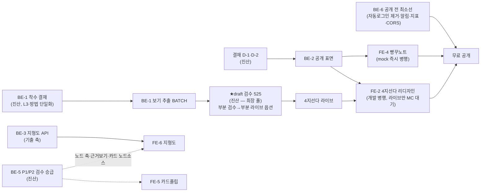

# 1차 시험 우선 서비스(무료·무인증·홍보용) — 백엔드 구축 + 프론트 디자인 스코프 정본

> **전제 (진산 발화 2026-07-08)**: 1차 시험 단독 우선. 범위 = ①4지선다 기출문제 랜덤 풀이 ②1차 학습/기출 자료 기반 암기(UIUX 시안 기법). 성격 = **무료·무인증·홍보용**.
> 근거 정본: `docs/backend/BACKEND_MIDPOINT_REVIEW_20260707.md`(07-08 독립검증 완료) §9.5·§10 + 실코드 재확인.
> 본 문서는 스코프 정리다 — L3 항목의 코드 착수는 각 결재 후(§6). **독립 검증 2렌즈(사실검증/적대 설계비평) C3·M9·m9 전건 반영본(rev2)** — 리뷰 정본 `.claude/reviews/review-20260708-113000-promo-1st-scope.md`.

## 0. 한 줄 요약

무인증·홍보용 덕에 **사업 계층(계정·과금·법무) 전부를 회피**하고, 남는 것은 ①**보기 추출 BATCH + 진산 검수(크리티컬 패스 — 데이터·검수 작업)** ②**공개(무인증) API 표면 소규모 신설** ③**프론트 리디자인+신규 화면**(4지선다·빈칸 UI 는 이미 완비·휴면 — 홍보용 화면·암기 모드가 신규) 3덩어리다.

## 1. 결정적 현 상태 사실 (실코드·실데이터, 07-08 독립 검증)

| #   | 사실                                                                                                                                                                                                                     | 함의                                                                                                                                                              |
| :-- | :----------------------------------------------------------------------------------------------------------------------------------------------------------------------------------------------------------------------- | :---------------------------------------------------------------------------------------------------------------------------------------------------------------- |
| F-1 | 1차 525문항 정답 100% 확보 — 그러나 **distractors 전량 NULL·input_type 전량 fill_blank** = 현재 빈칸 입력식으로만 서빙됨. MC 채점 코드·계약(위치라벨·시드셔플)은 완비·휴면                                               | "4지선다 랜덤 풀이"는 **보기 데이터 공급(BE-1) 없이는 성립 불가** — 최대 크리티컬 패스                                                                            |
| F-2 | 학습 API 는 **전면 인증 필수**(`router.use('*', requireAuth)` 가 전 핸들러 선행, `study/routes.ts:824-828`·우회 마운트 0). 셔플시드 = `hash(userId‖qId‖날짜)` 서버 결정(`learning-modes/shuffle.ts:32-36`)               | 무인증 서비스는 기존 라우트 재사용이 아니라 **공개 표면 신설(BE-2)** — 단 내부 로직(채점·셔플·서빙)은 추출 재사용                                                 |
| F-3 | 서빙(`/next`) 응답은 answer·explanation 비노출 projection. 단 **채점(`/grade`)은 정오 무관 correctAnswer+explanation 을 항상 반환**(`routes.ts:1524-1534` — 학습 UX 제품 요건)                                           | **무인증 표면에서 정답 비밀 유지는 구조적으로 불가**(문항당 1채점 요청 = 정답 1개) — D-2 판단의 진짜 축은 "보호 vs 노출"이 아니라 **유출 속도·운영 통제**(§2 D-2) |
| F-4 | 암기 즉시군 엔진·스키마 준비: FSRS = `ts-fsrs`(순수 구현, node API 0 — 브라우저 번들 성립) / Dexie 실재. 단 **web 은 `@thepick/srs` 미도입 + 현 IDB 는 D1→IDB read-only 미러**(`web/lib/db.ts`)                          | 무인증 진도·FSRS·스트릭 = 로컬(D-1). 단 "재사용"이 아니라 **로컬 쓰기 스토어 신설 + @thepick/srs 클라 배선 신설**                                                 |
| F-5 | 해설 0/525 · related_nodes 3/525 · ★**1차용 approved 노드 ≈ 0** — approved 488 전수는 2차 실무 도메인(p.400~630), 1차 근거(법령·요령 P1/P2 59건+P3)는 **전량 draft 검수 대기**                                           | **노드에 기대는 모든 1차 기능(지형도 노드 축·카드플립 노드 소스·근거보기)은 BE-5 승급 전 공허** — "스키마 존재≠populate" 자기점검(§3 BE-3/4/5 에 전파)            |
| F-6 | 프론트 기존 자산: **4지선다 라디오 UI 완비·휴면**(`QuestionCard→MultipleChoice.tsx` 라디오+1-5 단축키+정오 피드백 — 데이터만 대기) + FillBlank/Calc/Essay + claudeDesign 시안 jsx 8종. 랩 시안 `lab/*.jsx` 10개는 미반입 | FE-2/FE-4 는 그린필드가 아니라 **리디자인·재스타일**. 신규는 랜딩·암기 모드·지형도·공유                                                                           |
| F-7 | `PUBLIC_TEST_*` 자동로그인 크리덴셜이 웹 번들에 인라인(`AuthForm.tsx:127-160`, 빌드타임 정적 치환)                                                                                                                       | **무료 홍보 공개도 "공개"다** — 공개 전 제거 의무 발동(BE-6)                                                                                                      |

## 2. 아키텍처 갈림길 2건 (PITR — 진산 결재)

### D-1. 익명 학습 진도 저장 위치

| 안                      | 내용                                                                                                  | 판단 재료                                                                                                                                                                                                                                                                                                                                                                                                     |
| :---------------------- | :---------------------------------------------------------------------------------------------------- | :------------------------------------------------------------------------------------------------------------------------------------------------------------------------------------------------------------------------------------------------------------------------------------------------------------------------------------------------------------------------------------------------------------ |
| **A. 로컬 전용 (권고)** | 진도·FSRS·스트릭 전부 IndexedDB(로컬 쓰기 스토어 신설) + `@thepick/srs` 클라 배선. 서버 user 데이터 0 | PII 0(법무 회피 정합 — 단 rate limit IP 키는 **해시 IP** 사용으로 정합 유지)·D1 쓰기 0·IDB↔D1 동기화 stub 이슈 자연 회피. **단점(정직)**: 기기 간 이동 불가 + **같은 기기에서도 증발 경로**(브라우저 데이터 삭제·시크릿 모드·★Safari ITP 7일 미방문 자동 삭제 — 모바일 80% 타깃과 상충, 스트릭 장치와 순환 충돌). 완화 = `navigator.storage.persist()` 요청 + 진도 내보내기/가져오기(BE-7 export 구조 선확보) |
| B. 익명 서버 세션       | 쿠키 기반 anon id 로 user_progress 재사용                                                             | 기존 코드 재사용 최대 — 그러나 서버 유저데이터 발생(무인증 취지 상충)·purge 정책 신규 부담                                                                                                                                                                                                                                                                                                                    |

### D-2. 문항 공급·채점 방식

**공통 전제(정직)**: 채점 후 정답 표시는 제품 요건이므로 **어느 안이든 정답은 결국 노출**된다(F-3). A/B 의 실차이 = **전량 즉시 번들(B) vs 드립 유출 + 서버 텔레메트리 + 운영 통제(A)**.

| 안                                           | 내용                                                                                 | 판단 재료                                                                                                                                                                                                     |
| :------------------------------------------- | :----------------------------------------------------------------------------------- | :------------------------------------------------------------------------------------------------------------------------------------------------------------------------------------------------------------ |
| **A. 공개 read-only API + 서버 채점 (권고)** | `/api/public/*` 신설 — 서빙 비노출 projection 유지, 채점 시 정답 반환, IP rate limit | 실익 = ①유출을 "문항당 1채점·IP 캡" 드립 속도로 제어 ②flagged 문항 즉시 차단·BE-1 검수분 즉시 반영(재빌드 불요) ③서빙/채점 이벤트 = 홍보 지표·오답 통계 원천 ④채점 무결성 서버 소유. 비용 = Workers 호출 소액 |
| B. 빌드타임 정적 JSON 번들 + 클라 채점       | 525문항 정적 자산 배포, 백엔드 0·완전 오프라인                                       | **정답 전량 즉시 노출**(유료 전환 시 소급 불가) + flagged/검수 반영 = 재빌드 + 서버 지표 0(홍보 목적과 상충)                                                                                                  |

## 3. 백엔드 구축 목록 (우선순위 순)

| #        | 항목                                                                                                                                                                                                                                                                                                                                                                                                                                                                                                                                                                                                                                                                                                                                                                                                         | 성격            | 게이트                                                                                                                                         |
| :------- | :----------------------------------------------------------------------------------------------------------------------------------------------------------------------------------------------------------------------------------------------------------------------------------------------------------------------------------------------------------------------------------------------------------------------------------------------------------------------------------------------------------------------------------------------------------------------------------------------------------------------------------------------------------------------------------------------------------------------------------------------------------------------------------------------------------- | :-------------- | :--------------------------------------------------------------------------------------------------------------------------------------------- |
| **BE-1** | **4지선다 보기 추출 BATCH** — 기출 원문 ①~④ 추출 → distractors populate + input_type 전환 (525문항). 신규 창작 아닌 원문 추출 = 환각 리스크 낮음. ★방법 계보: 기결 7b 정본 = **pdfplumber 추출 + 정답지 cross-check**(apps/batch) — Claude 직접 추출과의 방법 단일화를 착수 결재에서 확정                                                                                                                                                                                                                                                                                                                                                                                                                                                                                                                    | 데이터          | **L3(정답 계약) — 기결 plan 7b~7f 착수 결재 + draft→진산 검수 525**(★전체 일정의 최장 폴 — 회차/과목 단위 부분 검수→부분 라이브 옵션 상신, §5) |
| **BE-2** | **공개 학습 표면 `/api/public/*`** — ①문항 랜덤 서빙(과목/회차 필터, 비노출 projection) ②채점 — 셔플 매핑은 서버 소유 유지: **보기별 불투명 choiceId 발급→choiceId 로 채점**(클라 시드 치환은 채점 무결성 리스크 + KST 자정 재셔플 carry-over 동시 해소) ③**경계 강제: `exam_type='1st'` 서버 고정(클라 파라미터 불가) + `status='active'` 를 서빙·채점 양쪽 WHERE 에**(현 `/grade` 는 id 직조회에 exam_type 필터 없음 — 공개 표면에서 2차/flagged 누출 차단, 회귀 테스트 2건 포함) ④IP rate limit = **`ratelimit` unsafe binding 신규 네임스페이스(해시 IP 키)** — 공개 무인증 `/api/search` 의 SEARCH_RATE_LIMITER_IP 가 선례. D1 rate_limits 는 user 키 전제라 부적합 ⑤cache-policy 에 `/api/public/` 명시 매핑(문항 풀 목록 캐시 가능 설계 검토 / 채점 = no-store) + **credentials 없는 별도 CORS 정책** | 코드(소규모)    | D-1·D-2 결재 후                                                                                                                                |
| **BE-3** | **지형도(MOC) 조회 API 1개** — F9 시안용 목차 트리. ⚠️ **1차 approved 노드 ≈ 0(F-5)** → 1차 지형도 축 = **기출-only(subject 3과목 × round × 문항)** 로 정의. knowledge_nodes chapter 축(인덱스는 chapter 만 실재·section 인덱스 없음)은 BE-5 승급 후 오버레이                                                                                                                                                                                                                                                                                                                                                                                                                                                                                                                                                | 코드(소건)      | 기출 축 = 게이트 없음 / 노드 축 = **BE-5 게이트**                                                                                              |
| **BE-4** | **암기 서빙 정리** — 빵꾸노트 = 기존 fill_blank 서빙 공개 편입(BE-2 흡수) / 카드플립 카드 소스: ⚠️노드 소스는 BE-5 게이트 → 1차 초기 소스 = **기출 문항 기반**(문항→정답 카드)                                                                                                                                                                                                                                                                                                                                                                                                                                                                                                                                                                                                                               | 코드(소건)      | 노드 소스만 BE-5 게이트                                                                                                                        |
| **BE-5** | **1차 노드 콘텐츠 게이트(승격)** — P1/P2 59건(+P3) draft→approved 검수 승급(진산). 지형도 노드 축·카드플립 노드 소스·근거보기(related_nodes 1차 백필 포함)의 **공급 선결** — "(선택)"이 아니라 노드 의존 기능 전체의 게이트                                                                                                                                                                                                                                                                                                                                                                                                                                                                                                                                                                                  | 데이터+검수     | 진산 검수. 홍보 범위 포함 여부 결재(§6-3)                                                                                                      |
| **BE-6** | **공개 전 최소 운영선** — ①`PUBLIC_TEST_*` 자동로그인 제거(F-7 원장 이행) ②알림 1채널(Email Routing 활성 — Cloudflare 콘솔 진산 행위) ③**홍보 지표 최소선: Cloudflare Web Analytics(Pages 스니펫, 코드 0줄) + BE-2 에 Analytics Engine 바인딩·익명 이벤트 3종(serve/grade/card — PII 0·단일 벤더)** — 현재 방문·퍼널 측정 수단 0 인 채로 홍보하면 효과 측정 불가 ④**CORS 화이트리스트 정리**(미보유 `thepick.app` 제거, 확정 도메인 반영) + rate limit 파라미터 점검                                                                                                                                                                                                                                                                                                                                         | 코드(소건)+설정 | 자동로그인 = 기존 런칭 차단 원장                                                                                                               |
| BE-7     | (예약) 로컬 진도→계정 이전 경로 — 유료 전환 시점 설계. 지금은 **로컬 스키마에 export 구조만 선확보**(D-1 증발 완화 겸용)                                                                                                                                                                                                                                                                                                                                                                                                                                                                                                                                                                                                                                                                                     | 설계 예약       | 유료화 스프린트                                                                                                                                |

**무인증 덕에 회피되는 것(작업 불요 확정)**: 이메일 인증·비밀번호 재설정·회원탈퇴·법무 3종·과금 전체·관리자 유저 CRUD·IDB↔D1 동기화 — 전부 유료화 직전 스프린트 원장 그대로 이월.

## 4. 프론트엔드 디자인 목록 (UIUX 시안 연계)

시안 정본 = `docs/사용자UIUX/` 3종(지형도 표현방법론·암기 인터랙션 방법론·랩 셸) + `docs/design/claudeDesign/*.jsx` 8종(기존 시안 자산). ★랩 실체 `lab/*.jsx` 10개는 **미반입(진산 반입 필요)** — 반입돼도 스택 격차(React 18 UMD ↔ React 19/빌드)로 "명세 참조 → 재구현"이 정석.

| #    | 화면/컴포넌트                                                                                                                                    | 성격          | 시안 연계                       | 백엔드 의존                                                                |
| :--- | :----------------------------------------------------------------------------------------------------------------------------------------------- | :------------ | :------------------------------ | :------------------------------------------------------------------------- |
| FE-1 | **랜딩/홍보 페이지** — 서비스 소개·무료 체험 진입·가입 전환 훅 + **OG/twitter 메타·sitemap·robots**(현재 0 — 공유 확산의 전제) + 전환 이벤트 훅  | 신규          | 없음(Aesthetic Anchor·3안 규율) | BE-6③ 지표                                                                 |
| FE-2 | **4지선다 풀이 화면** — 라디오·셔플·정오 피드백 **플로우는 완비·휴면(F-6) → 리디자인·재스타일** + 연속 풀이 플로우·(BE-5 후) 근거 출처           | **리디자인**  | 학습 UX 북극성 carry-over       | BE-1(라이브 게이트)+BE-2                                                   |
| FE-3 | **풀이 설정 픽커** — 3과목/회차/랜덤 범위                                                                                                        | 신규(소)      | —                               | BE-2 필터                                                                  |
| FE-4 | **암기 모드 A: 빵꾸노트** — 기존 FillBlank.tsx 기반 + M9 단계 힌트 신규                                                                          | 리디자인+확장 | 암기 방법론 M1·M9               | BE-2 — **BE-1 무관, mock 으로 즉시 병행 가능(진짜 게이트 = D-1/D-2 결재)** |
| FE-5 | **암기 모드 B: 카드 플립 + FSRS 4버튼** — 로컬 스케줄(@thepick/srs 클라 배선 신설)                                                               | 신규          | 방법론 M2                       | BE-4(초기 = 기출 소스 / 노드 소스 = **BE-5 게이트**)                       |
| FE-6 | **지형도(MOC) 네비게이션** — 초기 = 기출 축(과목×회차) 트리 + 로컬 진도 오버레이 / 노드(장·절) 축 = BE-5 후                                      | 신규          | 지형도 방법론 F9                | BE-3(노드 축 = **BE-5 게이트**)                                            |
| FE-7 | **스트릭/일일목표 위젯** — 로컬 계산(+ITP 완화 UX: persist 요청·내보내기 안내)                                                                   | 신규(소)      | 방법론 M14                      | 로컬(D-1)                                                                  |
| FE-8 | **결과 요약 + 공유 카드** — 세션 결과의 **이미지 공유(클라 canvas) 중심**(D-1 로컬이라 링크에 실을 서버 상태 없음 — 링크는 랜딩 유입용으로 구분) | 신규          | 홍보 확산 장치                  | 로컬                                                                       |
| FE-9 | **공통 상태 UX** — 로딩/빈/에러/오프라인 4종 + PWA 오프라인 + 접근성(터치 44px·모바일 80%)                                                       | 상시          | 리뷰 Pass 3                     | —                                                                          |

디자인 규율(불변): `~/.claude/AESTHETIC.md` 선독 → 레퍼런스 고정 → **3안(A/B/C) 제출** → 진산 선택. 프론트 본격화 시 shadcn/ui 도입 여부 결정(현재 미도입 실측).

## 5. 순서·의존 (병렬 최적)

- **크리티컬 패스 = RV(진산의 보기 검수 525문항)** — 회차/과목 단위 부분 검수→부분 라이브로 쪼개는 옵션을 결재에 상신한다.
- 암기 축(FE-4/5/7)과 4지선다 화면 개발은 BE-1 을 기다리지 않는다(mock 병행) — 라이브 전환만 게이트.

## 6. 진산 결재·행위 큐 (본 스코프 발동분)

0. **홍보 URL 확정**(`thepick-study.pages.dev` vs 서브도메인 조기 확보 — config 주입 원칙, 미보유 thepick.app 은 CORS 에서 제거)
1. **D-1 결재**(진도 로컬 vs 익명 서버 — 권고 A, 증발 한계 §2 명시) / **D-2 결재**(공개 API vs 정적 번들 — 권고 A, "정답은 어느 안이든 노출" 전제 확인)
2. **BE-1 착수 결재**(L3 — 방법 단일화: pdfplumber+정답지 cross-check vs Claude 직접) → **보기 추출 draft 검수 525**(행위 — 부분 검수 옵션 포함)
3. **BE-5 = 1차 노드 콘텐츠 게이트**: P1/P2 59건 검수 승급(행위) + 근거보기·노드 축 홍보 범위 포함 여부(결재)
4. `lab/*.jsx` 10개 반입(행위)
5. Email Routing 활성(행위 — Cloudflare 콘솔)
6. (원장 재확인) 자동로그인 제거 시점 = 무료 공개 전 — 본 스코프로 앞당겨짐

---

_작성: Fable 5, 2026-07-08 (rev2) · 근거 = 중간점검 정본(07-08 검증완료) + 실코드 재확인 · 독립 검증 2렌즈(사실검증 8항목/적대 설계비평 4렌즈) CRITICAL 3·MAJOR 9·MINOR 9 전건 반영 · 판정(GO/범위) = 진산._
