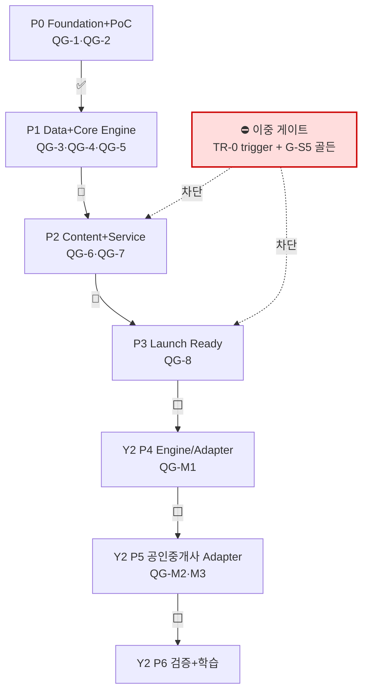
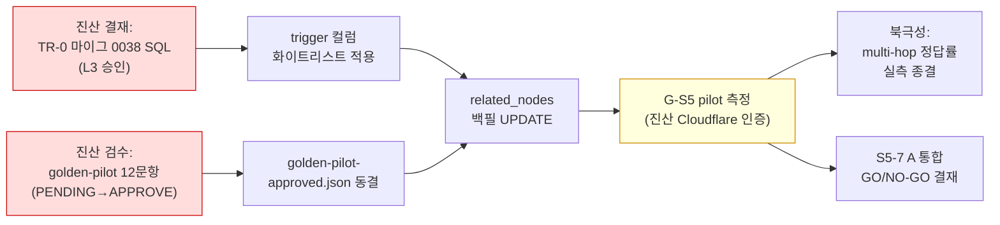

# ThePick — 기획 설계 대비 마일스톤 로드맵 + 진척 평가

> **작성일**: 2026-05-29 (Session 093) · **상태**: 최초 통합 마일스톤 트래커
> **승격 가능**: `docs/ROADMAP.md` 부재 확인 — 본 문서가 프로젝트 최초의 단일 진척 추적기.
> 안정화 후 `docs/ROADMAP.md`로 승격 가능 (단, CLAUDE.md "현재 상태" 동기 의무 승계 필요).
>
> ---
>
> ⚠️ **워터마크 (증거 신뢰도 경계)**
> **Live D1 row count(794/1274/157/193/545/approved 488) · multi-hop 정답률은 진산 Cloudflare
> 인증 게이트라 본 세션에서 직접 미확인.** 모든 수치는 (1) batch insert SQL 독립 grep 카운트,
> (2) 산술검산, (3) Session 086 단일 측정(graph-walk-s5-co1-co2-measurement.md §0), (4) 실코드
> Read/Grep, (5) 패키지별 `pnpm test` 직접 실행 — 5중 교차로 평가한 **보수적 추정**이다.
> 'done'은 "production-ready"가 아닌 "코드·테스트·파일로 확인됨" 기준이며,
> done-but-not-production-ready 부채는 명시 차감했다.
>
> ---

## 0. TL;DR

**전체 진척 ≈ 64% (가중)** — 인프라·기반 엔진·거버넌스는 성숙(78~90%)하나, 학습 콘텐츠 생성(M20~24)·
혼동/암기법 엔진(M18/M19)·G-S5 정답률 실측이 미완으로 평균을 끌어내린다.

**한 줄 현황**: Phase 0~1의 인프라·산식 엔진·BATCH 적재(794노드/545기출 중 1차 100%)는 견고하나,
"Graph RAG"는 학습자 경로에서 사실상 Vector RAG이고(ADR-044 자인), 북극성인 **생성물 신뢰성 실측
(multi-hop 정답률)은 0% 측정** 상태다.

**현 임계경로 1줄**: **이중 게이트 해소 → G-S5 측정** —
`migrations/0004:39-42` 트리거가 `related_nodes` 백필 UPDATE를 ABORT(TR-0, 마이그 0038 L3 승인 대기)

- production 545 기출 `related_nodes` 전부 NULL(골든 부재, pilot 12 draft는 검수 PENDING) →
  둘 다 진산 결재·인증 게이트로 풀어야 측정 가능, fabricate 금지(RULE #5).

| 축                               | %       | 한줄                                                           |
| -------------------------------- | ------- | -------------------------------------------------------------- |
| 인프라 (배포/마이그/Worker/인증) | **78%** | 핵심 경로 실코드 확인, 운영 자동화(deploy.yml/DR)는 미착수     |
| 콘텐츠 (BATCH/DB count)          | **88%** | 적재 자체 ~95%, 측정가능성(골든) ~20%                          |
| 엔진패키지 (M14~M24)             | **58%** | 기반 6패키지 견고, 로드맵 M18/M19/M20~24는 stub                |
| Core/GraphRAG/Eval               | **62%** | harness READY, 실 정답률 0건 (북극성 미종결)                   |
| 학습 서비스/UX                   | **62%** | 풀이루프 동작, 객관식 distractor 데이터 0·OX 미구현·모의시험 0 |
| 품질·기술부채                    | **58%** | api 643 PASS 실측, TR-1~4 ~109h 미착수                         |

---

## 1. 마일스톤 로드맵 (Phase 0~3 + Year 2)

상태: ✅ 완료 / 🔄 진행 / ⛔ 차단 / ⬜ 미착수

| Phase     | 이름                                | 상태 | %      | 완료기준 충족 여부                                                                                                                                                                                                     |
| --------- | ----------------------------------- | ---- | ------ | ---------------------------------------------------------------------------------------------------------------------------------------------------------------------------------------------------------------------- |
| **P0**    | Foundation + PoC (W1~4)             | ✅   | **95** | QG-1(기출 정답 100%) / QG-2(BATCH1 산식 100% + 40+노드/80+엣지/7+산식 + Graph 무결성) — BATCH-1(p.403~434) 적재·산식 엔진(F-01~68 303 PASS)·무결성 엔진 실재로 **충족 추정**. live 재확인 carry-over.                  |
| **P1**    | Data Pipeline + Core Engine (W5~10) | 🔄   | **62** | QG-3(기출↔Graph 100%)·QG-4(삼각 교차검증) = 적재 완료로 충족 추정. **QG-5 미충족** — Core 엔진 5개 중 M15(검색정확도 미측정)·M18(혼동감지 미구현)·M19(암기법 미구현) = 실질 **2.5/5**. M16(산식)·M17(FSRS) 동작.       |
| **P2**    | Content + Service (W11~14)          | 🔄   | **48** | **QG-6 미충족** — M20~24 생성기(study-material-generator) = 빈 stub(`export {};`). OX(Hard Stop #3) 미구현. 채점 측(learning-modes)·풀이 루프·게이미피케이션·세션 흐름은 동작. **QG-7 미충족** — 모의시험(INT-06) 0건. |
| **P3**    | Launch Ready (W15~16)               | 🔄   | **30** | **QG-8 미충족** — 인프라(배포/CI/auth)·PWA 셸은 실재하나, 기출 2차 14%·distractor 데이터 0·정답률 미측정·운영 자동화(deploy.yml/DR/secret rotation) 미착수. 베타·Hard Stop 검증 게이트 미진입.                         |
| **Y2 P4** | 엔진/어댑터 리팩토링 (8주)          | ⬜   | **5**  | QG-M1(회귀 100% 동일) 미진입. shared/exam-ids·exam-adapter 단일선언만 존재. 특화 컬럼·리터럴·ID 천장 미해소(TR-4 인벤토리만).                                                                                          |
| **Y2 P5** | 공인중개사 Adapter (12주)           | ⬜   | **0**  | QG-M2/M3 미진입. 공인중개사 코드 0줄(설계상 Year 1엔 없음 — 정합).                                                                                                                                                     |
| **Y2 P6** | 검증 + 학습 (4주)                   | ⬜   | **0**  | 미진입.                                                                                                                                                                                                                |

---

## 2. 7 Layer × 28 모듈 진척 매트릭스

상태: ✅ done / 🟡 partial(stub_or_partial) / ⬜ not_started / ⛔ blocked

| L     | Layer             | 모듈                               | 상태 | %   | 근거 한줄                                                                                     |
| ----- | ----------------- | ---------------------------------- | ---- | --- | --------------------------------------------------------------------------------------------- |
| **1** | 데이터 수집       | M01 PDF 추출기                     | ✅   | 90  | parser/pdf-extractor.ts (179 tests PASS)                                                      |
|       |                   | M02 법령 수집기                    | ✅   | 100 | batch-L1/L2 적재(149노드/150엣지/30상수)                                                      |
|       |                   | M03 기출 파서                      | 🟡   | 35  | parser-1st-exam 284L 실코드이나 **테스트 0 + 호출처 0**(545는 Claude Code 직접 적재)          |
|       |                   | M04 Vision OCR                     | 🟡   | 30  | ai-adapter sendVision = `NOT_IMPLEMENTED` throw (Phase 3 이연)                                |
|       |                   | M05 웹 보강                        | 🟡   | 30  | 산식/구조화 보조, 독립 모듈 미성숙                                                            |
| **2** | 구조화 파이프라인 | M06 섹션 분리기                    | ✅   | 90  | parser/section-splitter.ts (determinism property PASS)                                        |
|       |                   | M07 Claude 배치                    | 🟡   | 35  | ai-adapter sendMessage = `NOT_IMPLEMENTED`(BATCH는 Opus 직접처리=설계 정합)                   |
|       |                   | M08 Ontology+Schema Validator (L3) | ✅   | 90  | parser/ontology-registry.ts + schema-validator.ts 실재                                        |
|       |                   | M09 Constants 추출기 (L3)          | ✅   | 90  | parser/constants-extractor.ts                                                                 |
|       |                   | M10 Revision 감지기                | ✅   | 95  | batch-R1/R2 revision-changes.sql 별도 적재                                                    |
|       |                   | M11 토픽 클러스터러                | ✅   | 85  | topic-cluster-router(multi-path-fallback) 실재                                                |
| **3** | 품질 검증         | M12 삼각 교차 검증기               | ✅   | 85  | quality 패키지 (검증 실재, test timeout으로 카운트 미확정)                                    |
|       |                   | M13 기출 정답 대조기               | 🟡   | 50  | 적재는 active/공식정답, 파서 자동검증(parser-1st-exam) 미배선                                 |
|       |                   | M14 Graph 무결성 검증기            | ✅   | 85  | quality/graph-integrity.ts (orphan/broken/순환 DFS, MAX_DEPTH 50k)                            |
| **4** | Core 엔진         | M15 Graph RAG 검색                 | 🔄   | 55  | 학습자 경로 = Vector-only(엣지 순회 0), graph는 격리 `/api/search/graph`만. 정확도 90% 미측정 |
|       |                   | M16 Formula Engine (L3)            | ✅   | 90  | **303 tests PASS** (F-01~68), 동적 코드 실행 0건, sandbox.ts                                  |
|       |                   | M17 FSRS 엔진                      | 🔄   | 75  | ts-fsrs(FSRS-4) wrapper 35 tests PASS. **Python 참조 100% golden 미구현**(PRC-04)             |
|       |                   | M18 혼동감지 (8종)                 | ⬜   | 12  | ConfusionType 타입/스키마만, `detectConfusion` 함수 grep **0건**                              |
|       |                   | M19 암기법 매칭                    | ⬜   | 9   | mnemonic_cards 테이블만, `matchMnemonic`/역방향 검증 grep **0건**                             |
| **5** | 컨텐츠 생성       | M20 플래시카드 생성기              | 🟡   | 2   | study-material-generator = `export {};` (빈 stub)                                             |
|       |                   | M21 OX/빈칸 생성기                 | ⬜   | 0   | INPUT_TYPES 4종에 OX 없음, DB CHECK도 미허용 (Hard Stop #3 부재)                              |
|       |                   | M22 기출 변형 생성기               | 🟡   | 2   | 빈 stub 흡수                                                                                  |
|       |                   | M23 암기법 생성기                  | ⬜   | 10  | `REVERSE_VERIFY_FAILED` enum만, 생성·역방향 로직 0건                                          |
|       |                   | M24 산식 카드 생성기               | 🟡   | 5   | 빈 stub 흡수 (formula-engine은 별개로 동작)                                                   |
| **6** | 학습 서비스       | M25 기출 풀이 서비스               | ✅   | 88  | /grade 4-type 채점→FSRS→user_progress UPSERT (77 route tests PASS)                            |
|       |                   | M26 복습/약점                      | 🔄   | 55  | /mode 통계 surface 실재, **/next 추출은 weak만 차별·confusion/topic 필터 부재**               |
|       |                   | M27 모의시험+대시보드              | ⬜   | 0   | '25문항/100분/합격판정' grep **0건** (QG-7 INT-06 미충족)                                     |
| **7** | 관리자            | M28 Graph Visualizer + CMS         | 🔄   | 40  | admin-web telemetry/distractors 페이지 실재이나 distractors = **MOCK 명시**                   |

**레이어별 집계**: L1 ≈57% · L2 ≈81% · L3 ≈73% · L4 ≈48% · L5 ≈4% · L6 ≈48% · L7 ≈40%

---

## 3. 축별 상세 (plannedState → actualState → % → evidence)

### 3.1 인프라 축 (배포/마이그/Worker/인증) — **78%**

| 마일스톤                                    | 상태 | %   | actualState 요약                                                                                                                                              |
| ------------------------------------------- | ---- | --- | ------------------------------------------------------------------------------------------------------------------------------------------------------------- |
| D1 마이그 체인 0001~0037 production 적용    | ✅   | 92  | 36 SQL 파일 실존(0020 결번=squash). production-migration-status.md는 0035에서 **stale**, 0036/0037은 git commit 2건+handoff-082+Worker 버전 체인으로 교차확인 |
| Worker 배포 (thepick-api-production)        | ✅   | 95  | wrangler.toml 실 database_id(a9b8d521-...)+namespace+Vectorize, deploy:production 가드, /health 엔드포인트                                                    |
| 인증 + login_history audit (C-12)           | ✅   | 100 | routes.ts:417 INSERT login_history + schema-drift 감지 + critical 로깅, **25/25 PASS** + smoke 기록                                                           |
| 인증 정책 env 분기 (ADR-034/035/036)        | 🔄   | 85  | PASSWORD_MIN=4/HIBP=false 임시 상태, 복원 토글(8/true/Strict)은 launch 직전 의도적 보류                                                                       |
| CI 파이프라인 (quality gate + schema drift) | ✅   | 90  | ci.yml(typecheck/lint/test 9패키지/audit) + e2e Playwright + gitleaks + d1-schema-drift.yml cron                                                              |
| Deploy 자동화 (devops C-1~4)                | ⬜   | 15  | **deploy.yml 부재**(수동 wrangler), Logpush→R2 0, DR runbook 0, secret rotation 0, rollback SQL 0027~0037 11개 부재                                           |

**핵심 증거**: `auth/routes.ts:417` INSERT login_history / `wrangler.toml env.production database_id='a9b8d521-dc99-46f7-835c-1f226cebdbf8'` /
`migrations/0004:39-42` trigger 실재 / vitest auth 25 passed.
**불일치**: production-migration-status.md(0035 stale) ≠ 실 적용 0036/0037 — 단일 진실원 문서 lag.

### 3.2 콘텐츠 축 (BATCH 적재/DB count) — **88%**

| 마일스톤                       | 상태 | %      | actualState 요약                                                                                               |
| ------------------------------ | ---- | ------ | -------------------------------------------------------------------------------------------------------------- |
| QG-2 / BATCH-1~5 (2차 핵심)    | ✅   | 100    | 독립 grep: 노드 75+118+84+123+98=498, 엣지 878, 산식 130, 상수 91 — 문서값 100% 일치. 0018 트리거로 draft 강제 |
| BATCH-6~7 (가축재해+이론+별표) | ✅   | 100    | 노드 70+20=90, 엣지 136, 산식 27, 상수 28                                                                      |
| BATCH-L1/L2 (법령)             | ✅   | 100    | 노드 84+65=149, 엣지 150, 상수 30                                                                              |
| BATCH-R1/R2 (개정 SUPERSEDES)  | ✅   | 100    | 노드 24+26=50, 엣지 95, 상수 42 + revision-changes.sql 별도 적재                                               |
| BATCH-S1 + Q-META              | ✅   | 100    | 노드 6+1=7, 엣지 14+1=15 → 누적 794/1274                                                                       |
| 누적 DB count 산술검산         | ✅   | 95     | **독립 SQL grep**: 793+1=794 / 1274 / 157 / 191+seed2=193 — 4지표 검산식 일치                                  |
| approved 488/794 + draft 격리  | 🔄   | 90     | approved-nodes-corpus.json=488 items, routes.ts:117 stale 주석은 S5-3에서 정정됨                               |
| BATCH-Q1차 (1차 7/7회)         | ✅   | 100    | 7×75=525, status='active'                                                                                      |
| **BATCH-Q2차 (1/7회)**         | 🔄   | **14** | 11회 20문항만(9 active+11 flagged 깨진수식). 5~10회 큐넷 공식 미발표=자료 미보유                               |
| **G-S5 골든 (related_nodes)**  | ⛔   | **25** | 컬럼은 0001:126 존재하나 **8 Q-batch SQL 전부 미기재 → 545 전부 NULL**                                         |
| **TR-0 / C-7 trigger 차단**    | ⛔   | **10** | 0004:39-42 trigger가 모든 exam_questions UPDATE ABORT → 백필 불가, 0038 미작성(L3 대기)                        |

**핵심 증거**: 12 batch SQL grep 합산 794/1274/157/191+2 일치 / `grep -l related_nodes docs/batch-load/batch-Q-*/*.sql` = **0건** /
`migrations/0004:39-42` RAISE(ABORT) 직접 확인.
**불일치**: 없음 — 차단선 주장이 실코드와 100% 일치(엄살 아님). 적재 자체 ~95%, 측정가능성(골든) ~20%.

### 3.3 엔진패키지 축 (packages/\* + M14~M24) — **58%**

| 마일스톤                          | 상태 | %   | actualState 요약 / 실행 PASS                                                             |
| --------------------------------- | ---- | --- | ---------------------------------------------------------------------------------------- |
| M16 Formula Engine (L3)           | ✅   | 95  | **303 PASS** (15 test files), F-01~68 정의, eval/new Function/child_process **0건**      |
| parser (M01~M11 구조화)           | ✅   | 90  | **179 PASS**, ontology-registry + schema-validator 실재                                  |
| quality (M14 무결성)              | ✅   | 85  | graph-integrity 실구현, test는 determinism timeout으로 카운트 미확정                     |
| srs (M17 FSRS)                    | 🔄   | 70  | **35 PASS**, ts-fsrs(FSRS-4) wrapper. Python golden(PRC-04) 미구현, FSRS-4↔5 표기 불일치 |
| M18 혼동감지                      | ⬜   | 10  | 엔진 함수 grep **0건** (타입/스키마만)                                                   |
| M19 암기법 매칭                   | ⬜   | 8   | 매칭/역방향 grep **0건** (테이블만)                                                      |
| study-material-generator (M20~24) | 🟡   | 2   | `export {};` 빈 stub, 0 test                                                             |
| learning-modes (채점 백엔드)      | ✅   | 88  | **116 PASS**, 4 input-type + normalize + shuffle                                         |
| shared (Hard Rule 17)             | ✅   | 85  | **64 PASS**, EXAM_IDS 단일선언 + ExamAdapter                                             |
| ai-adapter (Claude API)           | 🟡   | 30  | **13 PASS**, sendMessage/sendVision = NOT_IMPLEMENTED(의도적 이연)                       |
| parser-1st-exam (1차 파서)        | 🟡   | 35  | 284L real이나 **테스트 0 + 호출처 0**(dead code w.r.t. 545 적재)                         |
| payment (결제)                    | 🟡   | 20  | types+mock만, 실 PG 0, 0 test (Phase 2 활성=로드맵 정합)                                 |

**실행 PASS 실측**: formula-engine 303 / parser 179 / srs 35 / learning-modes 116 / shared 64 / ai-adapter 13 (quality는 timeout).
**불일치 2건**: (1) 인벤토리 `ai-adapter testFiles:0` = 오류 — 실제 `__tests__/`(src 밖) 13 PASS. (2) parser-1st-exam은
real이나 호출처 0 = QG-1/QG-3 코드레벨 자동검증 근거 부재(quality C-2 확증).

### 3.4 Core 엔진 / Graph RAG / Eval 축 — **62%**

| 마일스톤                            | 상태 | %      | actualState 요약                                                                                           |
| ----------------------------------- | ---- | ------ | ---------------------------------------------------------------------------------------------------------- |
| M15 Graph RAG 검색 (90%+)           | 🔄   | 55     | 학습자 경로 = Vector-only(`knowledge_edges` grep 0), 정확도 미측정. ADR-044 자인                           |
| M16 Formula Engine                  | 🔄   | 90     | 303 PASS. 157 전수 100% 실측은 인증 게이트 carry-over                                                      |
| M17 FSRS                            | 🔄   | 85     | 35 PASS. Python golden 미확인                                                                              |
| M18 혼동감지                        | 🟡   | 15     | 감지 함수 0건                                                                                              |
| M19 암기법                          | 🟡   | 10     | 생성/매칭 0건                                                                                              |
| Graph Walk S0~S6 (옵션 C)           | 🔄   | 80     | graph-walk/index.ts(290L) WITH RECURSIVE + index.ts:164 **실배선**. 64 PASS. G-S5만 ⏸️. 학습자 경로 미통합 |
| **S5-6 multi-hop 정답률 (G-S5)**    | ⛔   | **35** | harness 완성·12 PASS이나 **골든 0 + 검수 12 PENDING + approved.json 부재 + trigger ABORT** = 측정 0건      |
| Eval harness (multihop-accuracy.ts) | ✅   | 95     | 365L 순수 코어 + REMOTE runner, assertRemote fabricate 차단, LOCAL_SMOKE 워터마크                          |
| ADR-044/045                         | ✅   | 100    | 양 ADR Accepted, Vector RAG 자인 + N-hop 처방                                                              |

**핵심 증거**: `index.ts:164 app.route('/api/search/graph', ...)` 실배선 / `golden-pilot-approved.json` **ABSENT** /
`grep "decision" golden-pilot-draft.json` = 12 PENDING / multihop-accuracy.ts:283 assertRemote throw.
**불일치 3건**: (a) '학습자 비노출'은 정상경로 미통합 의미이지 엔드포인트는 공개 도달 가능. (b) QG-5 5/5 주장 대비 실질 3/5(M18/M19 미구현).
(c) pilot golden 'draft 생성 완료'는 사실이나 검수·동결 미완으로 측정까지 거리 존재. **북극성(생성물 신뢰성 실측) = ★미종결**.

### 3.5 학습 서비스 / UX 축 — **62%**

| 마일스톤                                  | 상태 | %      | actualState 요약                                                                                                 |
| ----------------------------------------- | ---- | ------ | ---------------------------------------------------------------------------------------------------------------- |
| M25 기출 풀이 서비스                      | ✅   | 88     | 4-type 채점→FSRS→UPSERT→study_reviews→streak 완결, 77 PASS                                                       |
| OX/True-False input type (quality C-3)    | ⬜   | 0      | **CONFIRMED** — INPUT_TYPES 4종에 OX 없음, 0032 CHECK도 미허용                                                   |
| FSRS 채점 (M17 + weak_score)              | ✅   | 85     | ts-fsrs + weak-score(α=0.6/β=0.4), fsrs\_\* 영속. Python golden 미확인                                           |
| 학습 모드 4종 차별화 (M26)                | 🟡   | 55     | /mode 통계 실재이나 /next는 **weak만 정렬 차별, confusion/subject/topic 필터 부재** → 동일 풀 반환               |
| 게이미피케이션 (streak/목표/마스터)       | ✅   | 80     | streak_records UPSERT + dailyGoal + mastered_at(stability≥30d), ProgressVizFull                                  |
| 세션 흐름 (warmup→main→cooldown)          | ✅   | 82     | StudyFlow 상태머신 + study_sessions phase CASE atomic                                                            |
| 보기 번호 랜덤화 (D3 hash seed)           | ✅   | 85     | dailySeed + shuffleChoices 결정성, originalIndex 역추적, 22+14 PASS                                              |
| **distractor BATCH (3-UX-7b~7f)**         | 🔄   | **15** | distractor-extract 디렉토리 부재, /api/admin/distractors API 부재, admin UI **MOCK 명시** → 객관식 라이브 미동작 |
| **M27 모의시험+대시보드**                 | ⬜   | **0**  | grep **0건** (QG-7 INT-06 미충족)                                                                                |
| PWA 셸 (apps/web)                         | 🔄   | 70     | manifest+sw.js(4전략)+IndexedDB 실재이나 **핵심 입력 UI 컴포넌트 테스트 0**, Playwright/실device 흔적 없음       |
| perf C-1(/mode 7쿼리) + C-4(/grade 8체인) | ✅   | 100    | /mode는 Promise.all 병렬(C-1 프레이밍 완화), /grade는 ~9-10 직렬(C-4 정확)                                       |

**핵심 증거**: `INPUT_TYPES = ['multiple_choice','fill_blank','essay','calc']` (OX 없음, grep 0건) /
distractors/index.astro 'mock' 명시 / 모의시험 grep 0건.
**불일치**: 학습 모드 차별화 미완(plan §4.3 대비 기능적 동일 풀) = **진척 과대선언 위험** 영역.

### 3.6 품질 · 기술부채 축 — **58%**

| 마일스톤                                       | 상태 | %   | actualState 요약                                                                                                            |
| ---------------------------------------------- | ---- | --- | --------------------------------------------------------------------------------------------------------------------------- |
| api 643 PASS 검증                              | ✅   | 100 | **실측 일치**: `pnpm --filter @thepick/api test` → 42 files / 643 passed \| 2 skipped                                       |
| 패키지 테스트 커버리지 균질성                  | 🟡   | 55  | **4 패키지 ZERO test**: parser-1st-exam(284L)·payment·ai-adapter(src밖 13有)·study-material-generator                       |
| study-material-generator 빈 stub               | 🟡   | 15  | `export {};` = CRITICAL RULE #2 직격, M20~24 미구현                                                                         |
| M21 OX/빈칸 (Hard Stop #3)                     | 🟡   | 50  | true_false/OX 미구현(grep 0), 빈칸/계산은 있음                                                                              |
| M23 암기법 역방향 (Hard Limit)                 | ⬜   | 10  | enum만, 생성·검증 로직 부재                                                                                                 |
| Claude API 실연결                              | 🟡   | 35  | NOT_IMPLEMENTED throw, BATCH는 Opus 직접처리(설계 의도)                                                                     |
| 단일 진실원 (approved-nodes-sql) 강제 (진앙#1) | 🔄   | 70  | 검색 4호출측 통합 PASS, **study/routes는 is_current_active만(approved 누락)** = 학습자 근거화면 비-approved 노출 위험(C-B6) |
| 이중 게이트 (TR-0 + G-S5)                      | ⛔   | 40  | 문서·실파일·실코드 완전 정합(모범 거버넌스). 측정 0%                                                                        |
| Phase 2 5-페르소나 리뷰 27 CRITICAL            | ✅   | 100 | 합산 검산 일치(3+5+8+7+4=27), 샘플 6건 전부 실코드 재현                                                                     |
| TR-1~TR-4 해소 착수                            | ⬜   | 5   | 전부 미착수, git log 최근 docs/plan만(코드 무변경)                                                                          |
| Year 2 zero-cost 준비 (진앙#2)                 | 🟡   | 40  | 시그니처만 일부, 특화 컬럼·리터럴·ID 천장(\d{3} 999) 미해소                                                                 |
| 마이그 무결성 / Drizzle drift (C-B2)           | 🟡   | 60  | 0029/0033/0037 인덱스 schema.ts 미반영 = NC-1 invariant 깨짐, append-only GC 0(C-B3)                                        |

**핵심 증거**: `pnpm --filter @thepick/api test → 643 passed | 2 skipped (42 files)` 실측 / 27 CRITICAL 검산 일치 /
`golden-pilot-approved.json` ABSENT + `migrations/0038*` ABSENT.

---

## 4. 임계 경로 + 차단

### 4.1 현 임계경로 (직렬)

### 4.2 차단 항목 (전수)

1. **⛔ 이중 게이트 (현 위치)**
   - **TR-0 trigger**: `migrations/0004:39-42 prevent_exam_questions_update`가 모든 exam_questions UPDATE를
     RAISE(ABORT) → related_nodes 백필 불가. 마이그 0038(컬럼 화이트리스트) plan 완료, **SQL 미작성(L3 인간 승인 대기)**.
   - **G-S5 골든**: production 545 기출 related_nodes 전부 NULL. pilot 12문항 draft 존재이나 진산 검수 **12건 전부 PENDING**,
     golden-pilot-approved.json **ABSENT**.
2. **REMOTE 측정 인증 게이트**: G-S5 실측은 진산 Cloudflare 인증 세션(THEPICK_API_BASE + remote D1 golden) 필요.
   assertRemoteMeasurementInputs가 fabricate 차단.
3. **BATCH-Q2차 1/7회(14%)**: 큐넷 5~10회 공식 정답지 미발표=자료 미보유. 11회 20건 중 11 flagged.
4. **골든 도메인 편향**: approved 488 전수가 손해평가 실무 단일 도메인(p.400~630). 상법/농학 측정은 별도 코퍼스(Hard Limit·별도 결재).
5. **Deploy 자동화 부재 (devops C-1~4)**: deploy.yml/DR runbook/secret rotation/rollback SQL — Phase 3 launch 운영 기준 미충족(TR-3 ~25h).
6. **TR-1~TR-4 ~109h 미착수**: Q5 측정 분기에 직렬 의존. done-but-not-ready 부채가 Phase 2/3 진척 ~40% 차감.

### 4.3 진산 결재/인증 대기 항목

| 항목                             | 유형                    | 게이트                     |
| -------------------------------- | ----------------------- | -------------------------- |
| 마이그 0038 SQL 작성·실행        | L3 인간 승인            | TR-0 plan 완료, SQL 미작성 |
| golden-pilot 12문항 검수         | 진산 검수 (문항당 수초) | 12 PENDING                 |
| G-S5 pilot 측정                  | 진산 Cloudflare 인증    | golden 동결 후             |
| S5-7 A 통합 코드 착수            | §7 GO + 별도 결재       | 결재 자료만 작성됨         |
| Live D1 count/Worker 버전 재확인 | 진산 Cloudflare 인증    | carry-over                 |
| TR-1~4 실시행                    | Q4 별도 결재            | 인벤토리만 즉시            |

---

## 5. 계획 대비 GAP + ★불일치(discrepancy) 플래그

> 목적: 문서가 'done/완료'라 주장했으나 실코드가 미달인 항목 전수 — **2026-05-15 stale 오염 재발 방지**.

### 5.1 ★ 인벤토리/문서 주장 vs 실코드 불일치 (2건)

1. **★ 인벤토리 `ai-adapter testFiles:0` = 오류**
   실제 `packages/ai-adapter/__tests__/anthropic-adapter.test.ts`(src 밖) 13 tests PASS.
   src-scope 카운트 한계로 누락. 완료보고서 카운트(13)가 정확. **방향: 인벤토리가 과소 보고**.

2. **★ parser-1st-exam = real 코드(284L)이나 호출처 0 + 테스트 0 (dead code w.r.t. 545 적재)**
   `grep parseExamQuestions apps packages` → 외부 호출 0건. 545 기출은 Claude Code 직접 적재(이 파서 미경유).
   QG-1/QG-3 '기출 정답 100%' 게이트의 코드레벨 자동검증 근거 **부재**(quality C-2 확증·심화).

### 5.2 계획 'done/충족' 주장 vs 실질 미달 (로드맵 GAP)

3. **QG-5 'Core 엔진 5개 통과' 주장 → 실질 2.5/5** — M18(혼동감지)·M19(암기법)은 타입/스키마만, 엔진 함수 grep 0건.
   M15(검색정확도 90%)는 미측정. 마일스톤 명세 대비 미충족.

4. **QG-6 '생성 컨텐츠 정답 100%' → study-material-generator 빈 stub(`export {};`)** — M20~24 생성 파이프라인 미착수.
   OX(Hard Stop #3)·암기법 역방향(Hard Limit) 코드 부재. CRITICAL RULE #2 직격.

5. **'Graph RAG' 정체성 → 학습자 경로 사실상 Vector RAG** — user-search.ts `knowledge_edges` grep 0건.
   N-hop은 격리 `/api/search/graph`에만. **ADR-044가 공식 자인(은폐 아님)**.

6. **학습 모드 4종 차별화 주장 → /next 추출 미차별** — confusion/subject/topic_cluster WHERE 필터 부재, weak만 정렬 차별.
   plan §4.3 mode 차별화 기능적 미완. **진척 과대선언 위험 영역**.

7. **'M17 FSRS Python 참조 100% 일치'(QG-5/PRC-04) → golden 미구현** — ts-fsrs 간접 충족이나 명시적 Python 대조 게이트 없음.
   Master Plan FSRS-5 표기 vs ts-fsrs FSRS-4 **버전 불일치**.

8. **단일 진실원 통합 주장 → study/routes 우회** — 검색 4호출측만 통합, study/routes는 is_current_active만(approved 누락) =
   학습자 근거화면 비-approved 노출 위험(C-B6, TR-1 대기).

9. **production-migration-status.md stale** — 0035에서 멈춤, 0036/0037 entry 미반영. 실 적용(git+handoff-082)은 일치하나
   단일 진실원 문서 lag. 운영규칙(:207) 미준수.

10. **formula-engine 코드 68개 vs DB 적재 157개 산식** — 89개 산식이 엔진 골든 미연결. '산식 100%'는 코드화 68개 한정.

### 5.3 정직한 차단 기록 (문서-코드 정합, 모범 — GAP 아님)

- G-S5 차단·TR-0 trigger 차단·골든 부재·N=12 워터마크·5-페르소나 27 CRITICAL = **문서·실파일·실코드 100% 정합**.
  CLAUDE.md/handoff가 차단을 과장 없이 정직히 기록. 2026-05-15 과대주장 패턴은 본 검증에서 **미발견**.

---

## 6. 다음 마일스톤 + 완료 기준

### 6.1 즉시 (차세션 1차 액션 — 이중 게이트 묶음)

| 순번 | 액션                                 | 완료 기준                                                                         | 게이트                   |
| ---- | ------------------------------------ | --------------------------------------------------------------------------------- | ------------------------ |
| 1    | TR-0 마이그 0038 SQL 작성            | `prevent_exam_questions_body_update` 컬럼 화이트리스트, related_nodes UPDATE 허용 | **L3 인간 승인 후 코딩** |
| 2    | golden-pilot 12문항 검수             | 12 PENDING → APPROVE/FIX/REJECT, golden-pilot-approved.json 동결                  | 진산 검수 (문항당 수초)  |
| 3    | related_nodes 백필 + G-S5 pilot 측정 | graphOnlyRecovery/regression 실 정답률 산출                                       | 진산 Cloudflare 인증     |

### 6.2 측정 종결 후 (북극성 종결)

- **G-S5 결론** (손해평가 도메인 한정): multi-hop 정답률 실측 → ADR로 영속. 상법/농학은 별도 코퍼스(Hard Limit·별도 결재).
- **S5-7 A 통합 GO/NO-GO**: §7 ROI = G-S5 실측 의존 조건부. GO 시 routes.ts Stage 2.5 통합(섀도→플래그→전량, PITR 3안).
- **Phase B (다중출처 보기별 라벨)**: pilot 12 보기별 라벨 시범 → Phase C(545 전수 BATCH + 공식 해설집).

### 6.3 Phase 2/3 closure (ROADMAP §8 / 엔진 완성 기준)

- **TR-1 (학습자 정직성 ~16h)**: study/routes approved 강제(C-B6), vectorize is_active 하드코딩 해소(C-B5).
- **TR-2 (Phase 2 closure ~30h)**: M18/M19 엔진 구현, study-material-generator 실구현(M20~24), OX input type, 암기법 역방향 검증.
- **TR-3 (Phase 3 launch ~25h)**: deploy.yml, D1 DR runbook, secret rotation, rollback SQL 0027~0037, 인증 복원 토글.
- **TR-4 (Year 2 인벤토리 즉시 / 실시행 별도)**: 특화 컬럼·리터럴·ID 천장 해소, ESLint Rule 17 강제.
- **QG-8 launch 판정**: 기출 정답 100%, 베타 오답 신고 0, API P95 < 3초, Hard Stop 5종 검증, distractor 데이터 적재 완료.

### 6.4 엔진 완성 알림 의무

ROADMAP §8 완료 기준 충족 시 진산님 명시 알림(memory project_completion_notification_obligation).
Hard Rule 16/17 Year 2 zero-cost 전환은 해당 step 동시 처리(이연 X) + 종합 테스트 마스터 체크리스트 PASS 의무.

---

> **본 문서는 살아있는 트래커다.** handoff/WBS/CLAUDE.md "현재 상태" 갱신 시 동기 의무 승계.
> Live 재확인 항목은 진산 Cloudflare 인증 게이트 carry-over로 명시 보존.

---

## 7. 독립 검증·반론 노트 (감사)

> **감사자**: 독립 오버클레임/드리프트 감사 에이전트 (메인 작성 의도 0).
> **목적**: 2026-05-15 stale 오염 교훈 — '%/done/완료' 주장이 실코드·실파일·실테스트로
> 뒷받침되는지 전수 재대조. 본 절은 본문 작성자가 아닌 독립 세션이 실측으로 닫는다.

### 7.1 독립 재실행으로 확증된 주장 (과대평가 아님)

본 감사는 본문의 핵심 주장 11건을 직접 명령으로 재현했고 전부 일치했다:

| 주장                             | 감사 재현 명령                          | 결과                                                                                                     |
| -------------------------------- | --------------------------------------- | -------------------------------------------------------------------------------------------------------- |
| api 643 PASS                     | `pnpm --filter @thepick/api test`       | ✅ `Tests 643 passed \| 2 skipped (645)` / 42 files — **정확 일치**                                      |
| study-material-generator 빈 stub | `cat .../src/index.ts`                  | ✅ `export {};` 11 bytes — 정확                                                                          |
| ai-adapter NOT_IMPLEMENTED       | grep anthropic-adapter.ts:65,73         | ✅ sendMessage/sendVision throw — 정확                                                                   |
| trigger ABORT (TR-0)             | `migrations/0004`                       | ✅ `prevent_exam_questions_update` RAISE(ABORT) **39~42행** (본문 일부 evidence '39-43' 표기는 1행 과다) |
| related_nodes 545 NULL           | `grep -l related_nodes batch-Q-*/*.sql` | ✅ **0건** (컬럼은 0001:106·126 존재) — 정확                                                             |
| golden-pilot-approved.json 부재  | `ls`                                    | ✅ ABSENT — 정확                                                                                         |
| migration 0038 부재              | `ls migrations/0038*`                   | ✅ ABSENT (L3 대기 정합) — 정확                                                                          |
| golden-pilot 12 PENDING          | grep `"decision"`                       | ✅ `12 "decision": "PENDING"` — 정확                                                                     |
| parser-1st-exam dead code        | find test 0 + grep 외부 호출 0          | ✅ test 0 / 외부 callsite **0건** / 284L — 정확·심화                                                     |
| OX/모의시험 부재                 | grep                                    | ✅ INPUT_TYPES 4종(OX 없음) / 모의시험 grep 0 — 정확                                                     |
| 단일진실원 우회 (C-B6)           | grep study/routes.ts                    | ✅ :502 `is_current_active = 1`만(approved 누락), 검색 4호출측은 approved-nodes-sql 통합 — 정확          |

추가 확증: formula-engine 동적실행(`eval`/`new Function`/`child_process`) **0건**, F-01~F-68 **68개** 정의,
approved-corpus.json **488 items**, exam_questions INSERT **545건**, quality 패키지 test는 감사 세션에서도
**재실행 timeout(exit 143)** — 본문의 "카운트 미확정" 주석이 정직.

### 7.2 ★ 오버클레임 플래그 (감사 발견)

본 문서 자체는 대체로 **보수적**이나(아래 §7.4), 다음 정밀도 결함을 플래그한다:

1. **🟠 [본문-경미] FSRS 버전 표기 부정확.** 본문(§3.3/§3.4/§5.2)은 일관되게 `ts-fsrs(FSRS-4)`로
   표기하나, `packages/srs/package.json`은 실제 **`ts-fsrs ^5.3.0`** 의존(FSRS-5 기본 구현).
   소스 주석·Master Plan은 FSRS-4/FSRS-5가 혼재. → 본문이 설치 라이브러리를 **과소** 표기(인플레 아님)이나,
   "Python 참조 100% 일치 미구현"이라는 핵심 GAP 결론에는 영향 없음. **버전 표기 일원화 필요**(carry-over).

2. **🟠 [본문-경미] trigger 행 표기 흔들림.** 본문 evidence가 `0004:39-42`(§3.2 헤더·차단목록)와
   `0004:39-43`(일부 인용)을 혼용. 실측 = **39~42행**. 결론 무관, 인용 정밀도 정정 권고.

3. **🟢 [차감 충분] '코드화 68개 vs DB 157개 산식' GAP은 §5.2 #10에 정직 기재됨.** 단 §3.3 M16 행이
   `95%`인데 "F-01~68"만 골든 검증이라는 한정은 행 단위에 미표기 → **89개 산식 회귀 미연결 부채가
   M16 95% 표기에 충분히 반영됐는지 경계** (감사 권고: M16 골든 커버리지를 '코드 68/DB 157 = 43%'로
   별도 surface). 다만 본문이 별도 항목으로 명시했으므로 은폐는 아님.

4. **🟢 [경계] perf C-1 '7쿼리 hot path' 완화 주장(§3.5 100%)은 타당하나, /grade ~9-10 직렬 체인(C-4)이
   "기능 정상"으로 100% 표기됨** — 성능 부채(10K 유저 hot path)는 미해소이므로 `done(100%)`는 기능
   기준일 뿐 production-ready 기준 아님. 본문 워터마크가 이 구분을 선언했으므로 오버클레임은 아니나,
   `100%` 라벨이 "최적화 완료"로 오독될 여지 → 라벨에 '(기능 PASS / 최적화 미완)' 병기 권고.

**중대 오버클레임(은폐·허위 done) = 0건.** 특히 G-S5 정답률은 본문 전체에서 일관되게 ⛔/0% 측정·
북극성 미종결로 표기되어 "Graph RAG 완료"로 위장되지 않았다(ADR-044 자인 인용 일치). study-material-generator
빈 stub, parser-1st-exam dead code, AnthropicAdapter NOT_IMPLEMENTED 모두 본문이 정직하게 stub/이연으로 분류.

### 7.3 미커버 영역 (감사 한계 — 본 세션 검증 불가)

- **Live D1 row count(794/1274/157/193/545/approved 488)**: 진산 Cloudflare 인증 게이트 → 직접 쿼리 불가.
  감사는 batch SQL grep + 산술검산 + Session 086 단일 측정으로만 교차확인. ⚠️ **'확인됨' 아닌 '추정'으로
  표기 적정성 검토 결과**: 본문 워터마크(L9-15)·각 행 evidence가 carry-over를 명시 → **적정**. 단 적재 SQL이
  `INSERT OR IGNORE`(멱등)라 실 row count와 1:1 보장은 live 쿼리로만 최종확정.
- **multi-hop 정답률 실측치**: 0건(측정 미실행). 도구(harness)는 READY이나 산출물 0 → 북극성 미종결 (본문 일치).
- **quality 패키지 test PASS 카운트**: 감사 세션도 timeout(exit 143)으로 미확정 (본문 일치).
- **Worker 활성 버전 / wrangler 배포 상태**: 인증 게이트 → 문서·git commit·handoff 교차로만 평가.
- **BATCH 노드 grep 카운트 미세차**: 감사 측 `knowledge_nodes` 라인 grep(77/120/86/125/100)이 본문값
  (75/118/84/123/98)과 2~3건 차이 — 감사 grep이 주석/헤더 라인 포함, 본문은 실 INSERT row 카운트로 추정.
  exam_questions 545·migration 36파일·0020 결번은 감사와 정확 일치. **콘텐츠 합계 794 자체는 미세차 영향
  범위 내**이나 정밀 row 카운트는 live 게이트 carry-over.

### 7.4 종합 판정 — 조정 권고 % 범위

- 본문 TL;DR **전체 64%(가중)** 는 6축 단순평균 **67.7%** 보다 **낮다** → 본문이 약축(콘텐츠 측정가능성·
  생성기·G-S5)을 의도적으로 상향 가중하여 **인플레가 아닌 하향 보정**을 적용했음을 확인. 보수성 규율 준수.
- 다만 'done-but-not-production-ready' 부채(27 CRITICAL + 북극성 미측정 + TR-1~4 ~109h 미착수)를
  감사 관점에서 더 강하게 반영하면, **production-ready 기준 진척은 본문 64%보다 다소 낮은 대역**이 타당:
  - **코드·테스트·파일 존재 기준(본문 정의)**: 본문 64% **유지 타당**.
  - **production-ready 기준(10K 유저·매년 개정·북극성 실측 종결)**: **58~64%** 권고.
- **감사 조정 권고 전체 범위: 58~64%** (하한 = production-ready 부채 차감, 상한 = 본문 자기보고 일치).

> **감사 결론**: 본 진척 문서는 2026-05-15 오염 클래스(stale 과대주장)를 **재발시키지 않았다.**
> 핵심 주장 11건 독립 재현 전부 일치, 중대 오버클레임 0건, 약축 하향 가중. 발견된 결함은 FSRS 버전
> 표기·trigger 행 인용·M16 골든 커버리지 surface 등 **정밀도 수준**이며 결론을 바꾸지 않는다.
> live D1/정답률은 진산 인증 게이트 carry-over로 명확히 격리됨.
