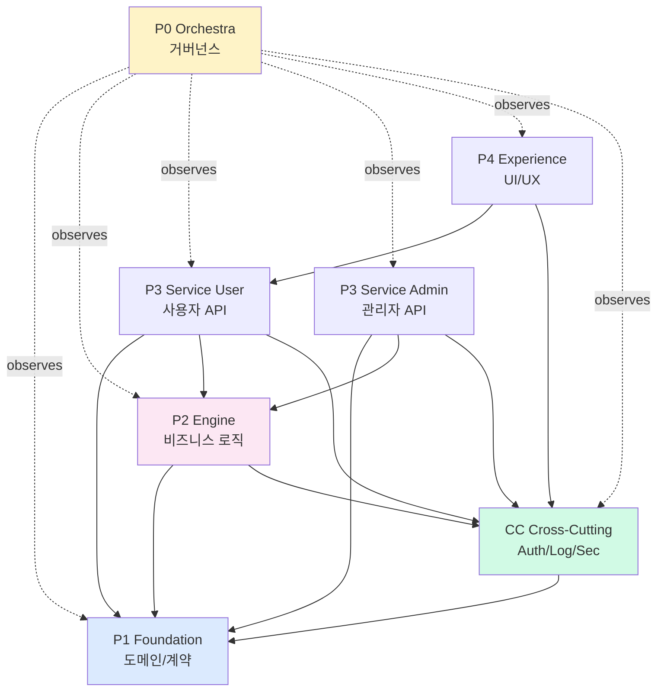

# 🪪 03. ROLE DEFINITION STANDARD

## 각 분할 단위(Plane/Stage/Domain)의 역할을 어떻게 정의하나

> **"역할이 모호하면, 모두가 모든 일을 한다.**
> **모두가 모든 일을 하면, 아무도 어떤 일도 끝내지 못한다."**
>
> — ARCHITECT

---

**버전:** v1.0
**선행 문서:** 02. Pattern Catalog (패턴 결정 후)
**연계 문서:** 04. Info Sharing, 05. Planning Workbook

---

# 0. 이 문서의 목적

## 0.1 풀려는 문제

```
패턴은 결정했는데:
  - "각 영역(Plane/Stage/Domain)이 정확히 무엇을 책임지나?"
  - "어디서 시작해서 어디까지가 그 영역인가?"
  - "두 영역의 경계 침범은 어떻게 감지하나?"
  - "각 Claude Code 세션이 자기 정체성을 어떻게 알게 하나?"
```

## 0.2 산출물

```
역할 정의가 끝나면 다음이 만들어진다:

  1. Role Card (역할 카드) — 각 영역마다 1장
  2. Dependency Graph (의존성 그래프) — 영역 간 관계 시각화
  3. Plane Context Files (.claude/plane-contexts/*.md) — 각 Claude 세션 정체성
  4. Ownership Matrix (소유권 매트릭스) — 폴더/파일 권한
```

---

# 1. 역할(Role) = 분할 단위의 표준 명칭

## 1.1 패턴별 단위 명칭

방법론 전체에서 쓰는 추상 용어 = **"역할(Role)"**.
실제 패턴별로는 다른 이름을 쓰지만, 본질은 같다.

| 패턴                | 분할 단위 명칭     | 일반 명칭               |
| :------------------ | :----------------- | :---------------------- |
| 0. Single Module    | (분할 없음)        | —                       |
| 1. Phase-based      | Phase              | Role = Phase            |
| 2. 5-Plane Hybrid   | Plane (P0~P4 + CC) | Role = Plane            |
| 3. Pipeline Stage   | Stage              | Role = Stage            |
| 4. Domain Vertical  | Domain             | Role = Domain           |
| 5. Core-Plugin      | Core / Plugin      | Role = Core 또는 Plugin |
| 6. Hybrid Composite | 조합               | Role = 가장 외부 단위   |

이 문서는 **"Role"**이라는 단어로 모두 통합해서 다룬다.

## 1.2 역할의 본질적 정의

```
역할(Role) ≡ 다음 4가지를 모두 가진 단위:

  ① 명시된 책임 (Responsibility) — 무엇을 하는가
  ② 명시된 경계 (Boundary) — 무엇을 안 하는가
  ③ 명시된 인터페이스 (Interface) — 외부와 어떻게 통신하는가
  ④ 명시된 페르소나 (Persona) — 누구의 눈으로 결정하는가
```

이 4가지가 명확하지 않으면 그건 "역할"이 아니라 "막연한 폴더"다.

---

# 2. Role Card 표준 양식

## 2.1 Role Card 템플릿

각 역할마다 **1장의 Role Card**를 작성한다. 이게 그 영역의 정체성 문서.

```yaml
# docs/methodology-output/role-cards/{role_id}.yaml

# ═════════════════════════════════════════════════════════
#  ROLE CARD: {Role 이름}
# ═════════════════════════════════════════════════════════

meta:
  role_id: 'P2-engine' # 패턴별 단위 명 + 식별자
  role_name: 'Engine' # 인간 읽기용
  pattern: '5-Plane Hybrid' # 02 Catalog 참조
  defcon: 'L3' # 헌법 v3.3 Part 1.6

# ─── 1. 책임 (Responsibility) ───
responsibility:
  what:
    - '비즈니스 로직 — 견적 생성/수정의 도메인 규칙'
    - '15-rule 린터 엔진 (이 프로젝트 핵심)'
    - 'AI 추론 호출 (제안 생성)'

  why: # 골든 스레드 — 왜 이 역할이 존재하나?
    - '이 엔진의 정확도가 사용자가 돈 내는 핵심 가치'

  business_value:
    - '북극성: 견적의 법적 정확성 100%'

# ─── 2. 경계 (Boundary) ───
boundary:
  out_of_scope: # 절대 안 하는 것 (다른 역할이 함)
    - 'UI 렌더링 (P4 Experience)'
    - '사용자 인증 (CC)'
    - 'DB 직접 접근 (P1 Foundation 통해서만)'
    - '배포 (P0 Orchestra)'

  edge_cases: # 모호한 경우 명시
    - case: 'AI 추론 결과를 캐싱하나?'
      answer: 'P2가 캐싱 로직 소유. KV는 P1이 제공하는 인터페이스로.'

# ─── 3. 인터페이스 (Interface) ───
interface:
  exposes: # 외부에 제공
    - name: 'validateQuote'
      signature: '(quote: Quote) => Promise<ValidationResult>'
      consumers: ['P3-service-user', 'P3-service-admin']

    - name: 'generateSuggestions'
      signature: '(context: Context) => Promise<Suggestion[]>'
      consumers: ['P3-service-user']

  consumes: # 외부 의존
    - from: 'P1-foundation'
      uses: ['Quote', 'Customer', 'Item types']
    - from: 'CC-cross-cutting'
      uses: ['Logger', 'AICostTracker']

# ─── 4. 페르소나 (Persona) ───
persona:
  primary: 'ARCHITECT' # 주 결정자
  secondary: ['HACKER'] # 협력자
  cot_focus: |
    - "이 구현이 기존 코드베이스의 패턴/컨벤션과 일관성이 있는가?"
    - "출력물을 직접 소비(재생/열람)해봤나?"

# ─── 5. 작업 영역 (Folders) ───
folders:
  write_access: # 쓰기 가능한 폴더
    - 'packages/engine/'
    - 'docs/plane/p2-engine/'
    - 'docs/contracts/p2-*.contract.yaml'

  read_only: # 읽기 전용
    - 'packages/foundation/'
    - 'packages/cross-cutting/'

  forbidden: # 절대 만지면 안 되는
    - 'package.json (root)'
    - 'apps/web/*'
    - '다른 packages/*'

# ─── 6. 의존 (Dependencies) ───
dependencies:
  upstream: # 이 역할이 의존하는 역할
    - role_id: 'P1-foundation'
      type: 'code_import'
      stability: 'high' # 자주 안 변함

  downstream: # 이 역할에 의존하는 역할
    - role_id: 'P3-service-user'
    - role_id: 'P3-service-admin'

# ─── 7. DEFCON 별 통제 (헌법 v3.3) ───
controls:
  defcon: 'L3'
  required:
    - 'Codebase Deep Dive (research.md)'
    - 'Implementation Plan (plan.md)'
    - 'RAR Cycle (최소 1회)'
    - 'Implementation Lock 활성'
    - 'Task Contract 전수'
    - 'Counter-Directive 프로젝트 특화'
    - 'BDD 시나리오 Epic당 2~3개'
    - 'Data Lineage (3+단계 파이프라인)'
    - 'Triangle Cross Verification'
    - 'Gate 5.5 인간 검증'

  exemptions: [] # 면제 항목

# ─── 8. 위험 신호 (Red Flags) ───
red_flags:
  - '이 역할의 코드가 forbidden 폴더 수정 PR 발생 → 즉시 ADR'
  - '이 역할의 인터페이스 시그니처가 ADR 없이 변경 → Silent Pivot'
  - 'downstream 역할이 이 역할의 internal 모듈 import → 캡슐화 깨짐'
  - '이 역할의 plan.md가 일주일 이상 미갱신 → 세션 망각 위험'
```

## 2.2 Role Card의 8개 필수 섹션

|  #  | 섹션               | 한 줄 요약           | 빠지면                       |
| :-: | :----------------- | :------------------- | :--------------------------- |
|  1  | **Responsibility** | "무엇을 하나 + 왜"   | 골든 스레드 없음 → 꼼수 발생 |
|  2  | **Boundary**       | "무엇을 안 하나"     | 영역 침범 → 충돌             |
|  3  | **Interface**      | "외부와 어떻게 통신" | 캡슐화 깨짐 → Silent Pivot   |
|  4  | **Persona**        | "누구의 눈으로 결정" | 결정 책임자 모호             |
|  5  | **Folders**        | "어디를 만지나"      | 충돌 + ESLint 룰 못 만듦     |
|  6  | **Dependencies**   | "누가 누구에게 의존" | 사이클 발생 위험             |
|  7  | **Controls**       | "DEFCON 어느 통제"   | 검증 누락                    |
|  8  | **Red Flags**      | "어떻게 망가지나"    | 조기 경고 못함               |

---

# 3. Role Card 작성 워크북

## 3.1 작성 시간 예산

```
첫 Role Card (학습): 60분
이후 Role Card: 20~30분/개
프로젝트 전체 (5 Roles): 약 2~3시간
```

## 3.2 5-Plane Hybrid의 Role Card 6장 작성 순서

```
권장 순서 (의존 방향과 반대 — 안쪽부터):

1. P0 Orchestra (가장 넓음, 메타)
2. P1 Foundation (가장 안쪽, 의존 없음)
3. CC Cross-Cutting (P1만 의존)
4. P2 Engine (P1, CC 의존)
5. P3 Service (P1, P2, CC 의존)
6. P4 Experience (P3, CC 의존)

이 순서로 작성하면 의존 그래프가 자연스럽게 형성.
```

## 3.3 작성 시 5가지 함정

| 함정                 | 예시                         | 회피             |
| :------------------- | :--------------------------- | :--------------- |
| **모호한 책임**      | "여러 가지를 한다"           | 구체 동사 + 명사 |
| **무한 책임**        | "필요한 모든 것"             | 5개 이내로 제한  |
| **다른 역할과 중복** | P2도 인증, CC도 인증         | 단일 책임 원칙   |
| **인터페이스 누락**  | "다른 역할과 통신" (어떻게?) | 시그니처 명시    |
| **페르소나 누락**    | "ARCHITECT" (왜?)            | COT focus 추가   |

---

# 4. Dependency Graph — 의존성 시각화

## 4.1 그래프 작성 원칙

```
1. 의존은 단방향 (Acyclic)
2. 한 역할의 outbound degree ≤ 3
3. 사이클 발생 시 ARCHITECT 즉시 소환
4. 그래프는 ARCHITECTURE.md에 SVG/Mermaid로 영속화
```

## 4.2 Mermaid 표기 표준

````markdown
# docs/ARCHITECTURE.md

## 역할 의존성 그래프


````

````

## 4.3 사이클 감지 자동화

```bash
# scripts/check-dependency-cycles.sh
#!/usr/bin/env bash
# pnpm + dependency-cruiser 활용

pnpm dlx dependency-cruiser \
  --no-config \
  --output-type err-html \
  --output-to dep-graph.html \
  packages/

# 또는 madge
pnpm dlx madge --circular packages/
````

CI에서 매 PR마다 실행 → 사이클 발견 시 머지 차단.

---

# 5. Plane Context Files — 각 Claude Code 세션 정체성

## 5.1 왜 필요한가

```
다중 세션 운영의 1번 위험:
  "이 세션이 어느 역할인지 모호해서 영역 침범"

해결책:
  각 세션 시작 시 "너는 P2 Engine 담당"이라고 명시.
  이걸 매번 타이핑하지 않게 .claude/plane-contexts/p2-engine.md에 영속화.
```

## 5.2 Plane Context File 템플릿

```markdown
# 🎚️ Plane Context: P2 Engine

> **이 세션의 정체성: 너는 P2 Engine 담당이다.**
> **다른 Plane의 작업은 다른 세션이 한다.**
> **너는 packages/engine/ 외 영역을 수정해서는 안 된다.**

## 🪪 정체성

- Role ID: P2-engine
- Pattern: 5-Plane Hybrid
- DEFCON: L3
- Persona: ARCHITECT (주) + HACKER (협력)

## 📂 작업 영역

### 쓰기 가능

- packages/engine/
- docs/plane/p2-engine/
- docs/contracts/p2-\*.contract.yaml

### 읽기 전용

- packages/foundation/ (의존)
- packages/cross-cutting/ (의존)
- docs/shared/ (SSOT)

### 절대 금지

- 다른 packages/\* 수정
- apps/\* 수정
- root config 수정 (P0 권한)

## 📚 시작 시 의무 로드

1. CLAUDE.md (루트)
2. docs/shared/NORTH_STAR.md
3. docs/shared/DOMAIN_MODEL.md
4. docs/shared/COUNTER_DIRECTIVES.md
5. docs/plane/p2-engine/research.md
6. docs/plane/p2-engine/plan.md
7. .project/plane-states/p2.json

## 🔔 NOTICE 체크 (시작 시 + 30분마다)

- .claude/notices/ 폴더의 P2 관련 NOTICE 읽기
- 처리 후 .claude/notices/processed/로 이동

## 🎯 골든 스레드 (이 세션의 북극성)

"이 엔진의 출력 정확도가 사용자가 돈 내는 핵심 가치.
80% 미만이면 출시 안 함."

## 🚨 Counter-Directive (P2 한정)

| #     | 함정                           | 회피                |
| :---- | :----------------------------- | :------------------ |
| CD-E1 | 다른 Plane internal import     | barrel(index.ts)만  |
| CD-E2 | AI Cost Cap 무시               | 모든 호출 전 체크   |
| CD-E3 | 3+단계 파이프라인 Lineage 없음 | Lineage 시스템 의무 |

## 🔒 Implementation Lock 상태

- 현재: 🔒 LOCKED / 🔓 UNLOCKED
- (RAR Cycle 진행 중인지 명시)

## ✅ 진행 상태

- 현재 Story: (작성)
- 다음 Story: (작성)
- 미해결 이슈: (작성)

## 🧠 자주 하는 실수 (P2 한정)

- 2026-04-20: AI 호출 전 토큰 추정 잊음 → Cost Cap 시스템 도입
- (계속 추가)
```

## 5.3 세션 시작 표준 명령

각 Claude Code 세션 시작 시 첫 명령:

```
"너는 P2 Engine 세션이다.
 .claude/plane-contexts/p2-engine.md 를 정독하라.
 거기 명시된 의무 로드 파일을 전부 읽어라.
 시작 시 NOTICE 체크부터 하라.
 너의 작업 영역 외에는 절대 수정하지 마라."
```

또는 단축어로:

```
"P2-engine 세션 활성"
```

(Claude가 Role ID로 plane-context.md를 자동 로드하도록 슬래시 커맨드 셋업 가능 — 08. Templates 참조)

---

# 6. Ownership Matrix — 소유권 매트릭스

## 6.1 폴더/파일 권한 매트릭스 표준

```yaml
# docs/methodology-output/ownership-matrix.yaml

ownership:
  # ─── Root files (P0 단독) ───
  - path: '/package.json'
    write: ['P0']
    read: ['all']
    reason: 'root config — 충돌 위험 매우 높음'

  - path: '/pnpm-workspace.yaml'
    write: ['P0']
    read: ['all']

  - path: '/turbo.json'
    write: ['P0']
    read: ['all']

  - path: '/tsconfig.json'
    write: ['P0']
    read: ['all']

  - path: '/.env*'
    write: ['P0']
    read: ['all']

  # ─── docs/ ───
  - path: '/docs/shared/**'
    write: ['P0', 'creator'] # 작성자도 가능
    read: ['all']
    notice: 'PostToolUse hook → SSOT_CHANGE NOTICE 자동'

  - path: '/docs/plane/p0-*/**'
    write: ['P0']
    read: ['all']

  - path: '/docs/plane/p2-*/**'
    write: ['P2']
    read: ['all']

  # ─── packages/ ───
  - path: '/packages/foundation/**'
    write: ['P1']
    read: ['all']
    notice: 'schema 변경 → SCHEMA_CHANGE NOTICE 자동'

  - path: '/packages/engine/**'
    write: ['P2']
    read: ['all']

  - path: '/packages/service-user/**'
    write: ['P3-user']
    read: ['all']

  - path: '/packages/service-admin/**'
    write: ['P3-admin']
    read: ['all']

  - path: '/packages/ui/**'
    write: ['P4']
    read: ['all']

  - path: '/packages/cross-cutting/**'
    write: ['CC']
    read: ['all']

  # ─── apps/ ───
  - path: '/apps/web/src/api/**'
    write: ['P3-user']
    read: ['all']

  - path: '/apps/web/src/admin/**'
    write: ['P3-admin']
    read: ['all']

  - path: '/apps/web/src/pages/**'
    write: ['P4']
    read: ['all']

  # ─── 인프라 ───
  - path: '/.github/workflows/**'
    write: ['P0']
    read: ['all']

  - path: '/.claude/**'
    write: ['P0']
    read: ['all']
```

## 6.2 자동 검증 — pre-commit hook

```bash
# .husky/pre-commit
#!/usr/bin/env bash

PLANE=${CLAUDE_PLANE:-unknown}

if [ "$PLANE" != "unknown" ] && [ "$PLANE" != "P0" ]; then
  # ownership-matrix.yaml 파싱해서 허용 경로 추출
  ALLOWED=$(yq ".ownership[] | select(.write[] | contains(\"$PLANE\")) | .path" \
    docs/methodology-output/ownership-matrix.yaml)

  # 변경된 파일이 허용 경로 안에 있는지 검증
  VIOLATING=$(git diff --cached --name-only | python3 scripts/check-ownership.py "$PLANE" "$ALLOWED")

  if [ -n "$VIOLATING" ]; then
    echo "❌ Plane 영역 침범!"
    echo "   $PLANE 권한 외 파일 수정 시도:"
    echo "$VIOLATING"
    echo ""
    echo "옵션:"
    echo "  A. 이 작업은 다른 Plane 세션으로 전환해서 수행"
    echo "  B. ADR 작성 (헌법 v3.3 Part 7.5) + 'SKIP_OWNERSHIP=1 git commit'"
    exit 1
  fi
fi
```

---

# 7. 패턴별 Role 정의 가이드

## 7.1 Pattern 0: Single Module

```
Role 수: 0 (분할 없음)
Role Card: 불필요
Plane Context: 불필요
Ownership Matrix: 단일 owner
```

단, 미니 Role Card는 작성 권장 (CLAUDE.md 안에):

```markdown
## 프로젝트 단일 책임

- 책임: ...
- 경계: 다음은 안 한다 ...
- 인터페이스: 외부 노출 ...
- 페르소나: 주로 HACKER, 결정 시 ARCHITECT
```

## 7.2 Pattern 1: Phase-based

```
Role = Phase (시간순)
Role Card: Phase별 1장 (3~5장)
Plane Context: 같은 세션이 Phase 전환하므로 불필요
Ownership Matrix: Phase별 작업 영역 명시
```

Phase별 Role Card 특화:

```yaml
phase_specific:
  start_condition: '이전 Phase 종료'
  end_condition: '이 Phase 산출물 G7 통과'
  duration_estimate: '3 weeks'
  business_milestone: 'MVP 출시 가능'
```

## 7.3 Pattern 2: 5-Plane Hybrid

```
Role 수: 6 (P0~P4 + CC)
Role Card: 6장 전수
Plane Context: 6장 전수
Ownership Matrix: 폴더 단위 명확
```

이 패턴이 가장 많은 산출물을 요구. v2.0 문서 참조.

## 7.4 Pattern 3: Pipeline Stage

```
Role = Stage
Role Card: Stage별 1장 (4~6장)
Plane Context: Stage별 (Stage 동시 작업 시)
Ownership Matrix: Stage별 폴더
```

Pipeline 특화 Role Card:

```yaml
pipeline_specific:
  upstream_stage: 'stage-1-audio'
  downstream_stage: 'stage-3-notation'
  input_format: 'WAV stems (4 channels)'
  output_format: 'MIDI (PrettyMIDI)'
  expected_loss_rate: '<10%' # Lineage 측정
```

## 7.5 Pattern 4: Domain Vertical

```
Role = Domain (Bounded Context)
Role Card: Domain별 1장
Plane Context: Domain별
Ownership Matrix: Domain별 + shared
```

Domain 특화 Role Card:

```yaml
domain_specific:
  bounded_context: 'Memo'
  aggregates: ['Memo', 'Highlight']
  domain_events: ['MemoCreated', 'MemoLinkedToBook']
  shared_kernel: ['BookId (from book domain)']
```

## 7.6 Pattern 5: Core-Plugin

```
Role = Core 또는 Plugin (다름)
Role Card:
  - Core: 1장 (상세, L3)
  - Plugin: Plugin별 1장 (간소, L1~L2)
Plane Context: Core 1개 + Plugin은 templating
Ownership Matrix: Core 영역 + Plugin 영역 (자유)
```

Core Role Card vs Plugin Role Card:

| 항목      | Core                          | Plugin            |
| :-------- | :---------------------------- | :---------------- |
| DEFCON    | L3 (변경 시 모든 Plugin 영향) | L1~L2 (작고 격리) |
| Interface | 한 번 정하면 못 바꿈          | Core API 사용     |
| 작성 시간 | 1시간                         | 10분              |
| RAR Cycle | 의무                          | 생략 가능         |

## 7.7 Pattern 6: Hybrid Composite

```
Role 수: 가변 (조합에 따라)
Role Card: 모든 단위 (5-Plane + Stage + Plugin)
Plane Context: 모두
Ownership Matrix: 가장 복잡 — 신중히
```

Hybrid는 Role Card가 폭발적으로 늘어남. 6개월 후 단순화 가능 여부 정기 검토.

---

# 8. 페르소나 매핑 (DEV COVEN)

## 8.1 8개 페르소나 + 각 Role의 매핑

헌법 v3.3 Part 2의 페르소나를 Role에 매핑:

| 페르소나     | 주로 어느 Role의 결정자              | 협력                  |
| :----------- | :----------------------------------- | :-------------------- |
| 🎩 MEPHISTO  | P0 Orchestra (또는 모든 Role의 메타) | 모든 영역             |
| 🔮 ORACLE    | 비즈니스 결정 시 (Phase 시작)        | P0 + 도메인 책임자    |
| 👤 ADVOCATE  | P4 Experience                        | P3 (UX 영향 시)       |
| 🏛️ ARCHITECT | P1 Foundation, P2 Engine, Stage 설계 | 모든 Role의 구조 결정 |
| 💻 HACKER    | 모든 구현 단계                       | Role마다              |
| 🔨 BREAKER   | 모든 검증 단계                       | 모든 Role             |
| 🛡️ SENTINEL  | CC, P3 Admin (보안), 결제            | 법적 검토             |
| 👻 GHOST     | P0, CC (운영)                        | 배포/모니터링         |

## 8.2 Role의 페르소나 활성 시점

각 Role 작업 시 페르소나가 어떻게 활성되는지 (헌법 v3.3 Part 2.3 소환 프로토콜 응용):

```
Role 시작 시:
  → 주 페르소나 + (시작 단계라면) ORACLE/ARCHITECT 협력

Role 구현 중:
  → 주 페르소나 (HACKER 협력)

Role 검증 시:
  → BREAKER 의무 + 주 페르소나

Role 머지 시:
  → BREAKER + ARCHITECT (의존 영향) + GHOST (CI)
```

## 8.3 COT 의무 (헌법 v3.3 Part 2.4)

각 Role의 작업 종료 시 COT 13문항 자기 검증:

```
Role 한정 추가 질문:

P1 Foundation:
  - "이 모델 변경이 downstream에 영향 있는데 NOTICE 발행했는가?"

P2 Engine:
  - "이 알고리즘이 Hard Limit 안에서 동작하는가?"

P3 Service:
  - "이 API가 인증/권한 체크를 거치는가?"

P4 Experience:
  - "엄마가 3초 안에 이해할 수 있는가?"

CC Cross-Cutting:
  - "이 변경이 모든 의존 Plane에 NOTICE 발행됐는가?"
```

---

# 9. 역할 충돌 해소 프로토콜

## 9.1 책임 모호 시 (Responsibility Ambiguity)

```
시나리오: "결제 webhook 처리는 P3-Admin인가, CC인가?"

해소 절차:
  1. Role Card의 'edge_cases' 섹션 확인
  2. 명시 안 됐으면 → ARCHITECT + SENTINEL 소환
  3. ADR 작성 (헌법 v3.3 Part 7.5)
  4. 책임 결정 → Role Card 갱신 + SSOT NOTICE
```

## 9.2 영역 침범 시 (Boundary Violation)

```
시나리오: P2 Engine이 P3-Admin의 코드를 수정함

탐지: pre-commit hook (Section 6.2)

해소:
  1. 즉시 차단 (commit 거부)
  2. 옵션 A: P3-Admin 세션으로 전환해서 작업
  3. 옵션 B: ADR 작성 + 명시적 침범 (긴급 상황)
  4. 옵션 C: 책임 자체를 P2로 이관 (Role Card 변경 + SSOT NOTICE)
```

## 9.3 인터페이스 충돌 시

```
시나리오: P1이 Quote 타입을 변경했는데 P2/P3이 모름

탐지: NOTICE 시스템 (04 Info Sharing) + Contract Hash 검증

해소:
  1. 자동 NOTICE 발행 (P1의 schema 변경 → SCHEMA_CHANGE NOTICE)
  2. 영향 받는 Role(P2, P3)이 다음 세션 시작 시 NOTICE 확인
  3. 의존 코드 갱신
  4. ack 갱신 → NOTICE 처리
```

---

# 10. Role Card 운영 일과

## 10.1 작성 시점

| 시점           | 활동                                        |  빈도   |
| :------------- | :------------------------------------------ | :-----: |
| 프로젝트 시작  | 모든 Role Card 초안 작성                    |   1회   |
| Role 책임 변경 | 해당 Role Card 갱신 + ADR                   | 변경 시 |
| 의존성 변경    | Dependencies 섹션 갱신 + 자동 그래프 재생성 | 변경 시 |
| 매 분기        | 모든 Role Card 정합성 점검                  | 분기별  |
| 프로젝트 회고  | 어느 Role Card가 정확했나 평가              | 종료 시 |

## 10.2 Role Card 검증 체크리스트

```
□ Responsibility의 'why'가 비즈니스 가치와 연결되어 있나?
□ Boundary의 'out_of_scope'에 다른 Role이 명시되어 있나?
□ Interface의 시그니처가 코드와 일치하나? (Contract.yaml 자동 생성)
□ Persona의 cot_focus가 헌법 v3.3 13문항과 일관?
□ Folders의 write_access가 Ownership Matrix와 일치?
□ Dependencies가 Acyclic? (자동 검증)
□ Controls가 DEFCON과 일치?
□ Red Flags가 헌법 v3.3 환각 유형(TYPE-1~9)과 매핑?
```

---

# 11. 페르소나 COT 검증 (이 문서)

## 🏛️ ARCHITECT

> "Role 정의의 4요소(R/B/I/P)가 충분한가? — 부족하지 않음. SOLID의 SRP + 명시적 인터페이스 + 페르소나."

## 🔨 BREAKER

> "Role Card가 너무 무겁나? 작성 시간 60분/첫 Role + 20분/이후. 솔로에게 부담? — 패턴별 차등으로 보완."

## 👤 ADVOCATE

> "Plane Context File이 매번 로드되면 토큰 소모? — Max 사용자라 무관."

## 🛡️ SENTINEL

> "Ownership Matrix가 보안 격리에 도움? ✓ secret 위치 + 권한 명확."

## 👻 GHOST

> "사이클 자동 검증? ✓ madge/dependency-cruiser 통합."

## 🔮 ORACLE

> "Role의 비즈니스 가치 명시? ✓ Responsibility의 'why' 섹션 의무."

## 🎩 MEPHISTO

> "역할이 모호하면 모두가 모든 일을 한다 — 이 문서가 명료성을 강제한다."

---

# 12. 다음 단계

```
Role Card 작성 완료 후:
  → 04. Information Sharing Protocol (Role 간 정보 동기화)
  → 05. Planning Workbook (Stage -1 ~ Stage 0.8)
```

---

**END OF 03. ROLE DEFINITION STANDARD**

_"Define the role, and the work defines itself."_
